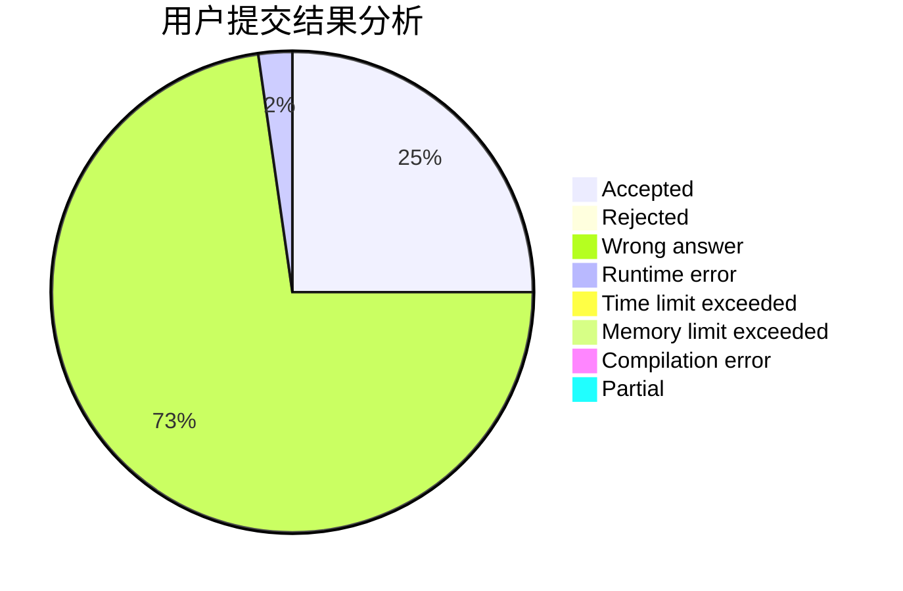
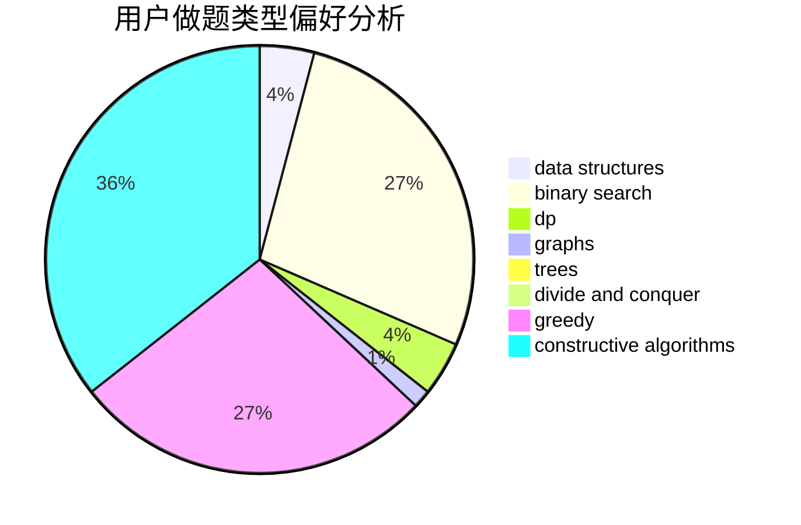
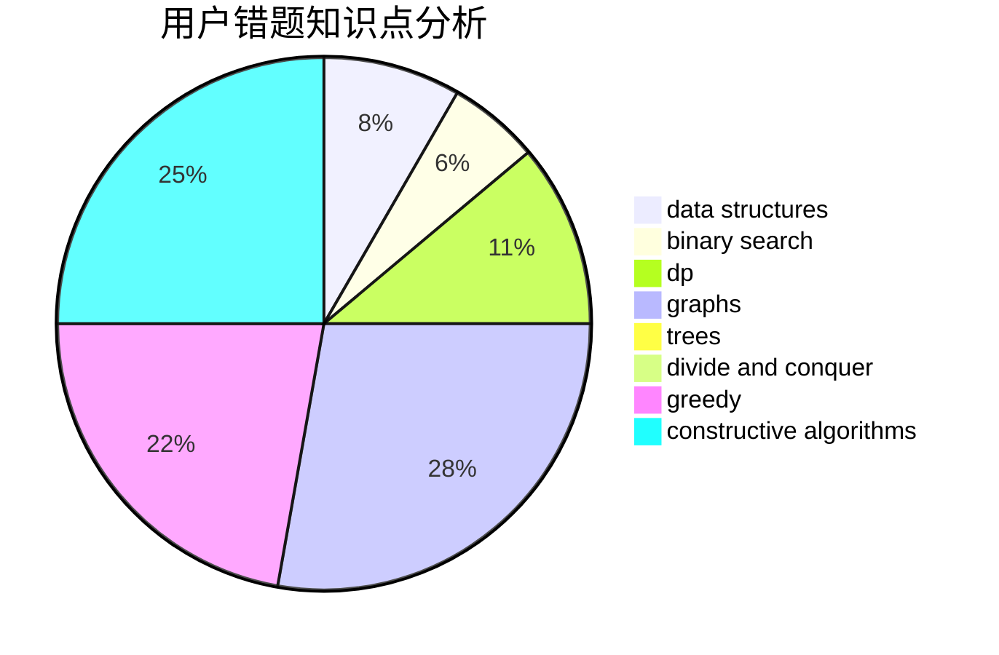

# _Zsz_

<!-- tabs:start -->

#### **用户提交结果分析**

#### **用户做题类型偏好分析**

#### **用户错题知识点分析**

<!-- tabs:end -->
# 推荐题目
[1461D](https://codeforces.com/contest/1461/problem/D)		binary search,
                        brute force,
                        data structures,
                        divide and conquer,
                        implementation,
                        sortings		  
[573B](https://codeforces.com/contest/573/problem/B)		binary search,
                        data structures,
                        dp,
                        math		  
[297E](https://codeforces.com/contest/297/problem/E)		data structures		  
[1293A](https://codeforces.com/contest/1293/problem/A)		binary search,
                        brute force,
                        implementation		  
[329B](https://codeforces.com/contest/329/problem/B)		dfs and similar,
                        shortest paths		  
[274A](https://codeforces.com/contest/274/problem/A)		binary search,
                        greedy,
                        sortings		  
[1270C](https://codeforces.com/contest/1270/problem/C)		bitmasks,
                        constructive algorithms,
                        math		  
[1482E](https://codeforces.com/contest/1482/problem/E)		data structures,
                        divide and conquer,
                        dp		  
[1489D](https://codeforces.com/contest/1489/problem/D)		dsu,graphs,sortings,trees		  
[1483E](https://codeforces.com/contest/1483/problem/E)		dsu,graphs,sortings,trees		  
