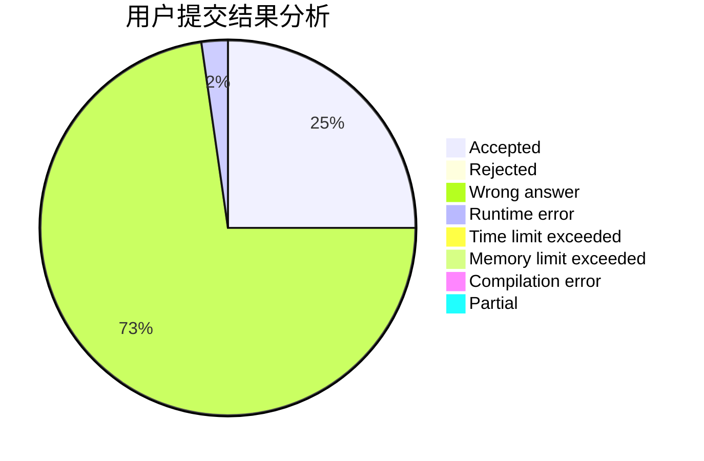
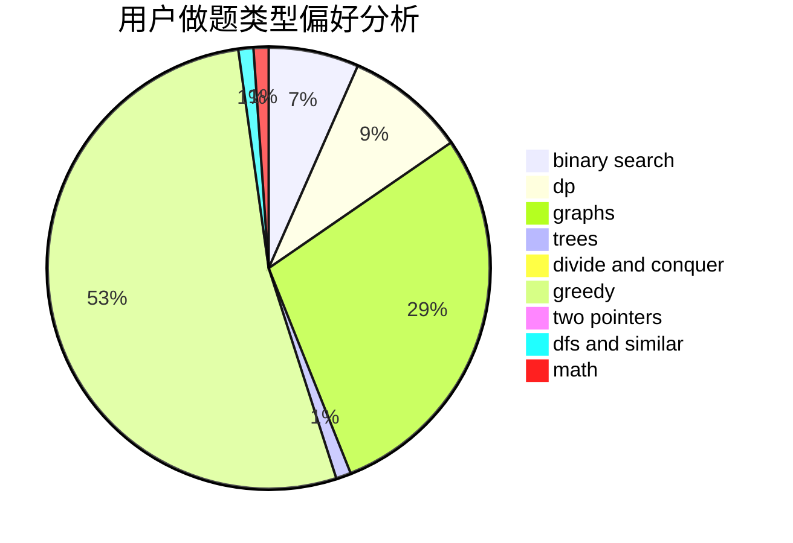

# _Zsz_

<!-- tabs:start -->

#### **用户提交结果分析**

#### **用户做题类型偏好分析**

<!-- tabs:end -->
# 推荐题目
[1468N](https://codeforces.com/contest/1468/problem/N)
[592D](https://codeforces.com/contest/592/problem/D)
[315A](https://codeforces.com/contest/315/problem/A)
[12B](https://codeforces.com/contest/12/problem/B)
[356E](https://codeforces.com/contest/356/problem/E)
[289E](https://codeforces.com/contest/289/problem/E)
[1279C](https://codeforces.com/contest/1279/problem/C)
[1490C](https://codeforces.com/contest/1490/problem/C)
[1497B](https://codeforces.com/contest/1497/problem/B)
[1491C](https://codeforces.com/contest/1491/problem/C)
