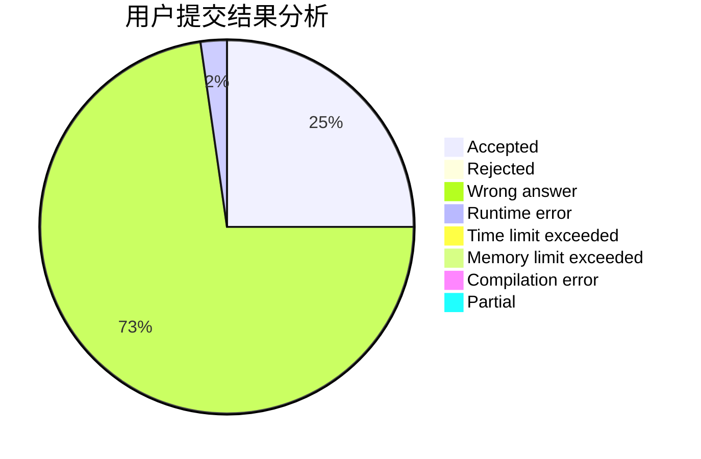
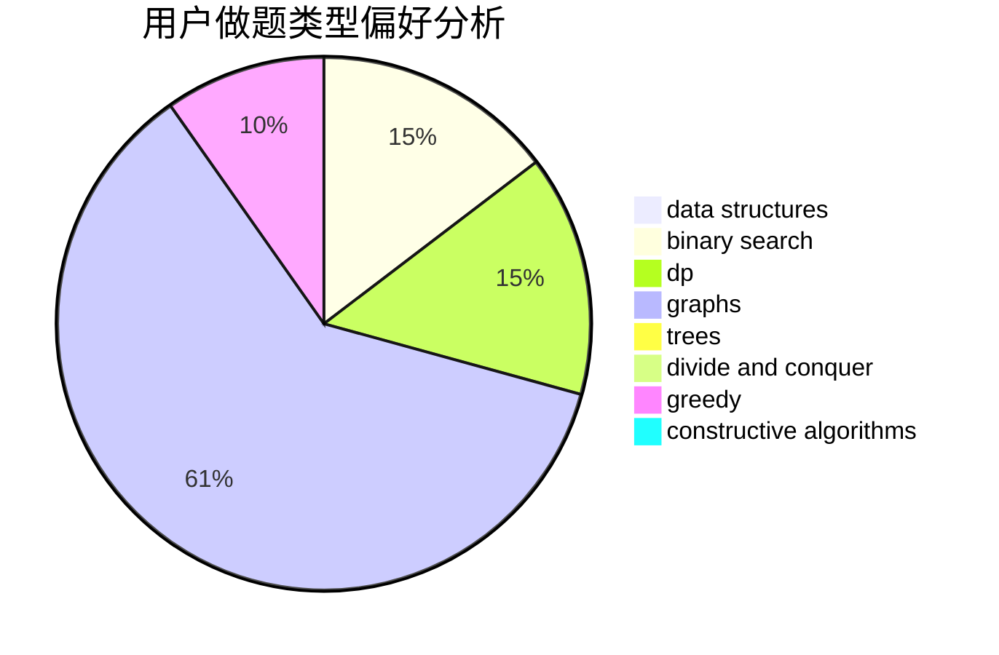
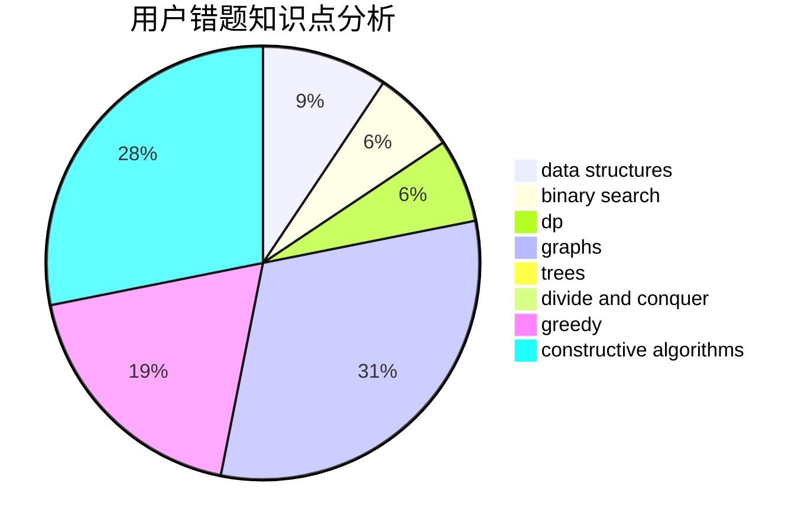

# _Zsz_

<!-- tabs:start -->

#### **用户提交结果分析**

#### **用户做题类型偏好分析**

#### **用户错题知识点分析**

<!-- tabs:end -->
# 推荐题目
[1468N](https://codeforces.com/contest/1468/problem/N)		greedy,
                        implementation		  
[592D](https://codeforces.com/contest/592/problem/D)		dfs and similar,
                        dp,
                        graphs,
                        trees		  
[315A](https://codeforces.com/contest/315/problem/A)		brute force		  
[12B](https://codeforces.com/contest/12/problem/B)		implementation,
                        sortings		  
[356E](https://codeforces.com/contest/356/problem/E)		dp,
                        hashing,
                        implementation,
                        string suffix structures,
                        strings		  
[289E](https://codeforces.com/contest/289/problem/E)		dsu,graphs,sortings,trees		  
[1279C](https://codeforces.com/contest/1279/problem/C)		data structures,
                        implementation		  
[1490C](https://codeforces.com/contest/1490/problem/C)		binary search,
                        brute force,
                        brute force,
                        math		  
[1497B](https://codeforces.com/contest/1497/problem/B)		constructive algorithms,
                        greedy,
                        math		  
[1491C](https://codeforces.com/contest/1491/problem/C)		brute force,
                        data structures,
                        dp,
                        greedy,
                        implementation		  
