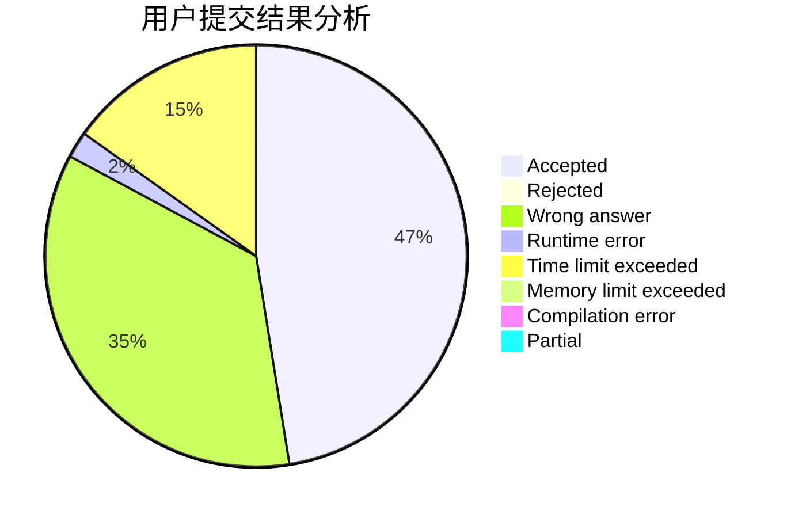
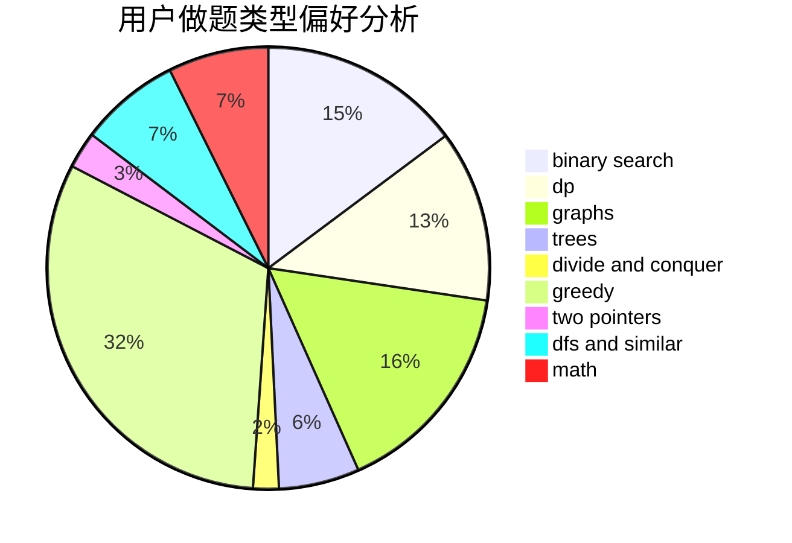

# __23333

<!-- tabs:start -->

#### **用户提交结果分析**

#### **用户做题类型偏好分析**

<!-- tabs:end -->
# 推荐题目
[1164M](https://codeforces.com/contest/1164/problem/M)
[1101C](https://codeforces.com/contest/1101/problem/C)
[293B](https://codeforces.com/contest/293/problem/B)
[26D](https://codeforces.com/contest/26/problem/D)
[95B](https://codeforces.com/contest/95/problem/B)
[411A](https://codeforces.com/contest/411/problem/A)
[1374D](https://codeforces.com/contest/1374/problem/D)
[354D](https://codeforces.com/contest/354/problem/D)
[85D](https://codeforces.com/contest/85/problem/D)
[988F](https://codeforces.com/contest/988/problem/F)
