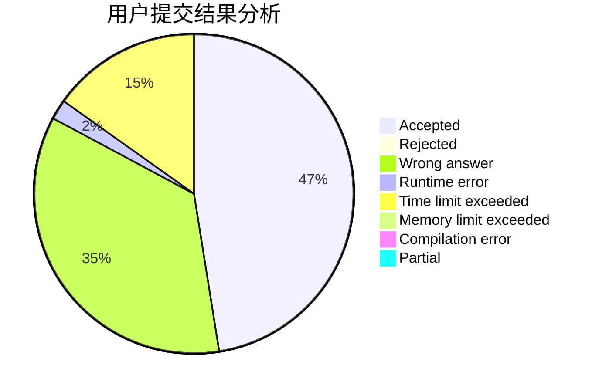
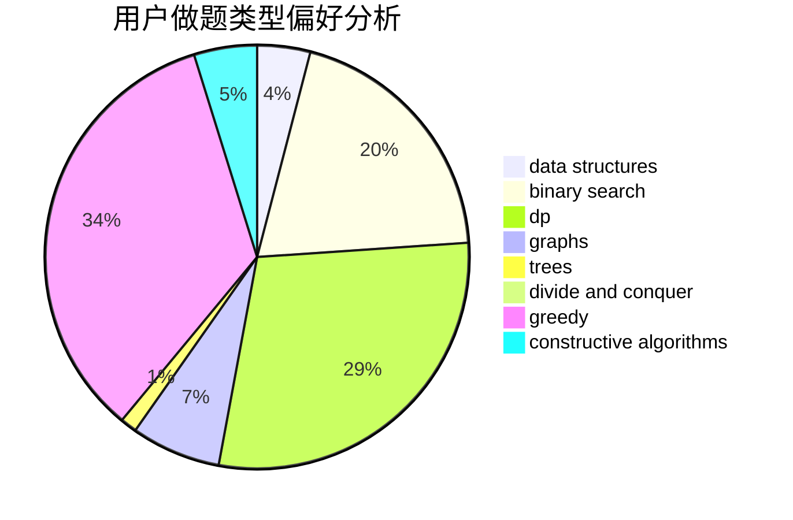
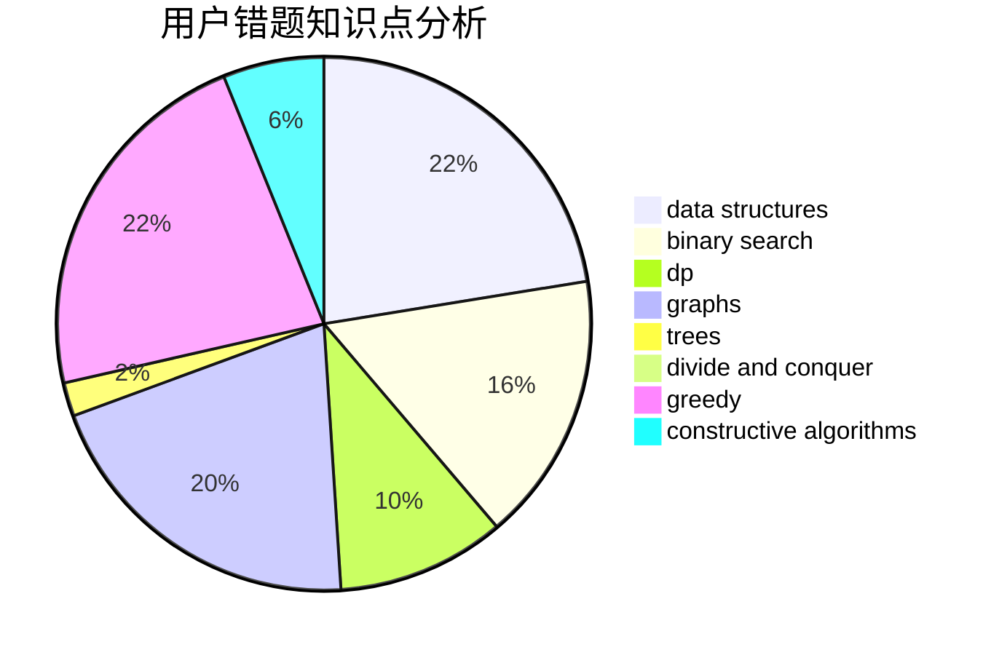

# __23333

<!-- tabs:start -->

#### **用户提交结果分析**

#### **用户做题类型偏好分析**

#### **用户错题知识点分析**

<!-- tabs:end -->
# 推荐题目
[1164M](https://codeforces.com/contest/1164/problem/M)		dsu,graphs,sortings,trees		  
[1101C](https://codeforces.com/contest/1101/problem/C)		sortings		  
[293B](https://codeforces.com/contest/293/problem/B)		brute force,
                        combinatorics		  
[26D](https://codeforces.com/contest/26/problem/D)		combinatorics,
                        math,
                        probabilities		  
[95B](https://codeforces.com/contest/95/problem/B)		dp,
                        greedy		  
[411A](https://codeforces.com/contest/411/problem/A)		*special problem,
                        implementation		  
[1374D](https://codeforces.com/contest/1374/problem/D)		math,
                        sortings,
                        two pointers		  
[354D](https://codeforces.com/contest/354/problem/D)		dp		  
[85D](https://codeforces.com/contest/85/problem/D)		binary search,
                        brute force,
                        data structures,
                        implementation		  
[988F](https://codeforces.com/contest/988/problem/F)		dp		  
