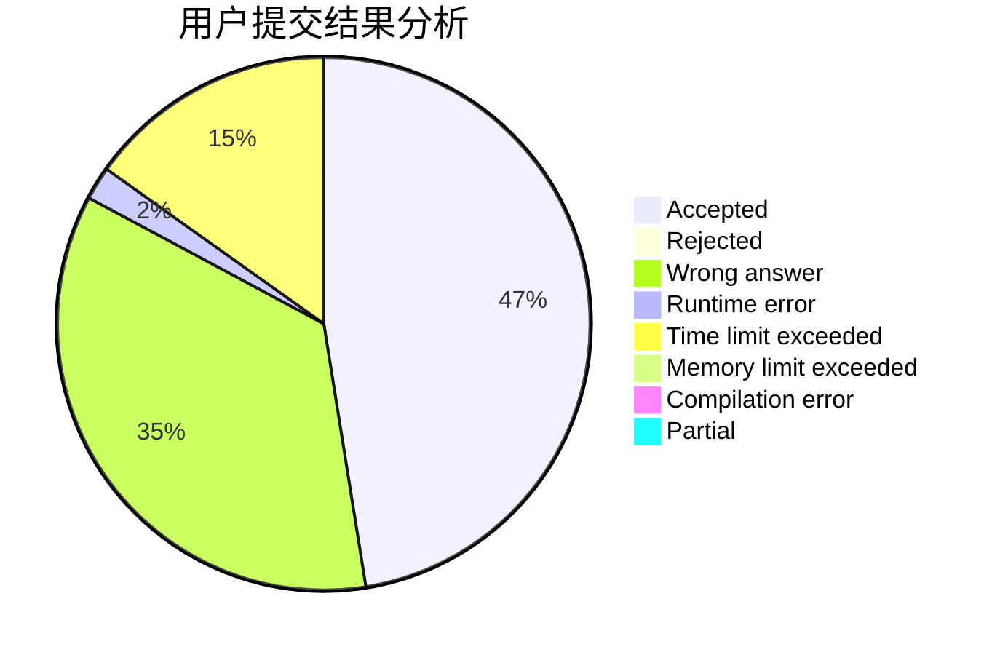
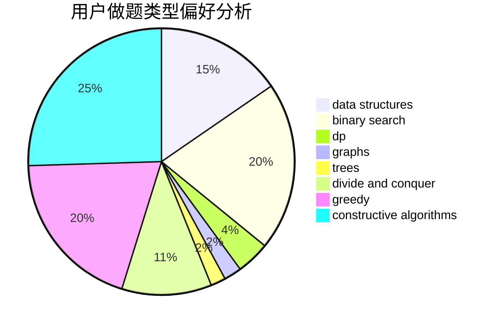
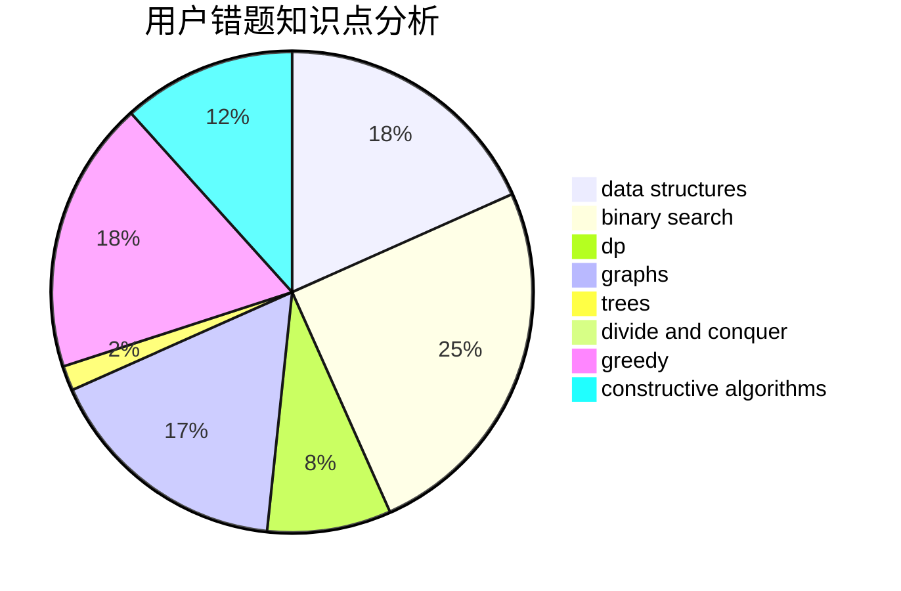

# __23333

<!-- tabs:start -->

#### **用户提交结果分析**

#### **用户做题类型偏好分析**

#### **用户错题知识点分析**

<!-- tabs:end -->
# 推荐题目
[1162E](https://codeforces.com/contest/1162/problem/E)		dsu,graphs,sortings,trees		  
[1100F](https://codeforces.com/contest/1100/problem/F)		data structures,
                        divide and conquer,
                        greedy,
                        math		  
[278B](https://codeforces.com/contest/278/problem/B)		brute force,
                        strings		  
[253A](https://codeforces.com/contest/253/problem/A)		greedy		  
[938C](https://codeforces.com/contest/938/problem/C)		binary search,
                        brute force,
                        constructive algorithms		  
[380C](https://codeforces.com/contest/380/problem/C)		data structures,
                        schedules		  
[1367F2](https://codeforces.com/contest/1367F/problem/2)		binary search,
                        data structures,
                        dp,
                        greedy,
                        sortings,
                        two pointers		  
[325C](https://codeforces.com/contest/325/problem/C)		dfs and similar,
                        graphs,
                        shortest paths		  
[840D](https://codeforces.com/contest/840/problem/D)		data structures,
                        probabilities		  
[967C](https://codeforces.com/contest/967/problem/C)		dsu,graphs,sortings,trees		  
