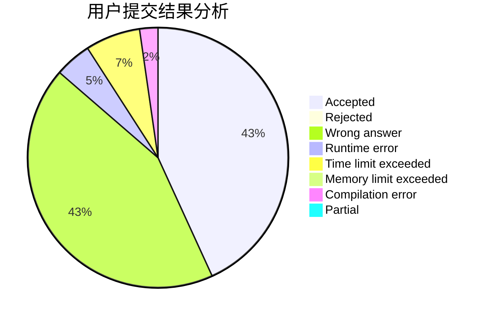
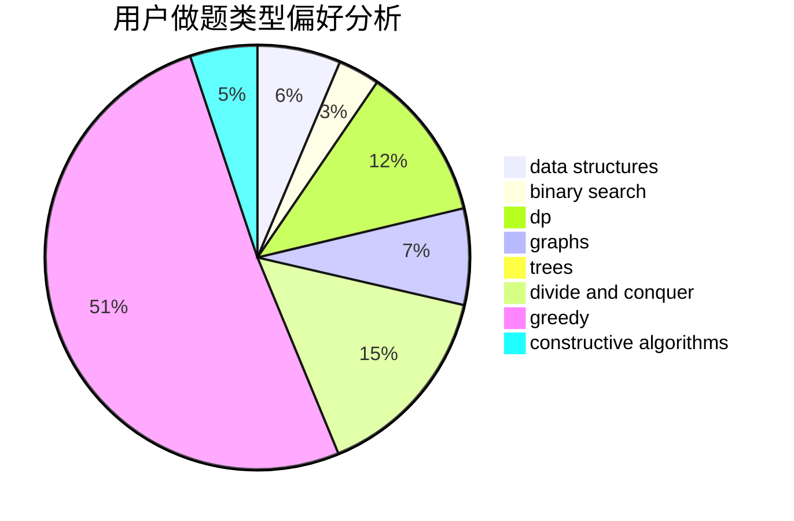

# __Neflibata

<!-- tabs:start -->

#### **用户提交结果分析**

#### **用户做题类型偏好分析**

#### **用户错题知识点分析**

<!-- tabs:end -->
# 推荐题目
[1296B](https://codeforces.com/contest/1296/problem/B)		math		  
[260C](https://codeforces.com/contest/260/problem/C)		constructive algorithms,
                        greedy,
                        implementation		  
[1473E](https://codeforces.com/contest/1473/problem/E)		graphs,
                        shortest paths		  
[816D](https://codeforces.com/contest/816/problem/D)		dsu,graphs,sortings,trees		  
[538A](https://codeforces.com/contest/538/problem/A)		brute force,
                        implementation		  
[917C](https://codeforces.com/contest/917/problem/C)		combinatorics,
                        dp,
                        matrices		  
[1188C](https://codeforces.com/contest/1188/problem/C)		dp		  
[240E](https://codeforces.com/contest/240/problem/E)		dfs and similar,
                        graphs,
                        greedy		  
[1084C](https://codeforces.com/contest/1084/problem/C)		combinatorics,
                        dp,
                        implementation		  
[1244F](https://codeforces.com/contest/1244/problem/F)		constructive algorithms,
                        implementation		  
