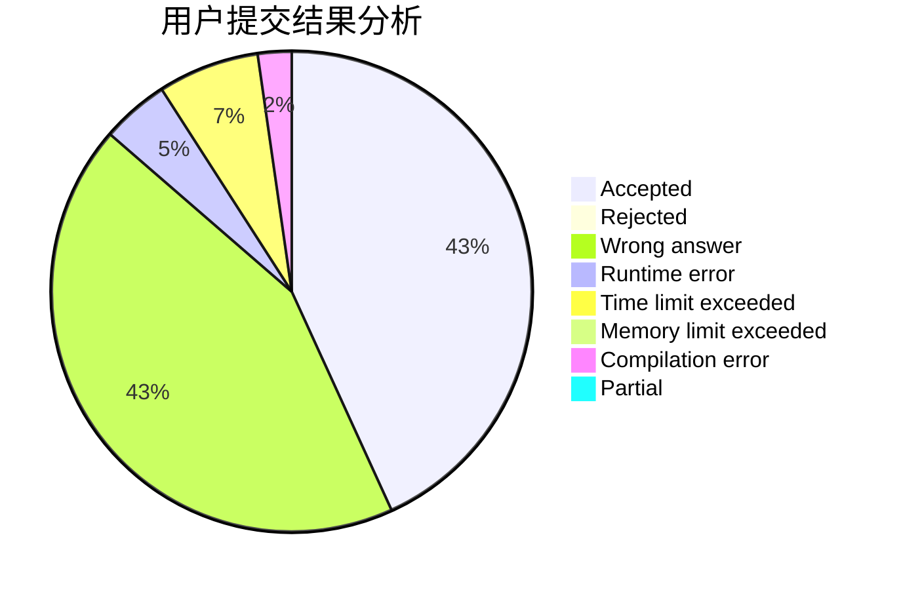
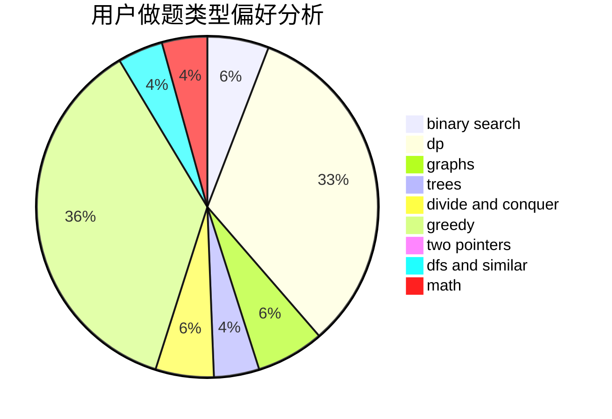

# __Neflibata

<!-- tabs:start -->

#### **用户提交结果分析**

#### **用户做题类型偏好分析**

<!-- tabs:end -->
# 推荐题目
[1303D](https://codeforces.com/contest/1303/problem/D)
[279A](https://codeforces.com/contest/279/problem/A)
[1482B](https://codeforces.com/contest/1482/problem/B)
[835E](https://codeforces.com/contest/835/problem/E)
[559B](https://codeforces.com/contest/559/problem/B)
[938A](https://codeforces.com/contest/938/problem/A)
[1193A](https://codeforces.com/contest/1193/problem/A)
[261C](https://codeforces.com/contest/261/problem/C)
[1085B](https://codeforces.com/contest/1085/problem/B)
[1250A](https://codeforces.com/contest/1250/problem/A)
