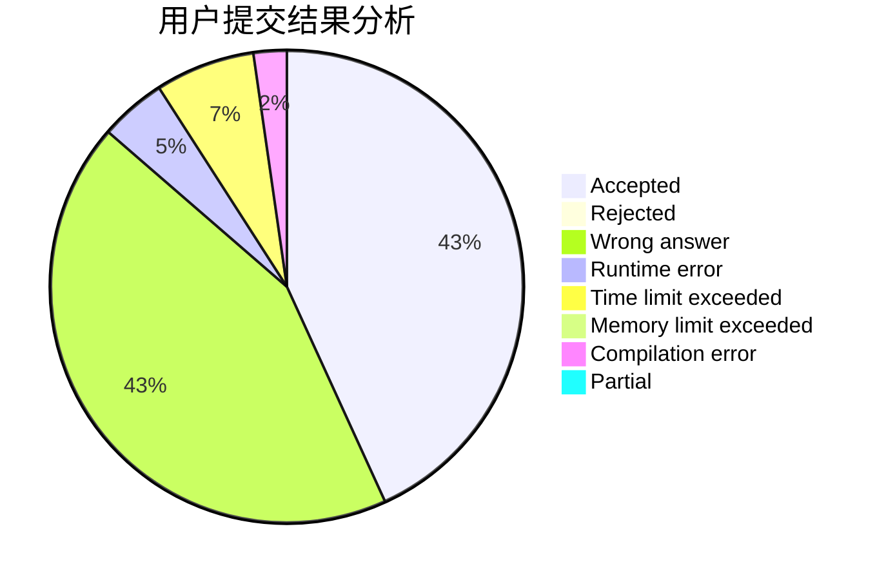
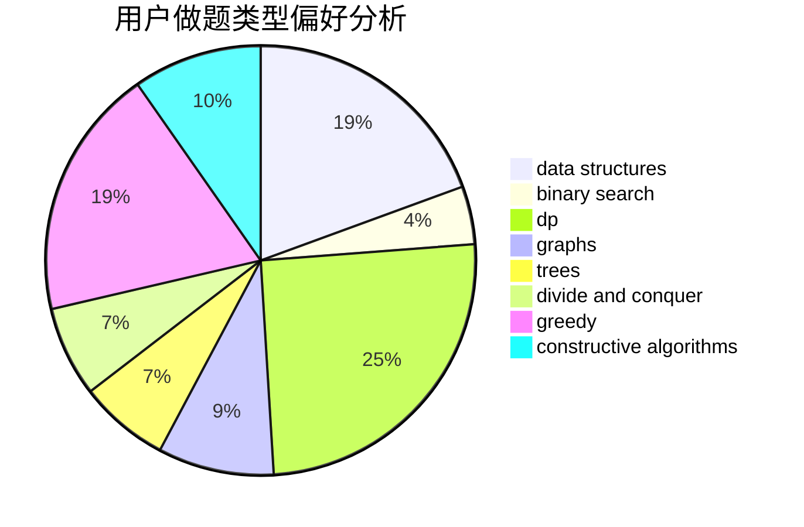

# __Neflibata

<!-- tabs:start -->

#### **用户提交结果分析**

#### **用户做题类型偏好分析**

#### **用户错题知识点分析**

<!-- tabs:end -->
# 推荐题目
[1303D](https://codeforces.com/contest/1303/problem/D)		bitmasks,
                        greedy		  
[279A](https://codeforces.com/contest/279/problem/A)		brute force,
                        geometry,
                        implementation		  
[1482B](https://codeforces.com/contest/1482/problem/B)		implementation,
                        math		  
[835E](https://codeforces.com/contest/835/problem/E)		binary search,
                        constructive algorithms,
                        interactive		  
[559B](https://codeforces.com/contest/559/problem/B)		divide and conquer,
                        hashing,
                        sortings,
                        strings		  
[938A](https://codeforces.com/contest/938/problem/A)		implementation		  
[1193A](https://codeforces.com/contest/1193/problem/A)		*special problem,
                        dp,
                        math		  
[261C](https://codeforces.com/contest/261/problem/C)		constructive algorithms,
                        dp,
                        math		  
[1085B](https://codeforces.com/contest/1085/problem/B)		math		  
[1250A](https://codeforces.com/contest/1250/problem/A)		implementation		  
