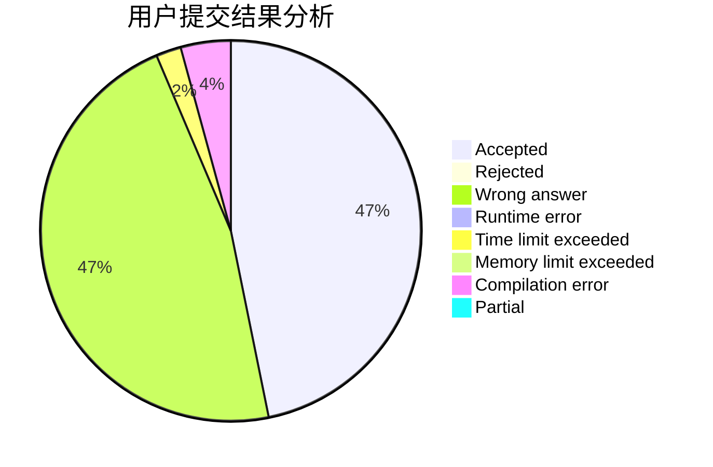
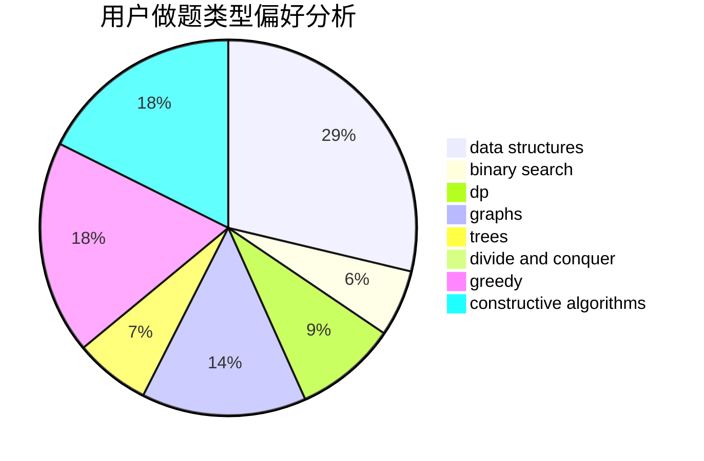

# __ONE1__

<!-- tabs:start -->

#### **用户提交结果分析**

#### **用户做题类型偏好分析**

#### **用户错题知识点分析**

<!-- tabs:end -->
# 推荐题目
[1260A](https://codeforces.com/contest/1260/problem/A)		math		  
[528D](https://codeforces.com/contest/528/problem/D)		bitmasks,
                        brute force,
                        fft		  
[913G](https://codeforces.com/contest/913/problem/G)		math,
                        number theory		  
[1336D](https://codeforces.com/contest/1336/problem/D)		constructive algorithms,
                        interactive		  
[868B](https://codeforces.com/contest/868/problem/B)		implementation		  
[1349D](https://codeforces.com/contest/1349/problem/D)		math,
                        probabilities		  
[756A](https://codeforces.com/contest/756/problem/A)		constructive algorithms,
                        dfs and similar		  
[1011D](https://codeforces.com/contest/1011/problem/D)		dsu,graphs,sortings,trees		  
[977C](https://codeforces.com/contest/977/problem/C)		sortings		  
[1214E](https://codeforces.com/contest/1214/problem/E)		constructive algorithms,
                        graphs,
                        math,
                        sortings,
                        trees		  
