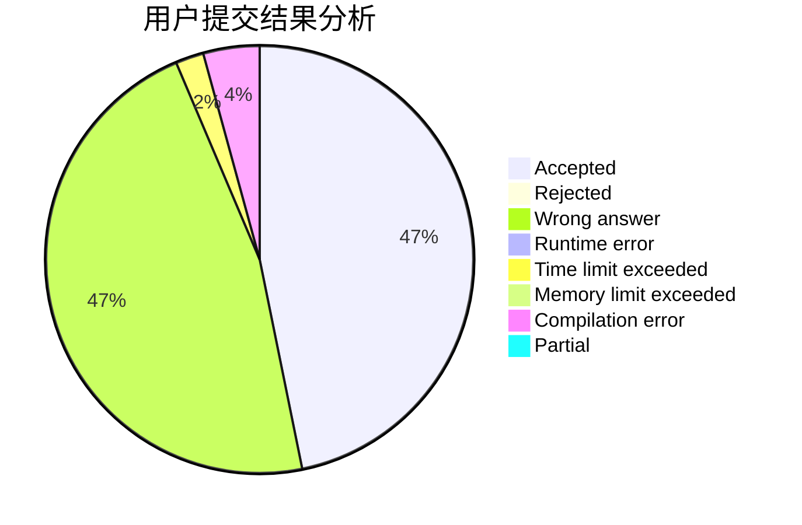
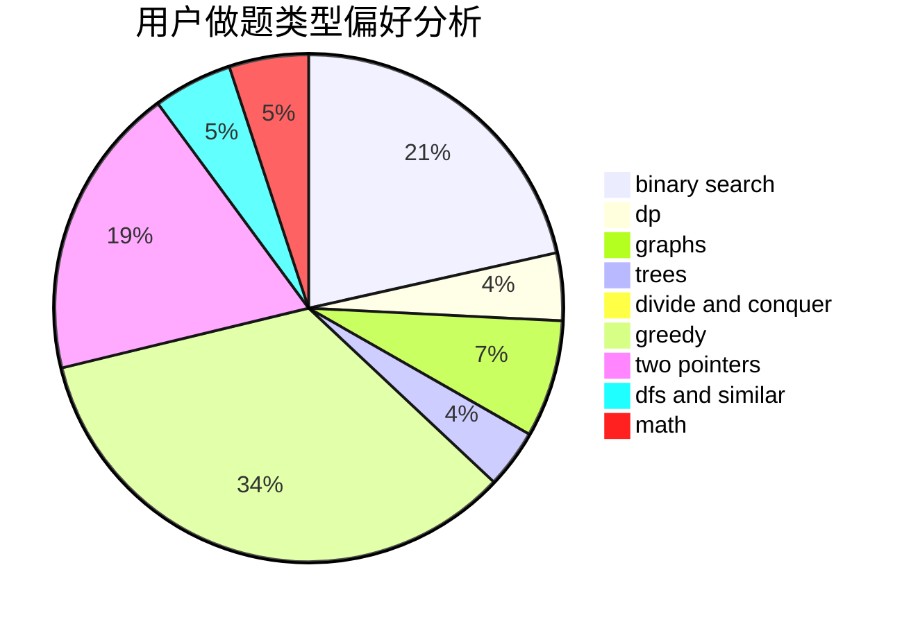

# __ONE1__

<!-- tabs:start -->

#### **用户提交结果分析**

#### **用户做题类型偏好分析**

<!-- tabs:end -->
# 推荐题目
[1260A](https://codeforces.com/contest/1260/problem/A)
[528D](https://codeforces.com/contest/528/problem/D)
[913G](https://codeforces.com/contest/913/problem/G)
[1336D](https://codeforces.com/contest/1336/problem/D)
[868B](https://codeforces.com/contest/868/problem/B)
[1349D](https://codeforces.com/contest/1349/problem/D)
[756A](https://codeforces.com/contest/756/problem/A)
[1011D](https://codeforces.com/contest/1011/problem/D)
[977C](https://codeforces.com/contest/977/problem/C)
[1214E](https://codeforces.com/contest/1214/problem/E)
