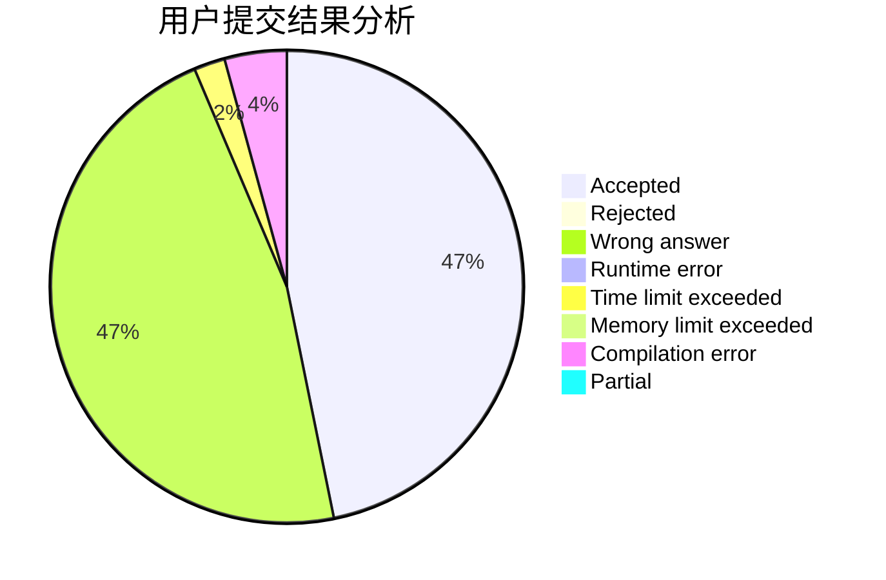
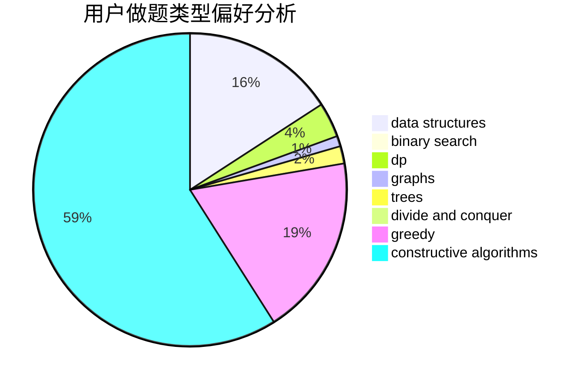
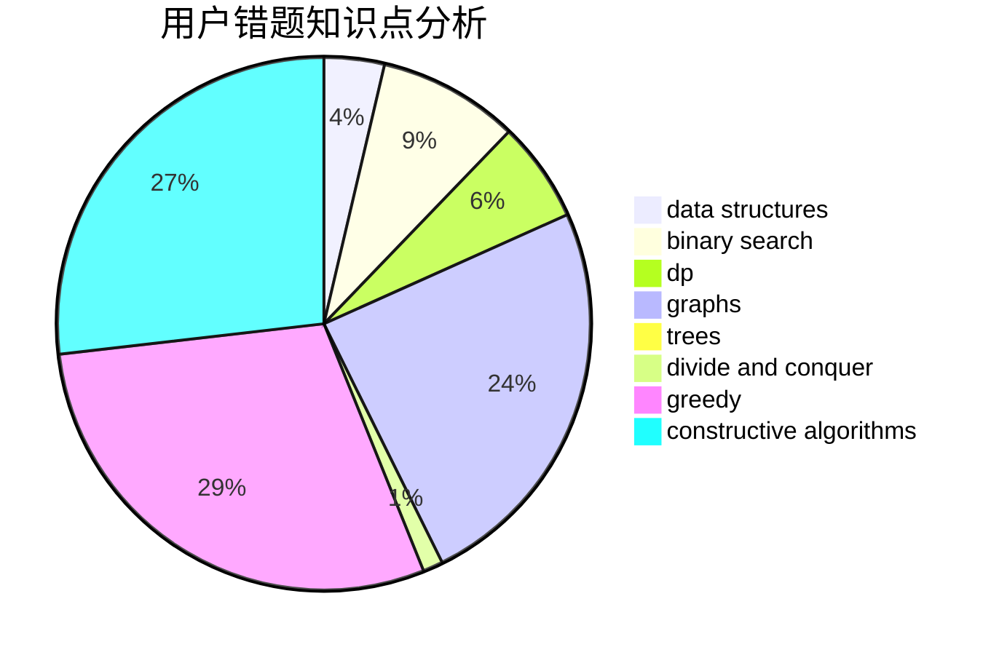

# __ONE1__

<!-- tabs:start -->

#### **用户提交结果分析**

#### **用户做题类型偏好分析**

#### **用户错题知识点分析**

<!-- tabs:end -->
# 推荐题目
[1252K](https://codeforces.com/contest/1252/problem/K)		data structures,
                        math,
                        matrices		  
[508D](https://codeforces.com/contest/508/problem/D)		dfs and similar,
                        graphs		  
[896D](https://codeforces.com/contest/896/problem/D)		chinese remainder theorem,
                        combinatorics,
                        math,
                        number theory		  
[1330D](https://codeforces.com/contest/1330/problem/D)		dsu,graphs,sortings,trees		  
[848E](https://codeforces.com/contest/848/problem/E)		combinatorics,
                        divide and conquer,
                        dp,
                        fft,
                        math		  
[1342F](https://codeforces.com/contest/1342/problem/F)		bitmasks,
                        brute force,
                        dp		  
[735B](https://codeforces.com/contest/735/problem/B)		greedy,
                        number theory,
                        sortings		  
[1011A](https://codeforces.com/contest/1011/problem/A)		greedy,
                        implementation,
                        sortings		  
[955C](https://codeforces.com/contest/955/problem/C)		binary search,
                        math,
                        number theory		  
[1209A](https://codeforces.com/contest/1209/problem/A)		greedy,
                        implementation,
                        math		  
