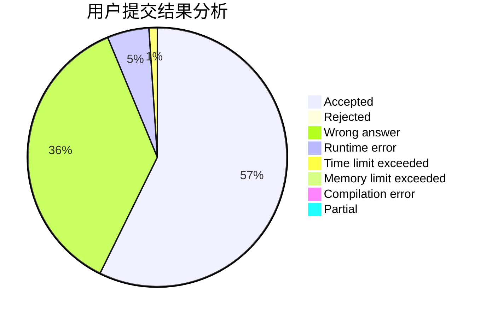
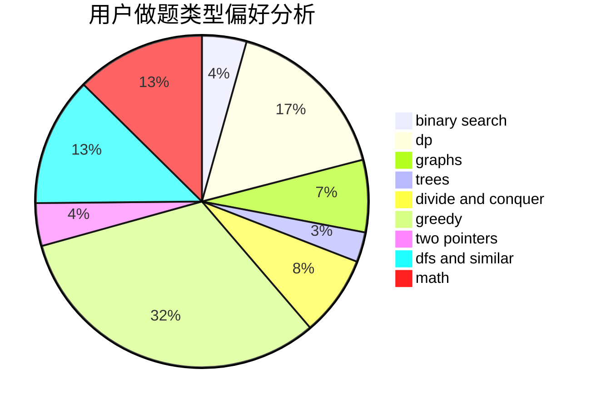

# __October

<!-- tabs:start -->

#### **用户提交结果分析**

#### **用户做题类型偏好分析**

<!-- tabs:end -->
# 推荐题目
[1341B](https://codeforces.com/contest/1341/problem/B)
[1490D](https://codeforces.com/contest/1490/problem/D)
[141B](https://codeforces.com/contest/141/problem/B)
[582A](https://codeforces.com/contest/582/problem/A)
[1163D](https://codeforces.com/contest/1163/problem/D)
[797C](https://codeforces.com/contest/797/problem/C)
[896A](https://codeforces.com/contest/896/problem/A)
[1059B](https://codeforces.com/contest/1059/problem/B)
[672C](https://codeforces.com/contest/672/problem/C)
[1059A](https://codeforces.com/contest/1059/problem/A)
