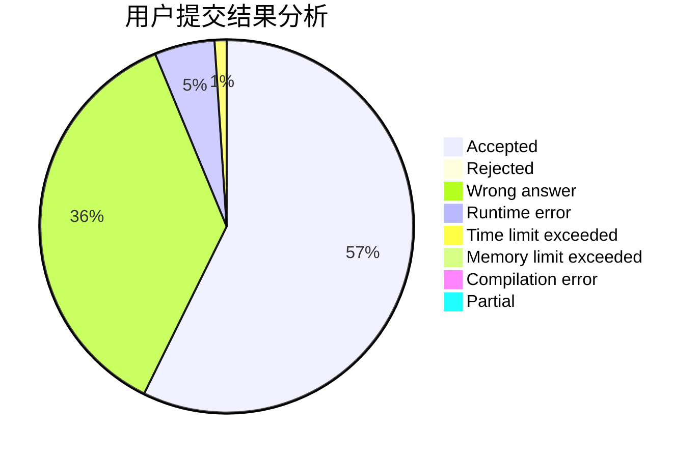
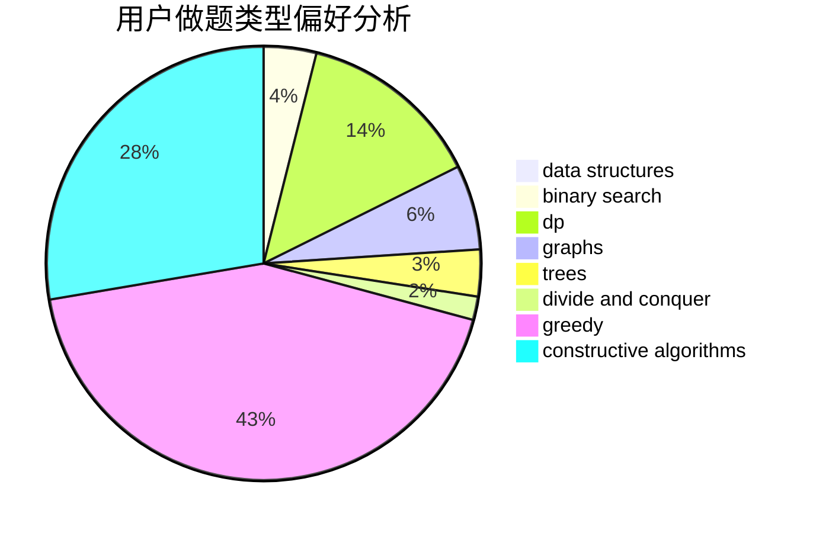

# __October

<!-- tabs:start -->

#### **用户提交结果分析**

#### **用户做题类型偏好分析**

#### **用户错题知识点分析**

<!-- tabs:end -->
# 推荐题目
[1334C](https://codeforces.com/contest/1334/problem/C)		brute force,
                        constructive algorithms,
                        greedy,
                        math		  
[1482F](https://codeforces.com/contest/1482/problem/F)		graphs,
                        shortest paths		  
[1409C](https://codeforces.com/contest/1409/problem/C)		brute force,
                        math,
                        number theory		  
[559C](https://codeforces.com/contest/559/problem/C)		combinatorics,
                        dp,
                        math,
                        number theory		  
[1161A](https://codeforces.com/contest/1161/problem/A)		dsu,graphs,sortings,trees		  
[779A](https://codeforces.com/contest/779/problem/A)		constructive algorithms,
                        math		  
[875F](https://codeforces.com/contest/875/problem/F)		dsu,
                        graphs,
                        greedy		  
[1058D](https://codeforces.com/contest/1058/problem/D)		dsu,graphs,sortings,trees		  
[645G](https://codeforces.com/contest/645/problem/G)		binary search,
                        geometry		  
[1058C](https://codeforces.com/contest/1058/problem/C)		dsu,graphs,sortings,trees		  
