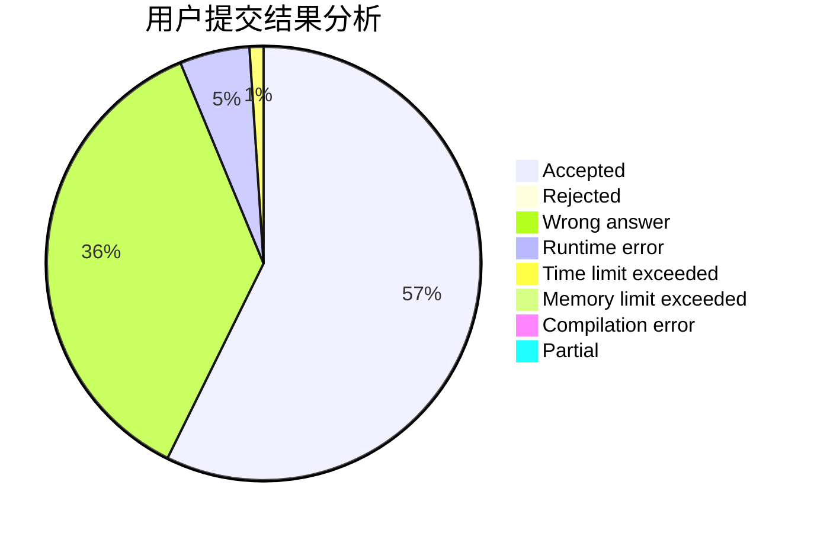
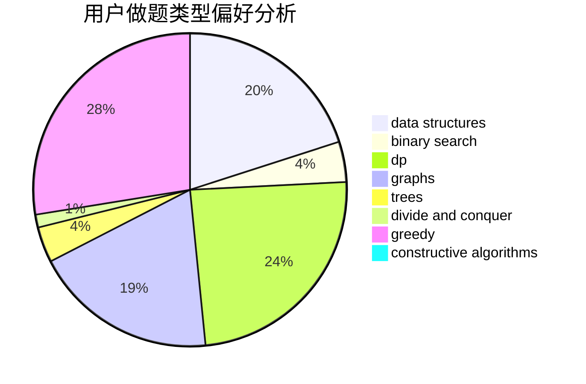

# __October

<!-- tabs:start -->

#### **用户提交结果分析**

#### **用户做题类型偏好分析**

#### **用户错题知识点分析**

<!-- tabs:end -->
# 推荐题目
[1341B](https://codeforces.com/contest/1341/problem/B)		greedy,
                        implementation		  
[1490D](https://codeforces.com/contest/1490/problem/D)		dfs and similar,
                        divide and conquer,
                        implementation		  
[141B](https://codeforces.com/contest/141/problem/B)		geometry,
                        math		  
[582A](https://codeforces.com/contest/582/problem/A)		constructive algorithms,
                        greedy,
                        number theory		  
[1163D](https://codeforces.com/contest/1163/problem/D)		dp,
                        strings		  
[797C](https://codeforces.com/contest/797/problem/C)		data structures,
                        greedy,
                        strings		  
[896A](https://codeforces.com/contest/896/problem/A)		binary search,
                        dfs and similar		  
[1059B](https://codeforces.com/contest/1059/problem/B)		implementation		  
[672C](https://codeforces.com/contest/672/problem/C)		dsu,graphs,sortings,trees		  
[1059A](https://codeforces.com/contest/1059/problem/A)		implementation		  
