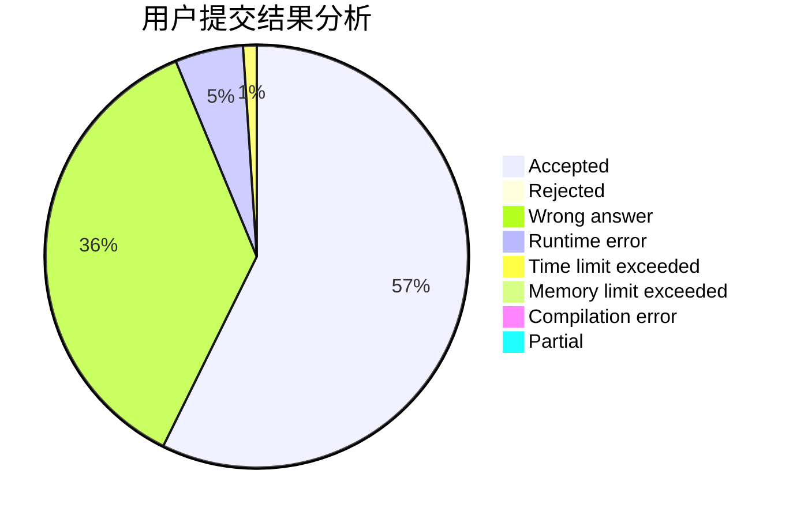
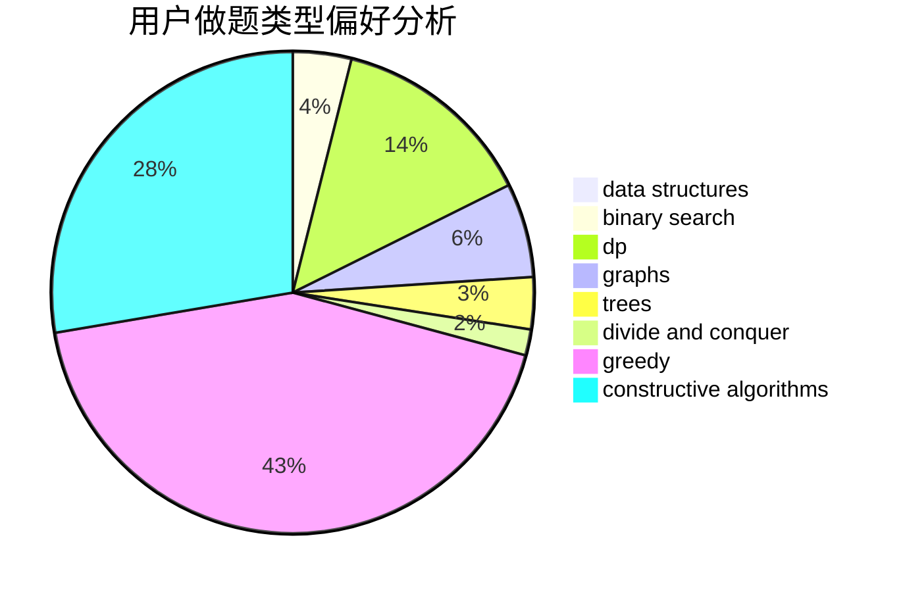

# __October
<!-- tabs:start -->
#### **用户提交结果分析**

#### **用户做题类型偏好分析**

#### **用户错题知识点分析**

<!-- tabs:end -->
# 推荐题目
[Royal Questions](http://codeforces.com/problemset/problem/875/F)		dsu,
                        graphs,
                        greedy		  
[Vasya and Triangle](https://codeforces.com/contest/1058/problem/D)		geometry,
                        number theory		  
[Vasya and Golden Ticket](https://codeforces.com/contest/1058/problem/C)		implementation		  
[Gerald and Giant Chess](http://codeforces.com/problemset/problem/559/C)		combinatorics,
                        dp,
                        math,
                        number theory		  
[Pupils Redistribution](http://codeforces.com/problemset/problem/779/A)		constructive algorithms,
                        math		  
[Armistice Area Apportionment](http://codeforces.com/problemset/problem/645/G)		binary search,
                        geometry		  
[Weird journey](http://codeforces.com/problemset/problem/788/B)		combinatorics,
                        constructive algorithms,
                        dfs and similar,
                        dsu,
                        graphs		  
[Nagini](http://codeforces.com/problemset/problem/855/F)		binary search,
                        data structures		  
[Rainbow Coins](https://codeforces.com/contest/1161/problem/E)		interactive		  
[Not Equal on a Segment](http://codeforces.com/problemset/problem/622/C)		data structures,
                        implementation		  
<!-- tabs:start -->
#### **data structures**
[Royal Questions](http://codeforces.com/problemset/problem/855/F)		binary search,
                        data structures		  
[Vasya and Triangle](http://codeforces.com/problemset/problem/622/C)		data structures,
                        implementation		  
[Vasya and Golden Ticket](http://codeforces.com/problemset/problem/1104/B)		data structures,
                        implementation,
                        math		  
[Gerald and Giant Chess](http://codeforces.com/problemset/problem/1151/E)		combinatorics,
                        data structures,
                        dp,
                        math		  
[Pupils Redistribution](http://codeforces.com/problemset/problem/1497/E2)		data structures,
                        dp,
                        greedy,
                        math,
                        number theory,
                        two pointers		  
[Armistice Area Apportionment](http://codeforces.com/problemset/problem/1439/C)		binary search,
                        data structures,
                        divide and conquer,
                        greedy,
                        implementation		  
[Weird journey](http://codeforces.com/problemset/problem/1492/C)		binary search,
                        data structures,
                        dp,
                        greedy,
                        two pointers		  
[Nagini](http://codeforces.com/problemset/problem/1490/G)		binary search,
                        data structures,
                        math		  
[Rainbow Coins](http://codeforces.com/problemset/problem/1479/D)		binary search,
                        bitmasks,
                        brute force,
                        data structures,
                        probabilities,
                        trees		  
[Not Equal on a Segment](http://codeforces.com/problemset/problem/1497/A)		brute force,
                        data structures,
                        greedy,
                        sortings		  
#### **binary search**
[Royal Questions](http://codeforces.com/problemset/problem/645/G)		binary search,
                        geometry		  
[Vasya and Triangle](http://codeforces.com/problemset/problem/855/F)		binary search,
                        data structures		  
[Vasya and Golden Ticket](http://codeforces.com/problemset/problem/939/C)		binary search,
                        two pointers		  
[Gerald and Giant Chess](http://codeforces.com/problemset/problem/166/A)		binary search,
                        implementation,
                        sortings		  
[Pupils Redistribution](http://codeforces.com/problemset/problem/1183/C)		binary search,
                        math		  
[Armistice Area Apportionment](http://codeforces.com/problemset/problem/1439/C)		binary search,
                        data structures,
                        divide and conquer,
                        greedy,
                        implementation		  
[Weird journey](http://codeforces.com/problemset/problem/1492/C)		binary search,
                        data structures,
                        dp,
                        greedy,
                        two pointers		  
[Nagini](http://codeforces.com/problemset/problem/1463/D)		binary search,
                        constructive algorithms,
                        greedy,
                        two pointers		  
[Rainbow Coins](http://codeforces.com/problemset/problem/1490/G)		binary search,
                        data structures,
                        math		  
[Not Equal on a Segment](http://codeforces.com/problemset/problem/1479/D)		binary search,
                        bitmasks,
                        brute force,
                        data structures,
                        probabilities,
                        trees		  
#### **dp**
[Royal Questions](http://codeforces.com/problemset/problem/559/C)		combinatorics,
                        dp,
                        math,
                        number theory		  
[Vasya and Triangle](http://codeforces.com/problemset/problem/980/D)		dp,
                        math,
                        number theory		  
[Vasya and Golden Ticket](http://codeforces.com/problemset/problem/427/D)		dp,
                        string suffix structures,
                        strings		  
[Gerald and Giant Chess](http://codeforces.com/problemset/problem/1389/G)		dfs and similar,
                        dp,
                        graphs,
                        trees		  
[Pupils Redistribution](http://codeforces.com/problemset/problem/1151/E)		combinatorics,
                        data structures,
                        dp,
                        math		  
[Armistice Area Apportionment](http://codeforces.com/problemset/problem/788/A)		dp,
                        two pointers		  
[Weird journey](http://codeforces.com/problemset/problem/1497/E2)		data structures,
                        dp,
                        greedy,
                        math,
                        number theory,
                        two pointers		  
[Nagini](http://codeforces.com/problemset/problem/1455/D)		dp,
                        greedy,
                        sortings		  
[Rainbow Coins](http://codeforces.com/problemset/problem/1478/B)		brute force,
                        dp,
                        greedy,
                        math		  
[Not Equal on a Segment](http://codeforces.com/problemset/problem/1492/C)		binary search,
                        data structures,
                        dp,
                        greedy,
                        two pointers		  
#### **graph**
[Royal Questions](http://codeforces.com/problemset/problem/875/F)		dsu,
                        graphs,
                        greedy		  
[Vasya and Triangle](http://codeforces.com/problemset/problem/788/B)		combinatorics,
                        constructive algorithms,
                        dfs and similar,
                        dsu,
                        graphs		  
[Vasya and Golden Ticket](https://codeforces.com/contest/1161/problem/A)		graphs		  
[Gerald and Giant Chess](http://codeforces.com/problemset/problem/1482/F)		graphs,
                        shortest paths		  
[Pupils Redistribution](http://codeforces.com/problemset/problem/852/I)		brute force,
                        dfs and similar,
                        graphs,
                        trees		  
[Armistice Area Apportionment](http://codeforces.com/problemset/problem/1389/G)		dfs and similar,
                        dp,
                        graphs,
                        trees		  
[Weird journey](http://codeforces.com/problemset/problem/1133/F1)		graphs		  
[Nagini](http://codeforces.com/problemset/problem/811/D)		constructive algorithms,
                        dfs and similar,
                        graphs,
                        interactive		  
[Rainbow Coins](http://codeforces.com/problemset/problem/1487/C)		brute force,
                        constructive algorithms,
                        dfs and similar,
                        graphs,
                        greedy,
                        implementation,
                        math		  
[Not Equal on a Segment](http://codeforces.com/problemset/problem/1437/C)		dp,
                        flows,
                        graph matchings,
                        greedy,
                        math,
                        sortings		  
#### **trees**
[Royal Questions](http://codeforces.com/problemset/problem/852/I)		brute force,
                        dfs and similar,
                        graphs,
                        trees		  
[Vasya and Triangle](http://codeforces.com/problemset/problem/573/C)		constructive algorithms,
                        dfs and similar,
                        trees		  
[Vasya and Golden Ticket](http://codeforces.com/problemset/problem/1389/G)		dfs and similar,
                        dp,
                        graphs,
                        trees		  
[Gerald and Giant Chess](http://codeforces.com/problemset/problem/1479/D)		binary search,
                        bitmasks,
                        brute force,
                        data structures,
                        probabilities,
                        trees		  
[Pupils Redistribution](http://codeforces.com/problemset/problem/1511/C)		brute force,
                        data structures,
                        implementation,
                        trees		  
[Armistice Area Apportionment](http://codeforces.com/problemset/problem/1499/F)		combinatorics,
                        dfs and similar,
                        dp,
                        trees		  
[Weird journey](http://codeforces.com/problemset/problem/1491/E)		brute force,
                        dfs and similar,
                        divide and conquer,
                        number theory,
                        trees		  
[Nagini](http://codeforces.com/problemset/problem/1466/D)		data structures,
                        greedy,
                        sortings,
                        trees		  
[Rainbow Coins](http://codeforces.com/problemset/problem/1495/D)		combinatorics,
                        dfs and similar,
                        graphs,
                        math,
                        shortest paths,
                        trees		  
[Not Equal on a Segment](http://codeforces.com/problemset/problem/1303/G)		data structures,
                        divide and conquer,
                        geometry,
                        trees		  
#### **divide and conquer**
[Royal Questions](http://codeforces.com/problemset/problem/1439/C)		binary search,
                        data structures,
                        divide and conquer,
                        greedy,
                        implementation		  
[Vasya and Triangle](http://codeforces.com/problemset/problem/1461/D)		binary search,
                        brute force,
                        data structures,
                        divide and conquer,
                        implementation,
                        sortings		  
[Vasya and Golden Ticket](http://codeforces.com/problemset/problem/1466/G)		combinatorics,
                        divide and conquer,
                        hashing,
                        math,
                        string suffix structures,
                        strings		  
[Gerald and Giant Chess](http://codeforces.com/problemset/problem/1490/D)		dfs and similar,
                        divide and conquer,
                        implementation		  
[Pupils Redistribution](https://codeforces.com/contest/1483/problem/C)		data structures,
                        divide and conquer,
                        dp		  
[Armistice Area Apportionment](http://codeforces.com/problemset/problem/1491/E)		brute force,
                        dfs and similar,
                        divide and conquer,
                        number theory,
                        trees		  
[Weird journey](http://codeforces.com/problemset/problem/1303/G)		data structures,
                        divide and conquer,
                        geometry,
                        trees		  
[Nagini](http://codeforces.com/problemset/problem/1494/D)		constructive algorithms,
                        data structures,
                        dfs and similar,
                        divide and conquer,
                        dsu,
                        greedy,
                        sortings,
                        trees		  
[Rainbow Coins](http://codeforces.com/problemset/problem/1482/E)		data structures,
                        divide and conquer,
                        dp		  
[Not Equal on a Segment](http://codeforces.com/problemset/problem/566/C)		dfs and similar,
                        divide and conquer,
                        trees		  
#### **greedy**
[Royal Questions](http://codeforces.com/problemset/problem/875/F)		dsu,
                        graphs,
                        greedy		  
[Vasya and Triangle](http://codeforces.com/problemset/problem/1117/B)		greedy,
                        math,
                        sortings		  
[Vasya and Golden Ticket](http://codeforces.com/problemset/problem/1155/B)		games,
                        greedy,
                        implementation		  
[Gerald and Giant Chess](http://codeforces.com/problemset/problem/1334/C)		brute force,
                        constructive algorithms,
                        greedy,
                        math		  
[Pupils Redistribution](http://codeforces.com/problemset/problem/1113/B)		greedy,
                        number theory		  
[Armistice Area Apportionment](http://codeforces.com/problemset/problem/1497/E2)		data structures,
                        dp,
                        greedy,
                        math,
                        number theory,
                        two pointers		  
[Weird journey](http://codeforces.com/problemset/problem/1439/C)		binary search,
                        data structures,
                        divide and conquer,
                        greedy,
                        implementation		  
[Nagini](http://codeforces.com/problemset/problem/1455/D)		dp,
                        greedy,
                        sortings		  
[Rainbow Coins](http://codeforces.com/problemset/problem/1478/B)		brute force,
                        dp,
                        greedy,
                        math		  
[Not Equal on a Segment](http://codeforces.com/problemset/problem/1492/C)		binary search,
                        data structures,
                        dp,
                        greedy,
                        two pointers		  
#### **constructive algorithms**
[Royal Questions](http://codeforces.com/problemset/problem/779/A)		constructive algorithms,
                        math		  
[Vasya and Triangle](http://codeforces.com/problemset/problem/788/B)		combinatorics,
                        constructive algorithms,
                        dfs and similar,
                        dsu,
                        graphs		  
[Vasya and Golden Ticket](http://codeforces.com/problemset/problem/573/C)		constructive algorithms,
                        dfs and similar,
                        trees		  
[Gerald and Giant Chess](http://codeforces.com/problemset/problem/1267/L)		constructive algorithms,
                        strings		  
[Pupils Redistribution](http://codeforces.com/problemset/problem/1334/C)		brute force,
                        constructive algorithms,
                        greedy,
                        math		  
[Armistice Area Apportionment](http://codeforces.com/problemset/problem/811/D)		constructive algorithms,
                        dfs and similar,
                        graphs,
                        interactive		  
[Weird journey](http://codeforces.com/problemset/problem/1493/A)		constructive algorithms,
                        greedy		  
[Nagini](http://codeforces.com/problemset/problem/1463/D)		binary search,
                        constructive algorithms,
                        greedy,
                        two pointers		  
[Rainbow Coins](https://codeforces.com/contest/1456/problem/B)		bitmasks,
                        brute force,
                        constructive algorithms		  
[Not Equal on a Segment](http://codeforces.com/problemset/problem/1492/D)		bitmasks,
                        constructive algorithms,
                        greedy,
                        math		  
#### **sortings**
[Royal Questions](http://codeforces.com/problemset/problem/1117/B)		greedy,
                        math,
                        sortings		  
[Vasya and Triangle](http://codeforces.com/problemset/problem/166/A)		binary search,
                        implementation,
                        sortings		  
[Vasya and Golden Ticket](http://codeforces.com/problemset/problem/1311/B)		dfs and similar,
                        sortings		  
[Gerald and Giant Chess](http://codeforces.com/problemset/problem/1455/D)		dp,
                        greedy,
                        sortings		  
[Pupils Redistribution](https://codeforces.com/contest/1496/problem/C)		geometry,
                        greedy,
                        math,
                        sortings		  
[Armistice Area Apportionment](http://codeforces.com/problemset/problem/1495/A)		geometry,
                        greedy,
                        math,
                        sortings		  
[Weird journey](http://codeforces.com/problemset/problem/1497/A)		brute force,
                        data structures,
                        greedy,
                        sortings		  
[Nagini](http://codeforces.com/problemset/problem/1427/A)		math,
                        sortings		  
[Rainbow Coins](http://codeforces.com/problemset/problem/1461/D)		binary search,
                        brute force,
                        data structures,
                        divide and conquer,
                        implementation,
                        sortings		  
[Not Equal on a Segment](http://codeforces.com/problemset/problem/1437/C)		dp,
                        flows,
                        graph matchings,
                        greedy,
                        math,
                        sortings		  
<!-- tabs:end -->
