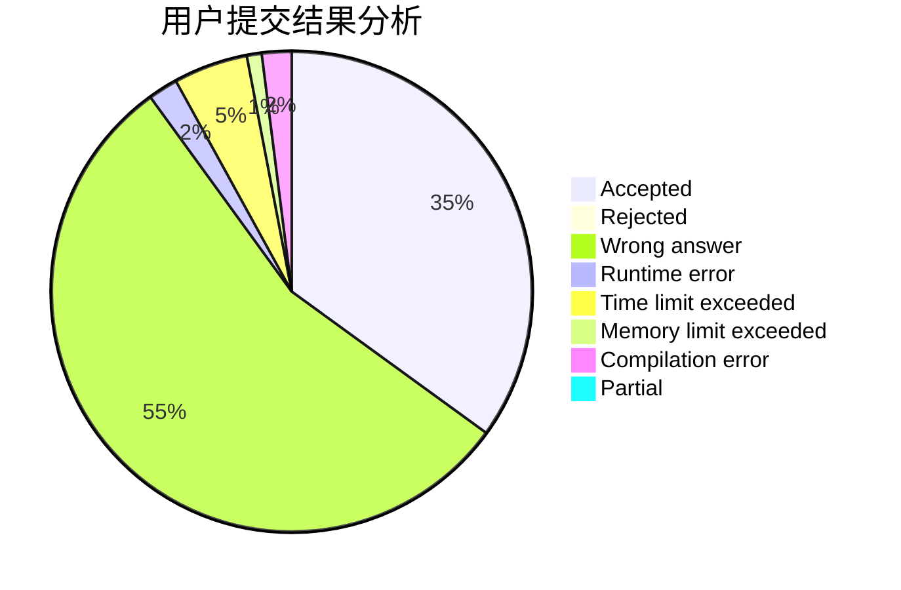
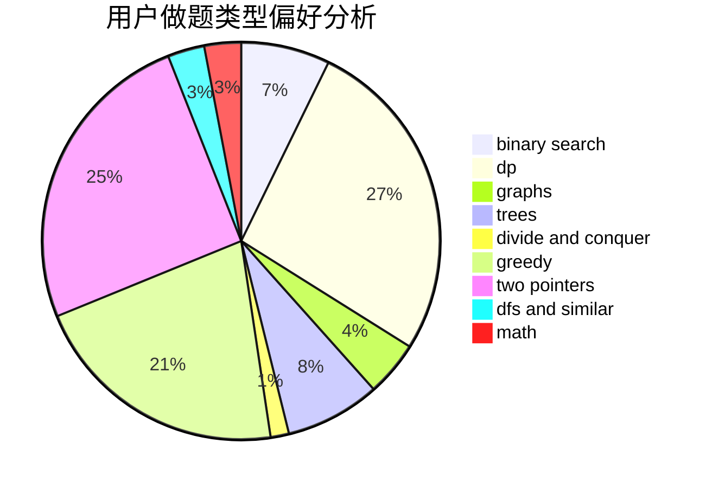

# __Wind__

<!-- tabs:start -->

#### **用户提交结果分析**

#### **用户做题类型偏好分析**

<!-- tabs:end -->
# 推荐题目
[579A](https://codeforces.com/contest/579/problem/A)
[1225A](https://codeforces.com/contest/1225/problem/A)
[1176E](https://codeforces.com/contest/1176/problem/E)
[770C](https://codeforces.com/contest/770/problem/C)
[863E](https://codeforces.com/contest/863/problem/E)
[584E](https://codeforces.com/contest/584/problem/E)
[287C](https://codeforces.com/contest/287/problem/C)
[409B](https://codeforces.com/contest/409/problem/B)
[436A](https://codeforces.com/contest/436/problem/A)
[696F](https://codeforces.com/contest/696/problem/F)
