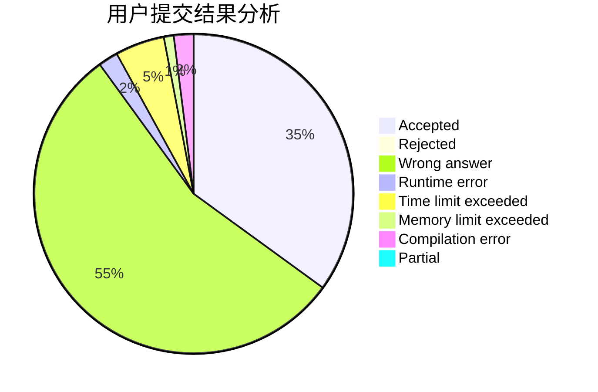
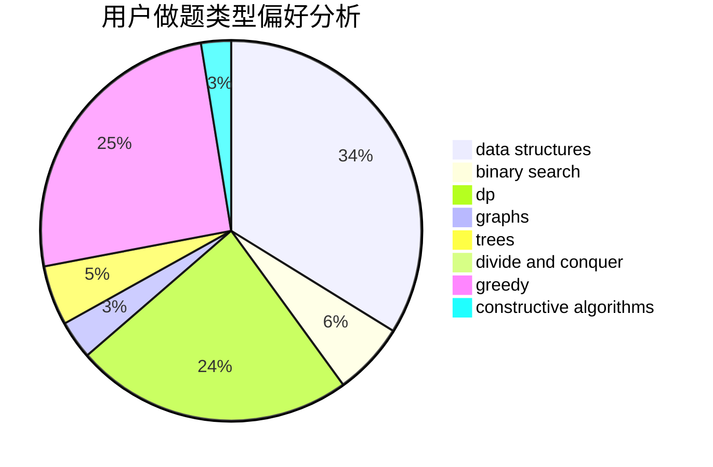

# __Wind__

<!-- tabs:start -->

#### **用户提交结果分析**

#### **用户做题类型偏好分析**

#### **用户错题知识点分析**

<!-- tabs:end -->
# 推荐题目
[579A](https://codeforces.com/contest/579/problem/A)		bitmasks		  
[1225A](https://codeforces.com/contest/1225/problem/A)		math		  
[1176E](https://codeforces.com/contest/1176/problem/E)		dfs and similar,
                        dsu,
                        graphs,
                        shortest paths,
                        trees		  
[770C](https://codeforces.com/contest/770/problem/C)		*special problem,
                        dfs and similar,
                        graphs,
                        implementation		  
[863E](https://codeforces.com/contest/863/problem/E)		data structures,
                        sortings		  
[584E](https://codeforces.com/contest/584/problem/E)		constructive algorithms,
                        greedy,
                        math		  
[287C](https://codeforces.com/contest/287/problem/C)		dsu,graphs,sortings,trees		  
[409B](https://codeforces.com/contest/409/problem/B)		*special problem		  
[436A](https://codeforces.com/contest/436/problem/A)		greedy		  
[696F](https://codeforces.com/contest/696/problem/F)		binary search,
                        geometry,
                        two pointers		  
