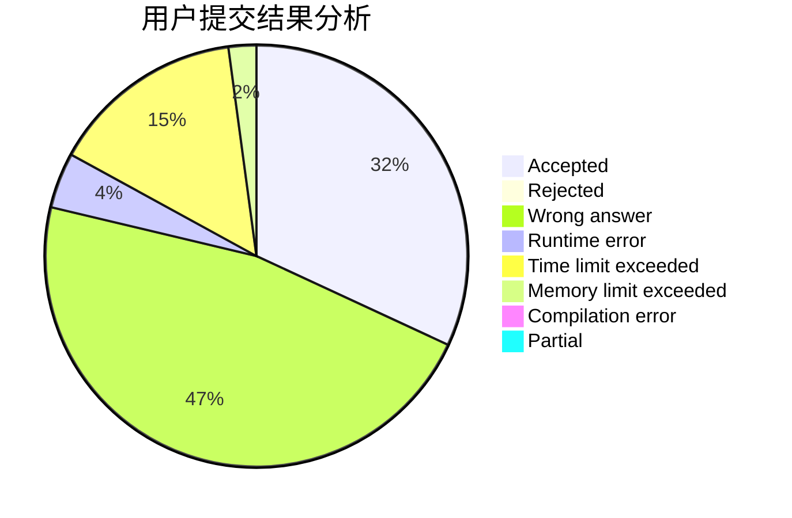
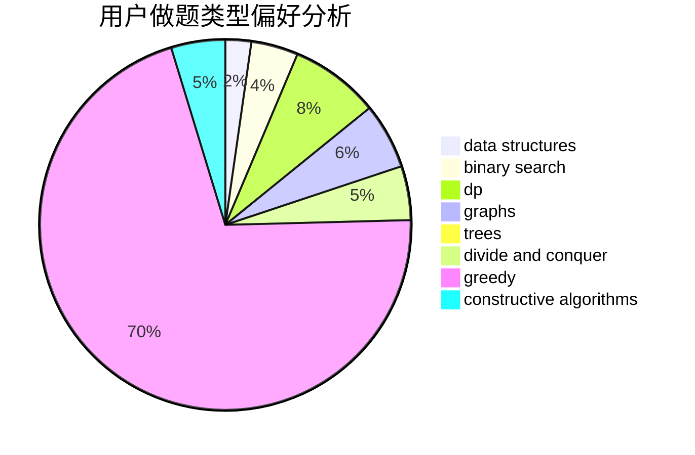
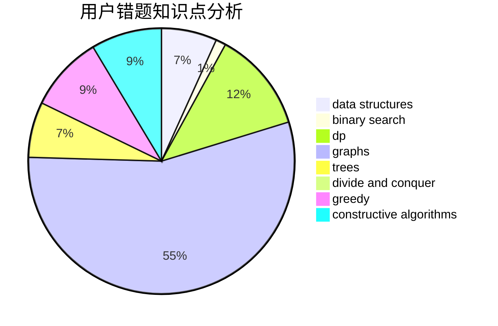

# __yuki__

<!-- tabs:start -->

#### **用户提交结果分析**

#### **用户做题类型偏好分析**

#### **用户错题知识点分析**

<!-- tabs:end -->
# 推荐题目
[1385G](https://codeforces.com/contest/1385/problem/G)		2-sat,
                        dfs and similar,
                        dsu,
                        graphs,
                        implementation		  
[1073A](https://codeforces.com/contest/1073/problem/A)		implementation,
                        strings		  
[950B](https://codeforces.com/contest/950/problem/B)		greedy,
                        implementation		  
[1483A](https://codeforces.com/contest/1483/problem/A)		dsu,graphs,sortings,trees		  
[707D](https://codeforces.com/contest/707/problem/D)		bitmasks,
                        data structures,
                        dfs and similar,
                        implementation		  
[271A](https://codeforces.com/contest/271/problem/A)		brute force		  
[805D](https://codeforces.com/contest/805/problem/D)		dsu,graphs,sortings,trees		  
[493D](https://codeforces.com/contest/493/problem/D)		constructive algorithms,
                        games,
                        math		  
[888D](https://codeforces.com/contest/888/problem/D)		combinatorics,
                        dp,
                        math		  
[713E](https://codeforces.com/contest/713/problem/E)		binary search,
                        dp		  
