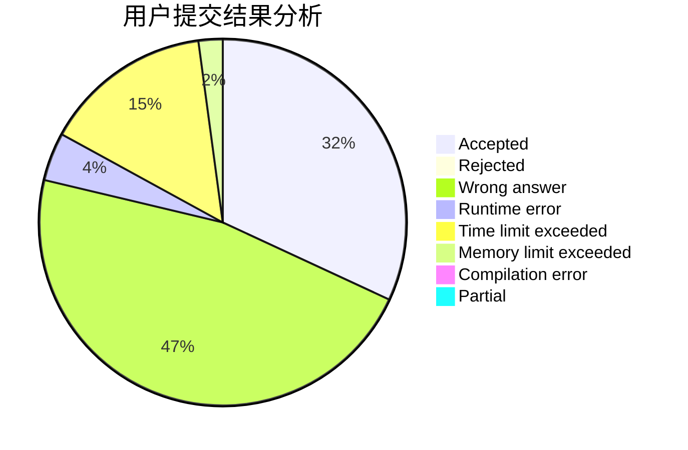
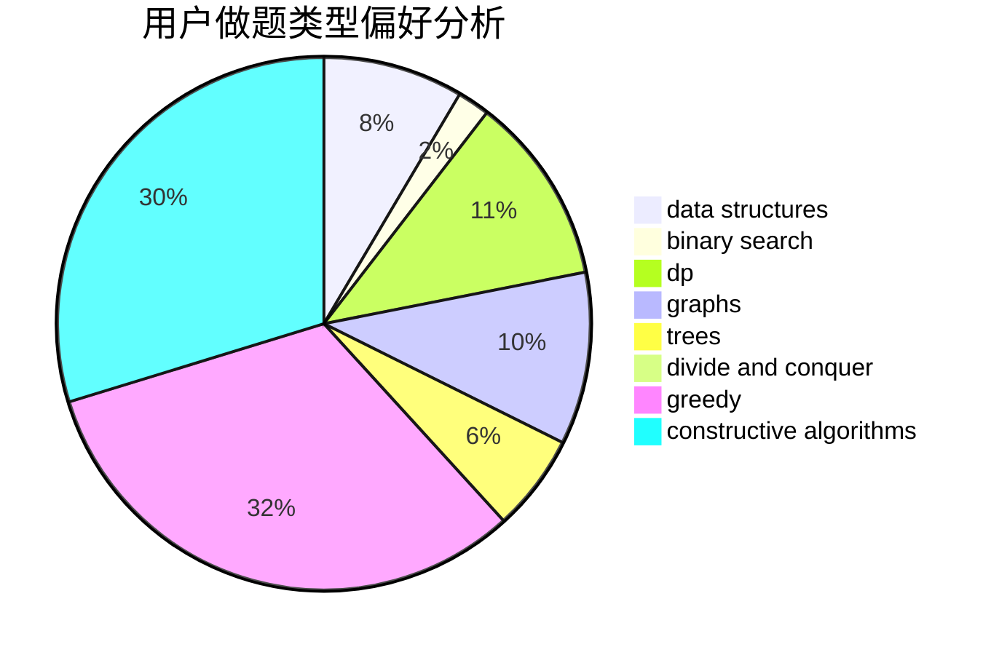
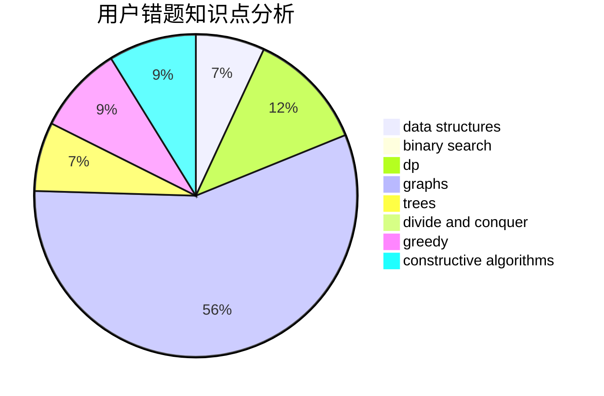

# __yuki__

<!-- tabs:start -->

#### **用户提交结果分析**

#### **用户做题类型偏好分析**

#### **用户错题知识点分析**

<!-- tabs:end -->
# 推荐题目
[1396A](https://codeforces.com/contest/1396/problem/A)		constructive algorithms,
                        greedy,
                        number theory		  
[1073D](https://codeforces.com/contest/1073/problem/D)		binary search,
                        brute force,
                        data structures,
                        greedy		  
[967D](https://codeforces.com/contest/967/problem/D)		dsu,graphs,sortings,trees		  
[1490F](https://codeforces.com/contest/1490/problem/F)		binary search,
                        data structures,
                        greedy,
                        math,
                        sortings		  
[725F](https://codeforces.com/contest/725/problem/F)		games,
                        greedy		  
[287C](https://codeforces.com/contest/287/problem/C)		dsu,graphs,sortings,trees		  
[822A](https://codeforces.com/contest/822/problem/A)		implementation,
                        math,
                        number theory		  
[513A](https://codeforces.com/contest/513/problem/A)		constructive algorithms,
                        math		  
[908B](https://codeforces.com/contest/908/problem/B)		brute force,
                        implementation		  
[732E](https://codeforces.com/contest/732/problem/E)		greedy,
                        sortings		  
