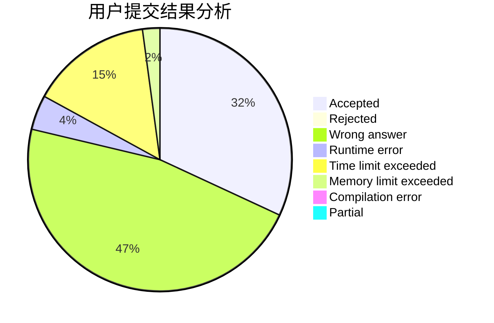
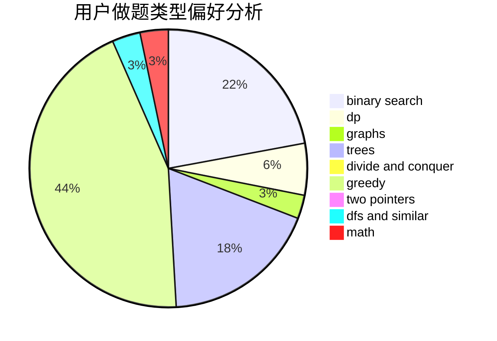

# __yuki__

<!-- tabs:start -->

#### **用户提交结果分析**

#### **用户做题类型偏好分析**

<!-- tabs:end -->
# 推荐题目
[1396A](https://codeforces.com/contest/1396/problem/A)
[1073D](https://codeforces.com/contest/1073/problem/D)
[967D](https://codeforces.com/contest/967/problem/D)
[1490F](https://codeforces.com/contest/1490/problem/F)
[725F](https://codeforces.com/contest/725/problem/F)
[287C](https://codeforces.com/contest/287/problem/C)
[822A](https://codeforces.com/contest/822/problem/A)
[513A](https://codeforces.com/contest/513/problem/A)
[908B](https://codeforces.com/contest/908/problem/B)
[732E](https://codeforces.com/contest/732/problem/E)
