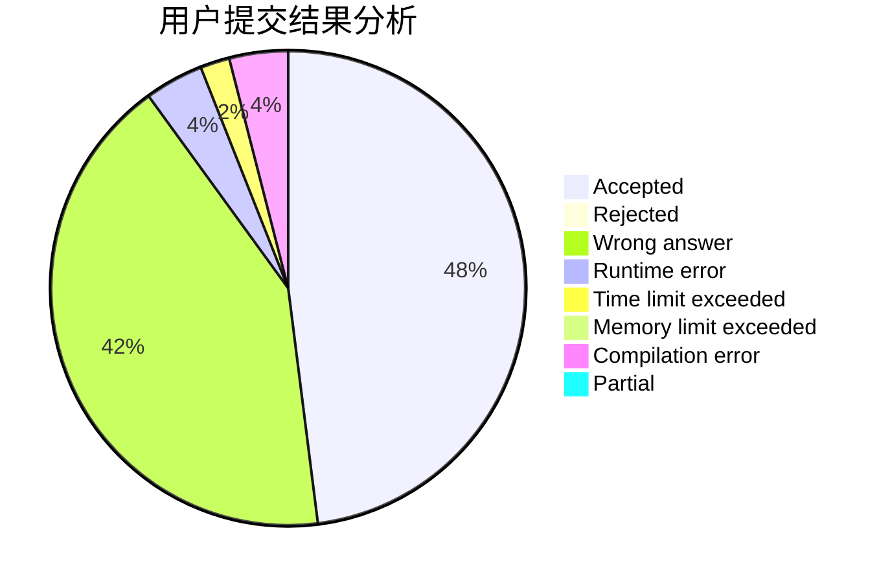
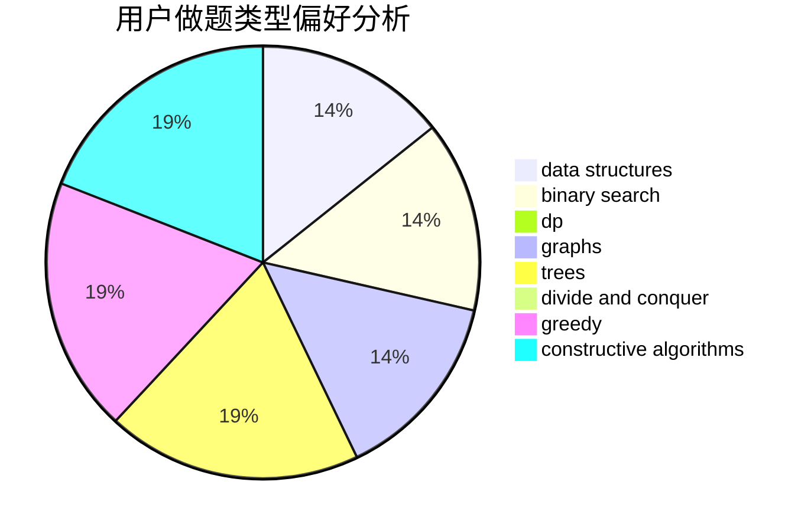

# _dne

<!-- tabs:start -->

#### **用户提交结果分析**

#### **用户做题类型偏好分析**

#### **用户错题知识点分析**

<!-- tabs:end -->
# 推荐题目
[778D](https://codeforces.com/contest/778/problem/D)		constructive algorithms		  
[39C](https://codeforces.com/contest/39/problem/C)		dp,
                        sortings		  
[463B](https://codeforces.com/contest/463/problem/B)		brute force,
                        implementation,
                        math		  
[1081D](https://codeforces.com/contest/1081/problem/D)		dsu,
                        graphs,
                        shortest paths,
                        sortings		  
[1199A](https://codeforces.com/contest/1199/problem/A)		implementation		  
[1504D](https://codeforces.com/contest/1504/problem/D)		dsu,graphs,sortings,trees		  
[1490C](https://codeforces.com/contest/1490/problem/C)		binary search,
                        brute force,
                        brute force,
                        math		  
[1497B](https://codeforces.com/contest/1497/problem/B)		constructive algorithms,
                        greedy,
                        math		  
[1491C](https://codeforces.com/contest/1491/problem/C)		brute force,
                        data structures,
                        dp,
                        greedy,
                        implementation		  
[1484C](https://codeforces.com/contest/1484/problem/C)		dsu,graphs,sortings,trees		  
