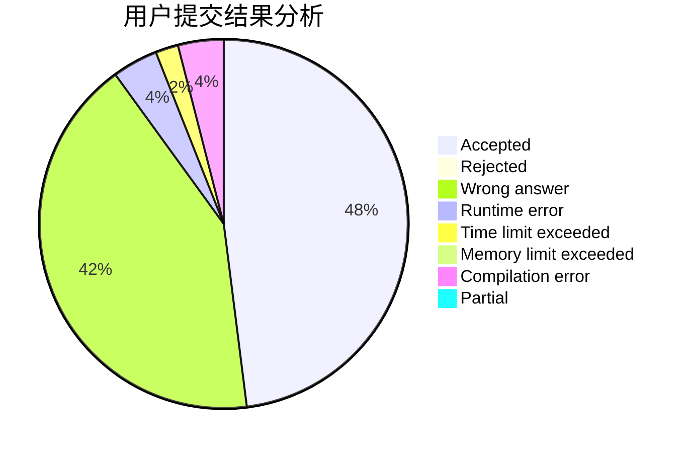
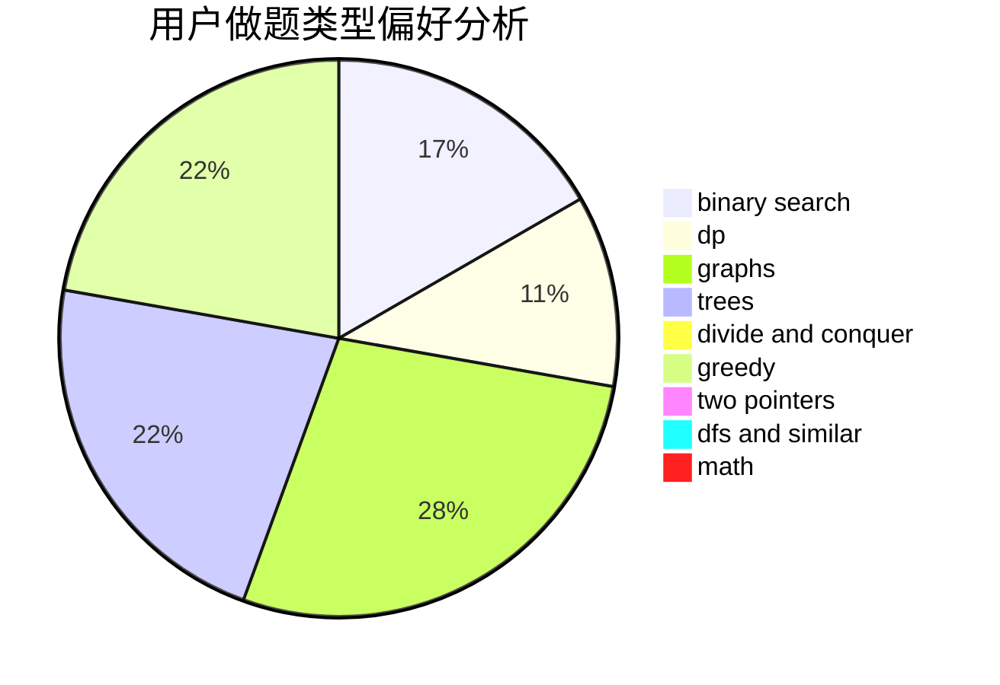

# _dne

<!-- tabs:start -->

#### **用户提交结果分析**

#### **用户做题类型偏好分析**

<!-- tabs:end -->
# 推荐题目
[778D](https://codeforces.com/contest/778/problem/D)
[39C](https://codeforces.com/contest/39/problem/C)
[463B](https://codeforces.com/contest/463/problem/B)
[1081D](https://codeforces.com/contest/1081/problem/D)
[1199A](https://codeforces.com/contest/1199/problem/A)
[1504D](https://codeforces.com/contest/1504/problem/D)
[1490C](https://codeforces.com/contest/1490/problem/C)
[1497B](https://codeforces.com/contest/1497/problem/B)
[1491C](https://codeforces.com/contest/1491/problem/C)
[1484C](https://codeforces.com/contest/1484/problem/C)
