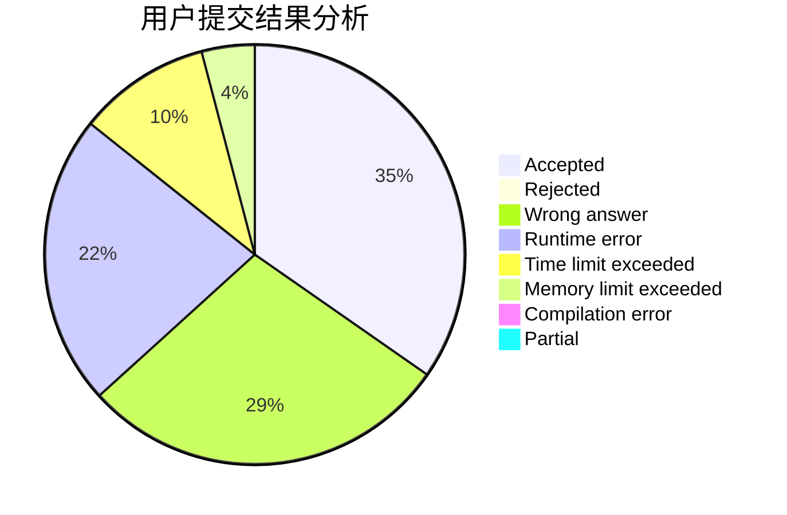
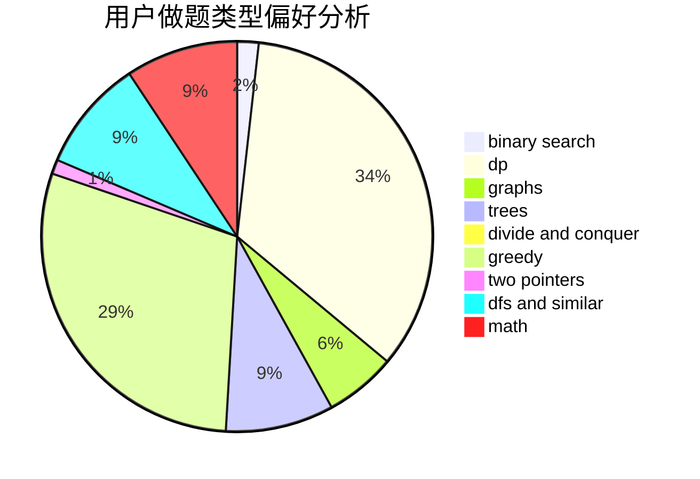

# _elgir

<!-- tabs:start -->

#### **用户提交结果分析**

#### **用户做题类型偏好分析**

<!-- tabs:end -->
# 推荐题目
[1511E](https://codeforces.com/contest/1511/problem/E)
[1295D](https://codeforces.com/contest/1295/problem/D)
[1466H](https://codeforces.com/contest/1466/problem/H)
[716B](https://codeforces.com/contest/716/problem/B)
[1073D](https://codeforces.com/contest/1073/problem/D)
[917E](https://codeforces.com/contest/917/problem/E)
[618A](https://codeforces.com/contest/618/problem/A)
[933A](https://codeforces.com/contest/933/problem/A)
[696F](https://codeforces.com/contest/696/problem/F)
[356D](https://codeforces.com/contest/356/problem/D)
