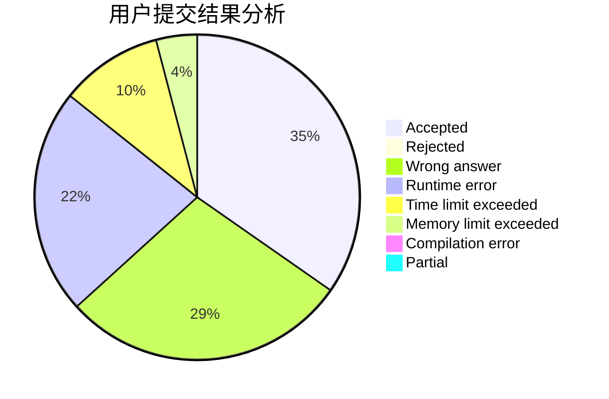
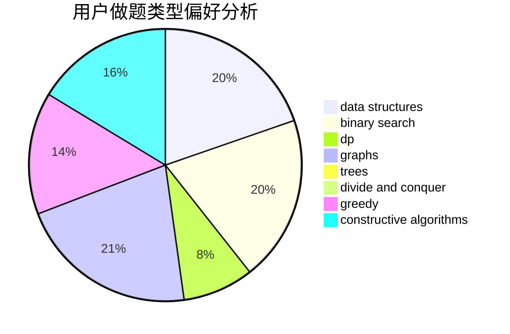
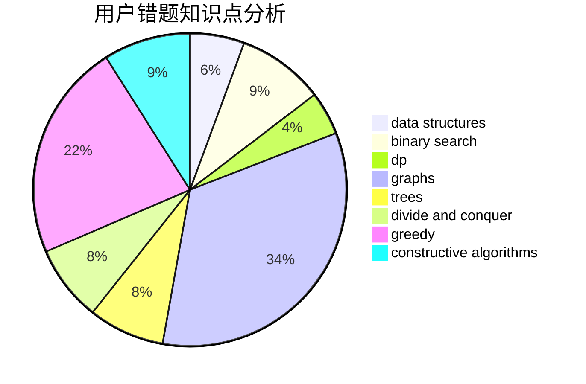

# _elgir

<!-- tabs:start -->

#### **用户提交结果分析**

#### **用户做题类型偏好分析**

#### **用户错题知识点分析**

<!-- tabs:end -->
# 推荐题目
[1501D](https://codeforces.com/contest/1501/problem/D)		dsu,graphs,sortings,trees		  
[1288B](https://codeforces.com/contest/1288/problem/B)		math		  
[1457E](https://codeforces.com/contest/1457/problem/E)		dsu,graphs,sortings,trees		  
[699C](https://codeforces.com/contest/699/problem/C)		dsu,graphs,sortings,trees		  
[1073A](https://codeforces.com/contest/1073/problem/A)		implementation,
                        strings		  
[901B](https://codeforces.com/contest/901/problem/B)		constructive algorithms,
                        math		  
[599E](https://codeforces.com/contest/599/problem/E)		bitmasks,
                        dp,
                        trees		  
[914B](https://codeforces.com/contest/914/problem/B)		games,
                        greedy,
                        implementation		  
[671A](https://codeforces.com/contest/671/problem/A)		dp,
                        geometry,
                        greedy,
                        implementation		  
[328A](https://codeforces.com/contest/328/problem/A)		implementation		  
