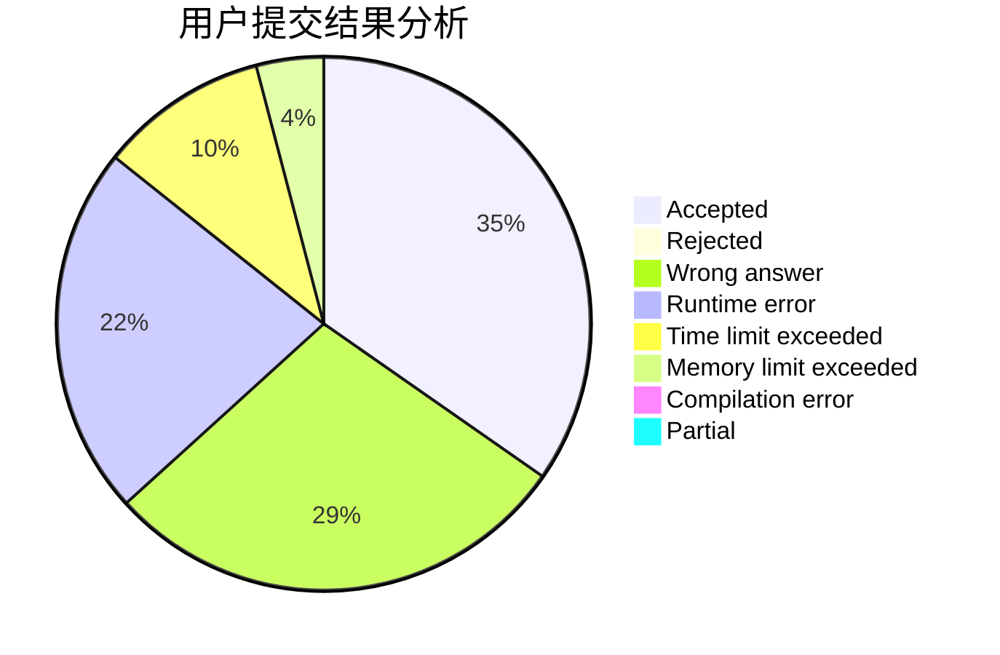
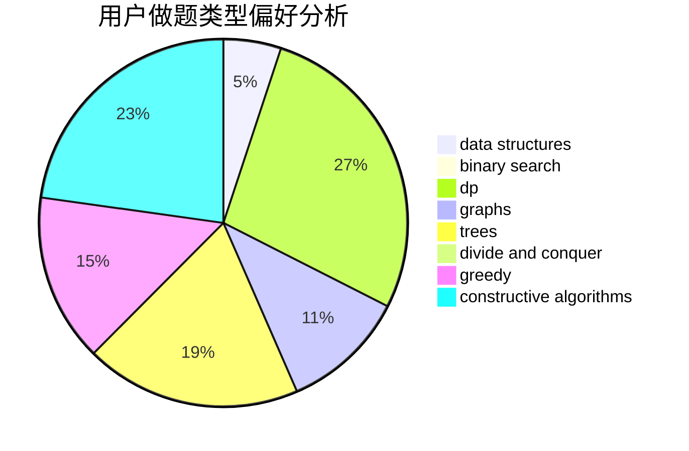
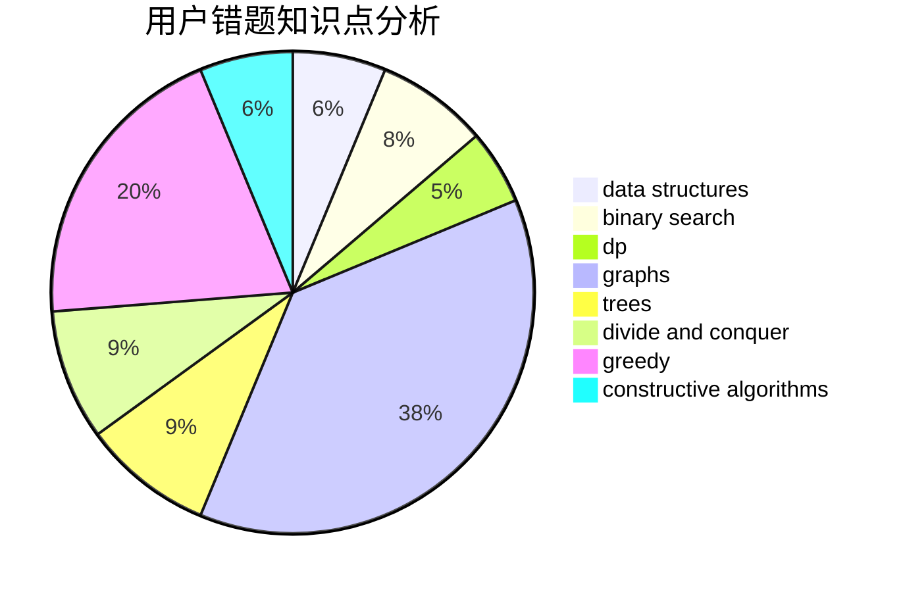

# _elgir

<!-- tabs:start -->

#### **用户提交结果分析**

#### **用户做题类型偏好分析**

#### **用户错题知识点分析**

<!-- tabs:end -->
# 推荐题目
[1511E](https://codeforces.com/contest/1511/problem/E)		combinatorics,
                        dp,
                        greedy,
                        math		  
[1295D](https://codeforces.com/contest/1295/problem/D)		math,
                        number theory		  
[1466H](https://codeforces.com/contest/1466/problem/H)		combinatorics,
                        dp,
                        graphs,
                        greedy,
                        math		  
[716B](https://codeforces.com/contest/716/problem/B)		greedy,
                        two pointers		  
[1073D](https://codeforces.com/contest/1073/problem/D)		binary search,
                        brute force,
                        data structures,
                        greedy		  
[917E](https://codeforces.com/contest/917/problem/E)		data structures,
                        string suffix structures,
                        strings,
                        trees		  
[618A](https://codeforces.com/contest/618/problem/A)		implementation		  
[933A](https://codeforces.com/contest/933/problem/A)		dp		  
[696F](https://codeforces.com/contest/696/problem/F)		binary search,
                        geometry,
                        two pointers		  
[356D](https://codeforces.com/contest/356/problem/D)		bitmasks,
                        constructive algorithms,
                        dp,
                        greedy		  
