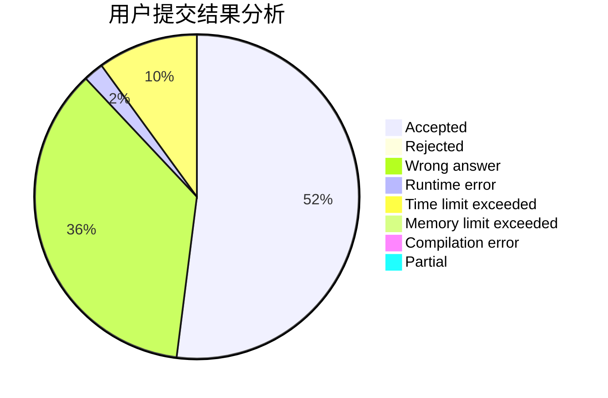
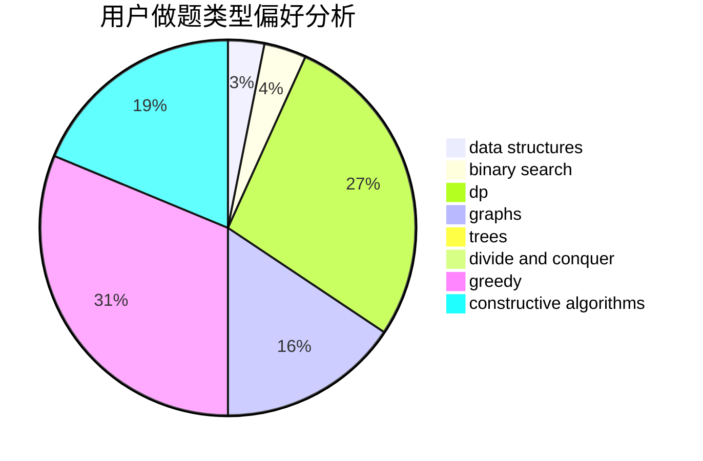
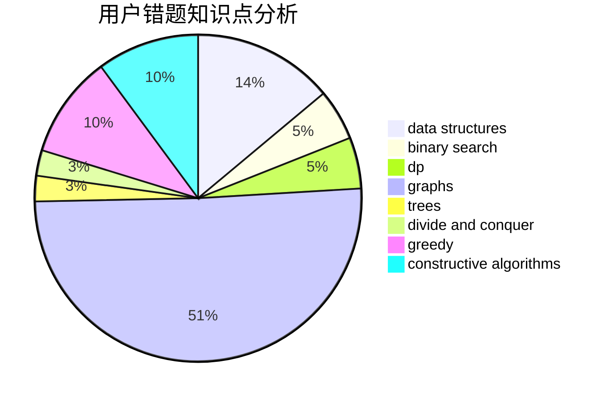

# AlternatingCurrent

<!-- tabs:start -->

#### **用户提交结果分析**

#### **用户做题类型偏好分析**

#### **用户错题知识点分析**

<!-- tabs:end -->
# 推荐题目
[311A](https://codeforces.com/contest/311/problem/A)		constructive algorithms,
                        implementation		  
[1466H](https://codeforces.com/contest/1466/problem/H)		combinatorics,
                        dp,
                        graphs,
                        greedy,
                        math		  
[312A](https://codeforces.com/contest/312/problem/A)		implementation,
                        strings		  
[306D](https://codeforces.com/contest/306/problem/D)		constructive algorithms,
                        geometry		  
[1144F](https://codeforces.com/contest/1144/problem/F)		dfs and similar,
                        graphs		  
[1488E](https://codeforces.com/contest/1488/problem/E)		*special problem,
                        data structures,
                        dp		  
[12271](https://codeforces.com/contest/1227/problem/1)		dsu,graphs,sortings,trees		  
[1403A](https://codeforces.com/contest/1403/problem/A)		*special problem,
                        2-sat,
                        binary search,
                        data structures,
                        graphs,
                        interactive,
                        sortings,
                        two pointers		  
[1183H](https://codeforces.com/contest/1183/problem/H)		dp,
                        strings		  
[306C](https://codeforces.com/contest/306/problem/C)		combinatorics,
                        number theory		  
