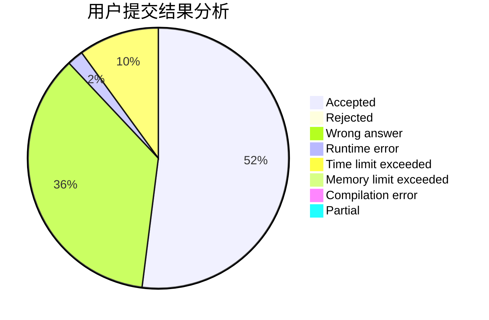
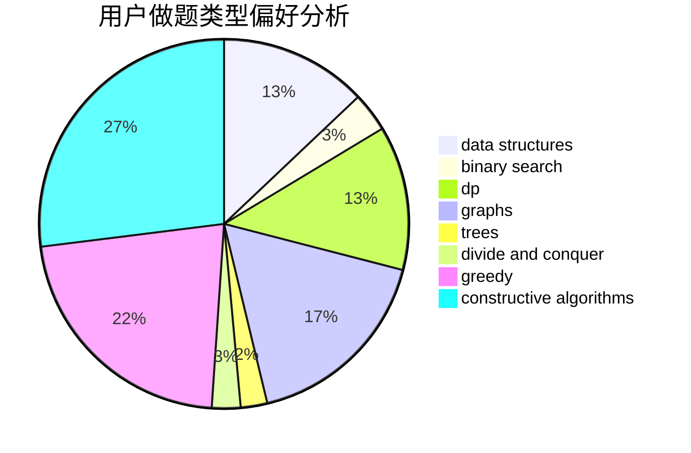
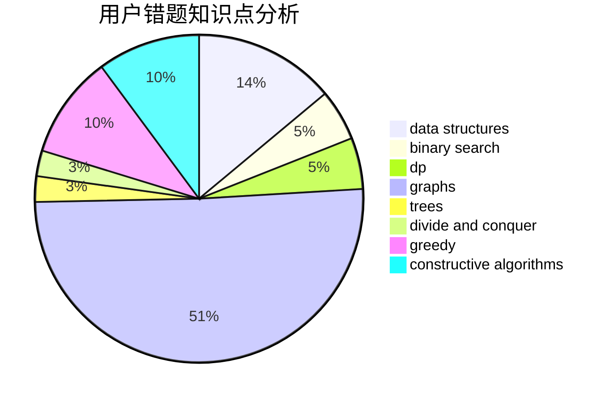

# AlternatingCurrent

<!-- tabs:start -->

#### **用户提交结果分析**

#### **用户做题类型偏好分析**

#### **用户错题知识点分析**

<!-- tabs:end -->
# 推荐题目
[294D](https://codeforces.com/contest/294/problem/D)		brute force,
                        implementation,
                        number theory		  
[1457E](https://codeforces.com/contest/1457/problem/E)		dsu,graphs,sortings,trees		  
[295C](https://codeforces.com/contest/295/problem/C)		combinatorics,
                        dp,
                        graphs,
                        shortest paths		  
[292A](https://codeforces.com/contest/292/problem/A)		implementation		  
[1142D](https://codeforces.com/contest/1142/problem/D)		dp		  
[1480A](https://codeforces.com/contest/1480/problem/A)		games,
                        greedy,
                        strings		  
[1219B](https://codeforces.com/contest/1219/problem/B)		dsu,graphs,sortings,trees		  
[1394E](https://codeforces.com/contest/1394/problem/E)		strings		  
[1181C](https://codeforces.com/contest/1181/problem/C)		brute force,
                        combinatorics,
                        dp,
                        implementation		  
[291E](https://codeforces.com/contest/291/problem/E)		*special problem,
                        dfs and similar,
                        hashing,
                        strings		  
