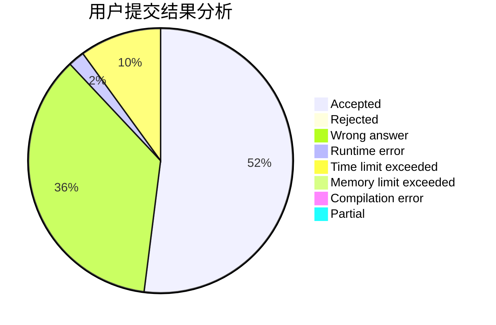
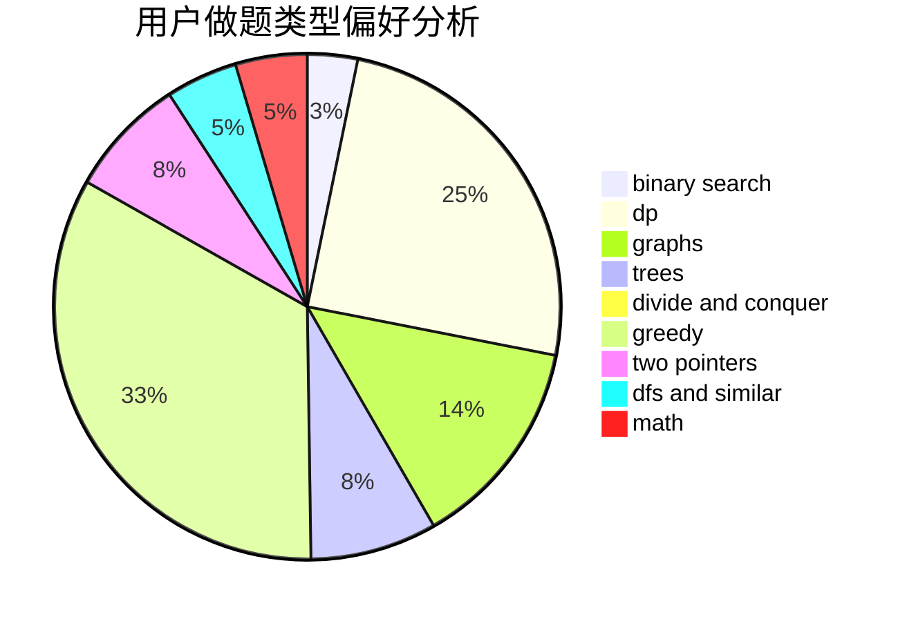

# AlternatingCurrent

<!-- tabs:start -->

#### **用户提交结果分析**

#### **用户做题类型偏好分析**

<!-- tabs:end -->
# 推荐题目
[311A](https://codeforces.com/contest/311/problem/A)
[1466H](https://codeforces.com/contest/1466/problem/H)
[312A](https://codeforces.com/contest/312/problem/A)
[306D](https://codeforces.com/contest/306/problem/D)
[1144F](https://codeforces.com/contest/1144/problem/F)
[1488E](https://codeforces.com/contest/1488/problem/E)
[12271](https://codeforces.com/contest/1227/problem/1)
[1403A](https://codeforces.com/contest/1403/problem/A)
[1183H](https://codeforces.com/contest/1183/problem/H)
[306C](https://codeforces.com/contest/306/problem/C)
