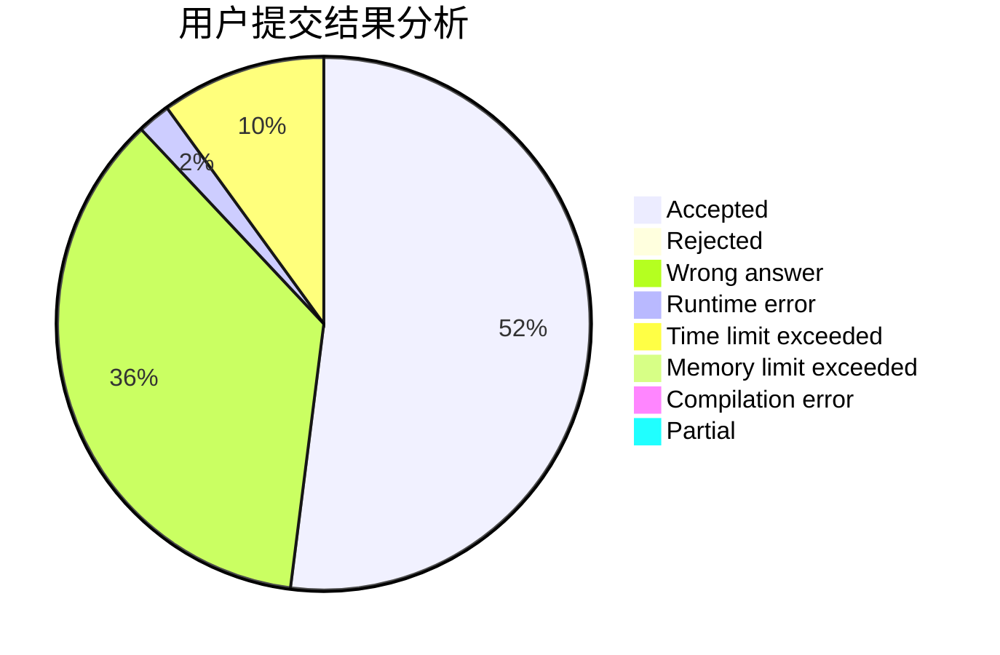
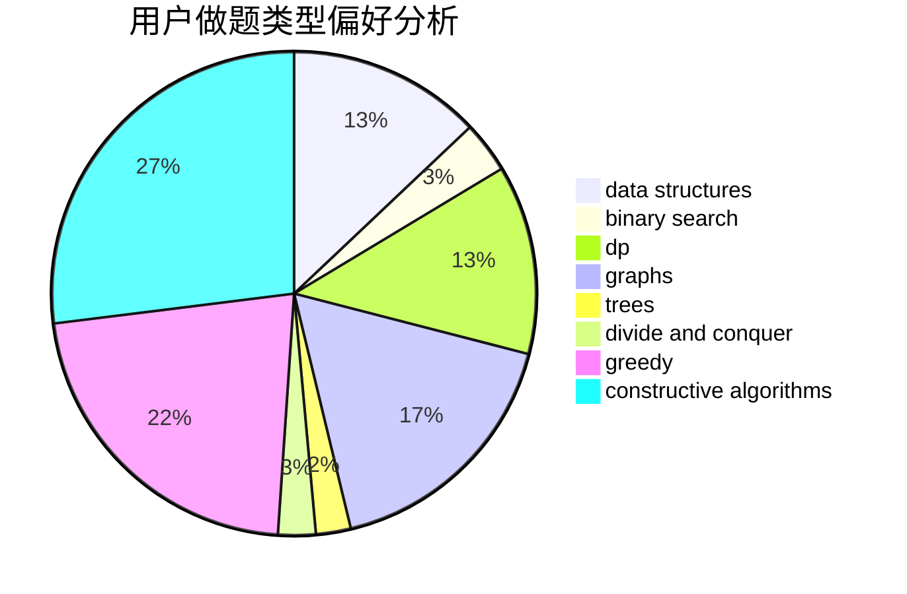
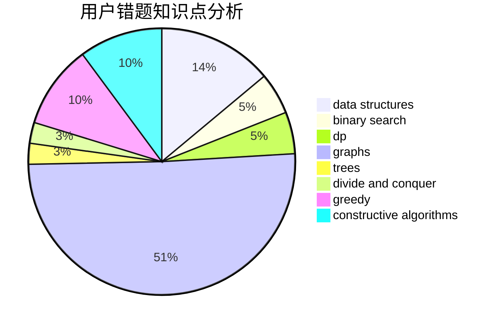

# AlternatingCurrent
<!-- tabs:start -->
#### **用户提交结果分析**

#### **用户做题类型偏好分析**

#### **用户错题知识点分析**

<!-- tabs:end -->
# 推荐题目
[SMSC](http://codeforces.com/problemset/problem/292/A)		implementation		  
[Greg and Friends](http://codeforces.com/problemset/problem/295/C)		combinatorics,
                        dp,
                        graphs,
                        shortest paths		  
[Shaass and Painter Robot](http://codeforces.com/problemset/problem/294/D)		brute force,
                        implementation,
                        number theory		  
[Yaroslav and Points](http://codeforces.com/problemset/problem/295/E)		data structures		  
[Greg and Array](http://codeforces.com/problemset/problem/295/A)		data structures,
                        implementation		  
[Points in Segments](http://codeforces.com/problemset/problem/1015/A)		implementation		  
[Boboniu and Banknote Collection](http://codeforces.com/problemset/problem/1394/E)		strings		  
[Flag](http://codeforces.com/problemset/problem/1181/C)		brute force,
                        combinatorics,
                        dp,
                        implementation		  
[Xor Spanning Tree](https://codeforces.com/contest/1219/problem/B)		divide and conquer,
                        fft,
                        graphs		  
[Greg and Graph](https://codeforces.com/contest/296/problem/D)		dp,
                        graphs,
                        shortest paths		  
<!-- tabs:start -->
#### **data structures**
[SMSC](http://codeforces.com/problemset/problem/295/E)		data structures		  
[Greg and Friends](http://codeforces.com/problemset/problem/295/A)		data structures,
                        implementation		  
[Shaass and Painter Robot](http://codeforces.com/problemset/problem/292/D)		data structures,
                        dfs and similar,
                        dp,
                        dsu		  
[Yaroslav and Points](http://codeforces.com/problemset/problem/292/E)		data structures		  
[Greg and Array](http://codeforces.com/problemset/problem/1500/D)		data structures,
                        sortings,
                        two pointers		  
[Points in Segments](https://codeforces.com/contest/1459/problem/F)		data structures,
                        graphs,
                        greedy		  
[Boboniu and Banknote Collection](http://codeforces.com/problemset/problem/293/E)		data structures,
                        divide and conquer,
                        trees		  
[Flag](http://codeforces.com/problemset/problem/1492/C)		binary search,
                        data structures,
                        dp,
                        greedy,
                        two pointers		  
[Xor Spanning Tree](http://codeforces.com/problemset/problem/1490/G)		binary search,
                        data structures,
                        math		  
[Greg and Graph](http://codeforces.com/problemset/problem/1479/D)		binary search,
                        bitmasks,
                        brute force,
                        data structures,
                        probabilities,
                        trees		  
#### **binary search**
[SMSC](http://codeforces.com/problemset/problem/1436/C)		binary search,
                        combinatorics		  
[Greg and Friends](http://codeforces.com/problemset/problem/1344/D)		binary search,
                        greedy,
                        math		  
[Shaass and Painter Robot](http://codeforces.com/problemset/problem/1492/C)		binary search,
                        data structures,
                        dp,
                        greedy,
                        two pointers		  
[Yaroslav and Points](http://codeforces.com/problemset/problem/1463/D)		binary search,
                        constructive algorithms,
                        greedy,
                        two pointers		  
[Greg and Array](http://codeforces.com/problemset/problem/1490/G)		binary search,
                        data structures,
                        math		  
[Points in Segments](http://codeforces.com/problemset/problem/1479/D)		binary search,
                        bitmasks,
                        brute force,
                        data structures,
                        probabilities,
                        trees		  
[Boboniu and Banknote Collection](http://codeforces.com/problemset/problem/1436/E)		binary search,
                        data structures,
                        two pointers		  
[Flag](http://codeforces.com/problemset/problem/1461/D)		binary search,
                        brute force,
                        data structures,
                        divide and conquer,
                        implementation,
                        sortings		  
[Xor Spanning Tree](http://codeforces.com/problemset/problem/1493/C)		binary search,
                        brute force,
                        constructive algorithms,
                        greedy,
                        strings		  
[Greg and Graph](http://codeforces.com/problemset/problem/1487/D)		binary search,
                        brute force,
                        math,
                        number theory		  
#### **dp**
[SMSC](http://codeforces.com/problemset/problem/295/C)		combinatorics,
                        dp,
                        graphs,
                        shortest paths		  
[Greg and Friends](http://codeforces.com/problemset/problem/1181/C)		brute force,
                        combinatorics,
                        dp,
                        implementation		  
[Shaass and Painter Robot](https://codeforces.com/contest/296/problem/D)		dp,
                        graphs,
                        shortest paths		  
[Yaroslav and Points](http://codeforces.com/problemset/problem/294/E)		dp,
                        trees		  
[Greg and Array](http://codeforces.com/problemset/problem/292/D)		data structures,
                        dfs and similar,
                        dp,
                        dsu		  
[Points in Segments](http://codeforces.com/problemset/problem/295/B)		dp,
                        graphs,
                        shortest paths		  
[Boboniu and Banknote Collection](http://codeforces.com/problemset/problem/1142/D)		dp		  
[Flag](http://codeforces.com/problemset/problem/1137/C)		dp,
                        graphs,
                        implementation		  
[Xor Spanning Tree](http://codeforces.com/problemset/problem/295/D)		combinatorics,
                        dp		  
[Greg and Graph](http://codeforces.com/problemset/problem/296/B)		combinatorics,
                        dp		  
#### **graph**
[SMSC](http://codeforces.com/problemset/problem/295/C)		combinatorics,
                        dp,
                        graphs,
                        shortest paths		  
[Greg and Friends](https://codeforces.com/contest/1219/problem/B)		divide and conquer,
                        fft,
                        graphs		  
[Shaass and Painter Robot](https://codeforces.com/contest/296/problem/D)		dp,
                        graphs,
                        shortest paths		  
[Yaroslav and Points](http://codeforces.com/problemset/problem/295/B)		dp,
                        graphs,
                        shortest paths		  
[Greg and Array](http://codeforces.com/problemset/problem/1137/C)		dp,
                        graphs,
                        implementation		  
[Points in Segments](https://codeforces.com/contest/1459/problem/F)		data structures,
                        graphs,
                        greedy		  
[Boboniu and Banknote Collection](http://codeforces.com/problemset/problem/1487/C)		brute force,
                        constructive algorithms,
                        dfs and similar,
                        graphs,
                        greedy,
                        implementation,
                        math		  
[Flag](http://codeforces.com/problemset/problem/1437/C)		dp,
                        flows,
                        graph matchings,
                        greedy,
                        math,
                        sortings		  
[Xor Spanning Tree](http://codeforces.com/problemset/problem/1470/D)		constructive algorithms,
                        dfs and similar,
                        graph matchings,
                        graphs,
                        greedy		  
[Greg and Graph](http://codeforces.com/problemset/problem/1476/C)		dp,
                        graphs,
                        greedy		  
#### **trees**
[SMSC](http://codeforces.com/problemset/problem/294/E)		dp,
                        trees		  
[Greg and Friends](http://codeforces.com/problemset/problem/1210/C)		math,
                        number theory,
                        trees		  
[Shaass and Painter Robot](http://codeforces.com/problemset/problem/293/E)		data structures,
                        divide and conquer,
                        trees		  
[Yaroslav and Points](http://codeforces.com/problemset/problem/1479/D)		binary search,
                        bitmasks,
                        brute force,
                        data structures,
                        probabilities,
                        trees		  
[Greg and Array](http://codeforces.com/problemset/problem/1511/C)		brute force,
                        data structures,
                        implementation,
                        trees		  
[Points in Segments](http://codeforces.com/problemset/problem/1499/F)		combinatorics,
                        dfs and similar,
                        dp,
                        trees		  
[Boboniu and Banknote Collection](http://codeforces.com/problemset/problem/1491/E)		brute force,
                        dfs and similar,
                        divide and conquer,
                        number theory,
                        trees		  
[Flag](http://codeforces.com/problemset/problem/1466/D)		data structures,
                        greedy,
                        sortings,
                        trees		  
[Xor Spanning Tree](http://codeforces.com/problemset/problem/1495/D)		combinatorics,
                        dfs and similar,
                        graphs,
                        math,
                        shortest paths,
                        trees		  
[Greg and Graph](http://codeforces.com/problemset/problem/1303/G)		data structures,
                        divide and conquer,
                        geometry,
                        trees		  
#### **divide and conquer**
[SMSC](https://codeforces.com/contest/1219/problem/B)		divide and conquer,
                        fft,
                        graphs		  
[Greg and Friends](http://codeforces.com/problemset/problem/293/E)		data structures,
                        divide and conquer,
                        trees		  
[Shaass and Painter Robot](http://codeforces.com/problemset/problem/1461/D)		binary search,
                        brute force,
                        data structures,
                        divide and conquer,
                        implementation,
                        sortings		  
[Yaroslav and Points](http://codeforces.com/problemset/problem/1466/G)		combinatorics,
                        divide and conquer,
                        hashing,
                        math,
                        string suffix structures,
                        strings		  
[Greg and Array](http://codeforces.com/problemset/problem/1490/D)		dfs and similar,
                        divide and conquer,
                        implementation		  
[Points in Segments](https://codeforces.com/contest/1483/problem/C)		data structures,
                        divide and conquer,
                        dp		  
[Boboniu and Banknote Collection](http://codeforces.com/problemset/problem/1491/E)		brute force,
                        dfs and similar,
                        divide and conquer,
                        number theory,
                        trees		  
[Flag](http://codeforces.com/problemset/problem/1303/G)		data structures,
                        divide and conquer,
                        geometry,
                        trees		  
[Xor Spanning Tree](http://codeforces.com/problemset/problem/1494/D)		constructive algorithms,
                        data structures,
                        dfs and similar,
                        divide and conquer,
                        dsu,
                        greedy,
                        sortings,
                        trees		  
[Greg and Graph](http://codeforces.com/problemset/problem/1482/E)		data structures,
                        divide and conquer,
                        dp		  
#### **greedy**
[SMSC](http://codeforces.com/problemset/problem/297/B)		constructive algorithms,
                        greedy		  
[Greg and Friends](http://codeforces.com/problemset/problem/1204/B)		greedy,
                        math		  
[Shaass and Painter Robot](https://codeforces.com/contest/1457/problem/E)		constructive algorithms,
                        greedy,
                        math		  
[Yaroslav and Points](https://codeforces.com/contest/1241/problem/D)		dp,
                        greedy,
                        two pointers		  
[Greg and Array](http://codeforces.com/problemset/problem/293/A)		games,
                        greedy		  
[Points in Segments](http://codeforces.com/problemset/problem/294/B)		dp,
                        greedy		  
[Boboniu and Banknote Collection](http://codeforces.com/problemset/problem/1344/D)		binary search,
                        greedy,
                        math		  
[Flag](https://codeforces.com/contest/1459/problem/F)		data structures,
                        graphs,
                        greedy		  
[Xor Spanning Tree](http://codeforces.com/problemset/problem/1181/B)		greedy,
                        implementation,
                        strings		  
[Greg and Graph](http://codeforces.com/problemset/problem/1488/B)		*special problem,
                        greedy		  
#### **constructive algorithms**
[SMSC](http://codeforces.com/problemset/problem/297/B)		constructive algorithms,
                        greedy		  
[Greg and Friends](http://codeforces.com/problemset/problem/297/A)		constructive algorithms		  
[Shaass and Painter Robot](https://codeforces.com/contest/1457/problem/E)		constructive algorithms,
                        greedy,
                        math		  
[Yaroslav and Points](http://codeforces.com/problemset/problem/1455/C)		constructive algorithms,
                        games,
                        math		  
[Greg and Array](http://codeforces.com/problemset/problem/1149/A)		constructive algorithms,
                        greedy,
                        math,
                        number theory		  
[Points in Segments](http://codeforces.com/problemset/problem/1493/A)		constructive algorithms,
                        greedy		  
[Boboniu and Banknote Collection](http://codeforces.com/problemset/problem/1463/D)		binary search,
                        constructive algorithms,
                        greedy,
                        two pointers		  
[Flag](https://codeforces.com/contest/1456/problem/B)		bitmasks,
                        brute force,
                        constructive algorithms		  
[Xor Spanning Tree](http://codeforces.com/problemset/problem/1492/D)		bitmasks,
                        constructive algorithms,
                        greedy,
                        math		  
[Greg and Graph](https://codeforces.com/contest/1504/problem/D)		constructive algorithms,
                        games,
                        interactive		  
#### **sortings**
[SMSC](http://codeforces.com/problemset/problem/1294/B)		implementation,
                        sortings		  
[Greg and Friends](http://codeforces.com/problemset/problem/291/A)		*special problem,
                        implementation,
                        sortings		  
[Shaass and Painter Robot](http://codeforces.com/problemset/problem/1500/D)		data structures,
                        sortings,
                        two pointers		  
[Yaroslav and Points](https://codeforces.com/contest/1496/problem/C)		geometry,
                        greedy,
                        math,
                        sortings		  
[Greg and Array](http://codeforces.com/problemset/problem/1495/A)		geometry,
                        greedy,
                        math,
                        sortings		  
[Points in Segments](http://codeforces.com/problemset/problem/1497/A)		brute force,
                        data structures,
                        greedy,
                        sortings		  
[Boboniu and Banknote Collection](http://codeforces.com/problemset/problem/1427/A)		math,
                        sortings		  
[Flag](http://codeforces.com/problemset/problem/1461/D)		binary search,
                        brute force,
                        data structures,
                        divide and conquer,
                        implementation,
                        sortings		  
[Xor Spanning Tree](http://codeforces.com/problemset/problem/1437/C)		dp,
                        flows,
                        graph matchings,
                        greedy,
                        math,
                        sortings		  
[Greg and Graph](http://codeforces.com/problemset/problem/1473/A)		greedy,
                        implementation,
                        math,
                        sortings		  
<!-- tabs:end -->
