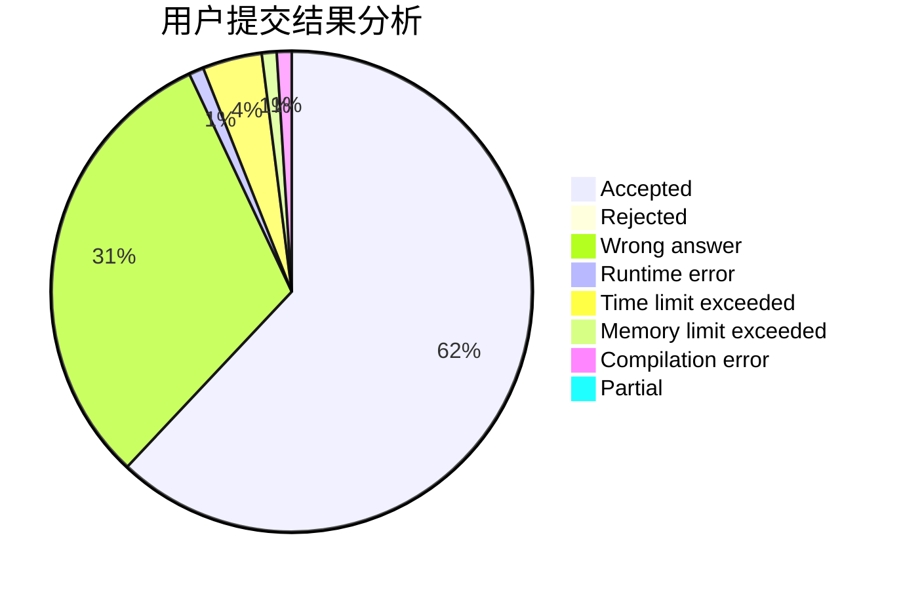
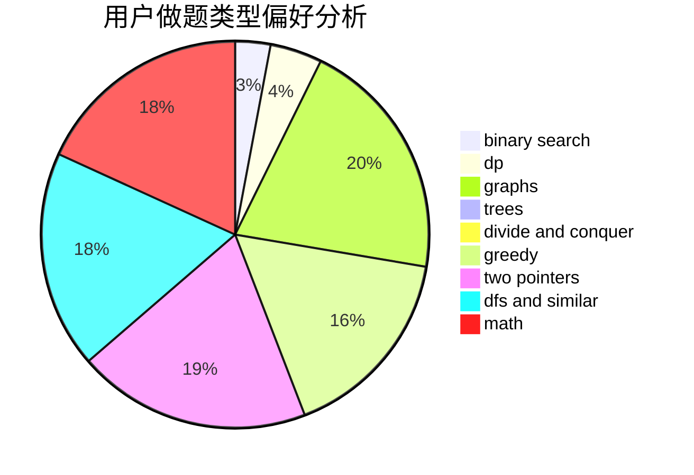

# _int_me

<!-- tabs:start -->

#### **用户提交结果分析**

#### **用户做题类型偏好分析**

<!-- tabs:end -->
# 推荐题目
[1104C](https://codeforces.com/contest/1104/problem/C)
[717E](https://codeforces.com/contest/717/problem/E)
[334B](https://codeforces.com/contest/334/problem/B)
[911B](https://codeforces.com/contest/911/problem/B)
[1346A](https://codeforces.com/contest/1346/problem/A)
[13352](https://codeforces.com/contest/1335/problem/2)
[1187G](https://codeforces.com/contest/1187/problem/G)
[986A](https://codeforces.com/contest/986/problem/A)
[317E](https://codeforces.com/contest/317/problem/E)
[1136E](https://codeforces.com/contest/1136/problem/E)
