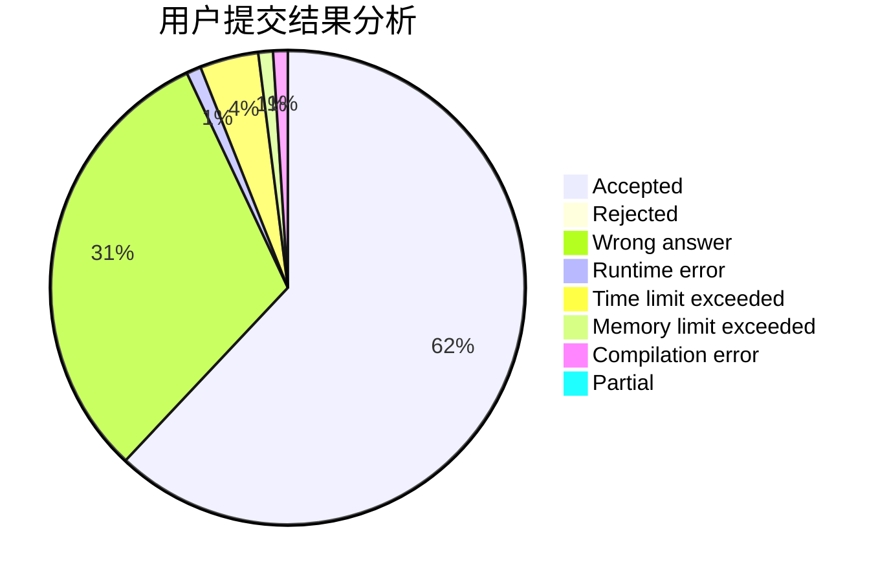
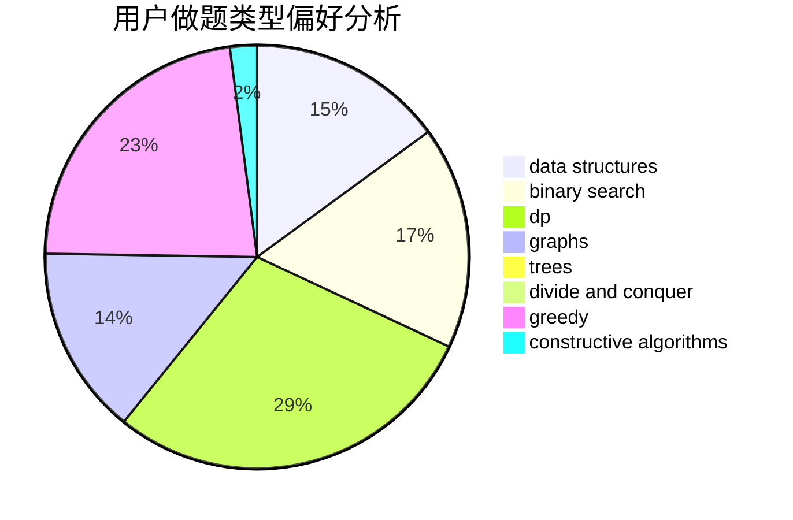

# _int_me

<!-- tabs:start -->

#### **用户提交结果分析**

#### **用户做题类型偏好分析**

#### **用户错题知识点分析**

<!-- tabs:end -->
# 推荐题目
[1104C](https://codeforces.com/contest/1104/problem/C)		dsu,graphs,sortings,trees		  
[717E](https://codeforces.com/contest/717/problem/E)		dfs and similar		  
[334B](https://codeforces.com/contest/334/problem/B)		sortings		  
[911B](https://codeforces.com/contest/911/problem/B)		binary search,
                        brute force,
                        implementation		  
[1346A](https://codeforces.com/contest/1346/problem/A)		*special problem,
                        math		  
[13352](https://codeforces.com/contest/1335/problem/2)		dsu,graphs,sortings,trees		  
[1187G](https://codeforces.com/contest/1187/problem/G)		flows,
                        graphs		  
[986A](https://codeforces.com/contest/986/problem/A)		graphs,
                        greedy,
                        number theory,
                        shortest paths		  
[317E](https://codeforces.com/contest/317/problem/E)		constructive algorithms,
                        shortest paths		  
[1136E](https://codeforces.com/contest/1136/problem/E)		binary search,
                        data structures		  
