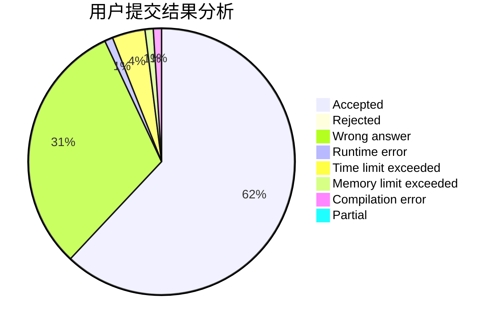
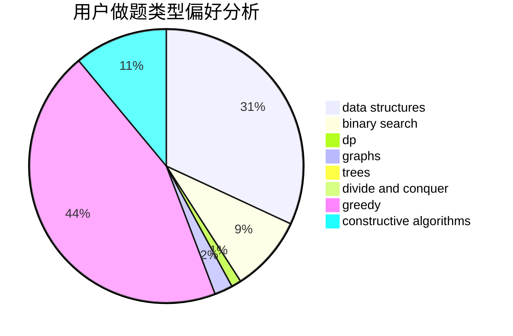

# _int_me

<!-- tabs:start -->

#### **用户提交结果分析**

#### **用户做题类型偏好分析**

#### **用户错题知识点分析**

<!-- tabs:end -->
# 推荐题目
[1103E](https://codeforces.com/contest/1103/problem/E)		fft,
                        math,
                        number theory		  
[6C](https://codeforces.com/contest/6/problem/C)		greedy,
                        two pointers		  
[311B](https://codeforces.com/contest/311/problem/B)		data structures,
                        dp		  
[893B](https://codeforces.com/contest/893/problem/B)		brute force,
                        implementation		  
[1339A](https://codeforces.com/contest/1339/problem/A)		brute force,
                        dp,
                        implementation,
                        math		  
[1328F](https://codeforces.com/contest/1328/problem/F)		greedy		  
[1184C1](https://codeforces.com/contest/1184C/problem/1)		implementation		  
[963C](https://codeforces.com/contest/963/problem/C)		brute force,
                        math,
                        number theory		  
[2A](https://codeforces.com/contest/2/problem/A)		hashing,
                        implementation		  
[1132F](https://codeforces.com/contest/1132/problem/F)		dp		  
