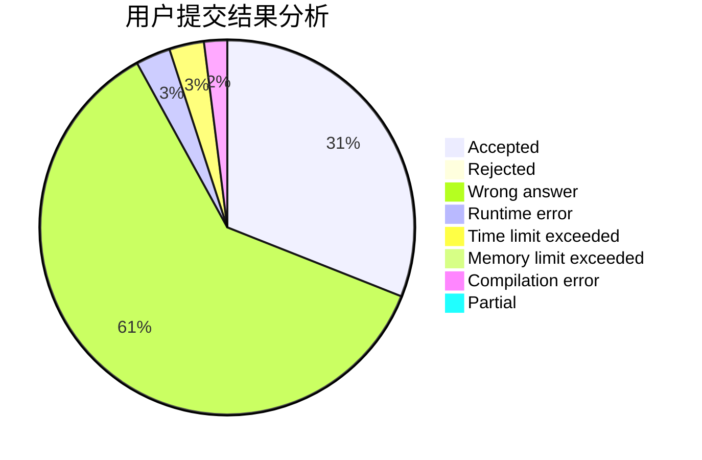
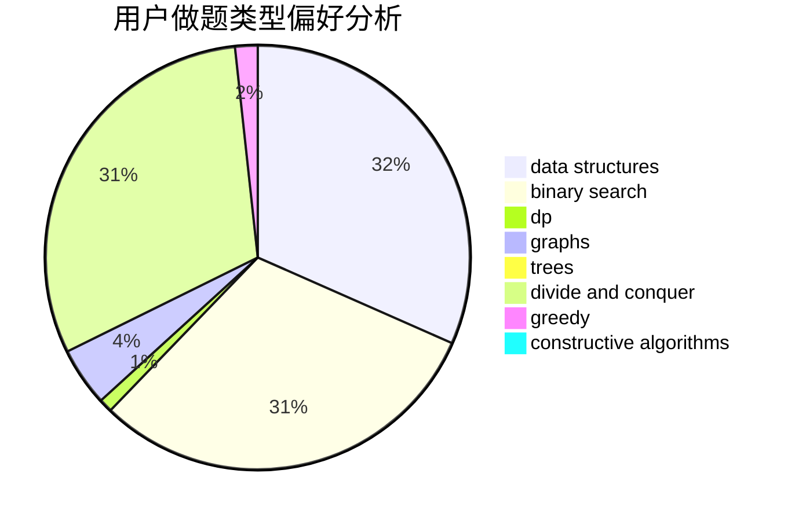

# _ipLee_

<!-- tabs:start -->

#### **用户提交结果分析**

#### **用户做题类型偏好分析**

#### **用户错题知识点分析**

<!-- tabs:end -->
# 推荐题目
[1244G](https://codeforces.com/contest/1244/problem/G)		constructive algorithms,
                        greedy,
                        math		  
[802C](https://codeforces.com/contest/802/problem/C)		flows		  
[272D](https://codeforces.com/contest/272/problem/D)		combinatorics,
                        math,
                        sortings		  
[1513C](https://codeforces.com/contest/1513/problem/C)		dp,
                        matrices		  
[813B](https://codeforces.com/contest/813/problem/B)		brute force,
                        math		  
[1281F](https://codeforces.com/contest/1281/problem/F)		dsu,graphs,sortings,trees		  
[1386B](https://codeforces.com/contest/1386/problem/B)		*special problem,
                        data structures,
                        geometry,
                        math,
                        sortings		  
[540C](https://codeforces.com/contest/540/problem/C)		dfs and similar		  
[1440A](https://codeforces.com/contest/1440/problem/A)		implementation,
                        math		  
[1314A](https://codeforces.com/contest/1314/problem/A)		dsu,graphs,sortings,trees		  
