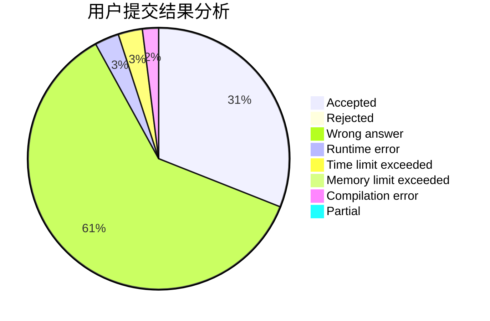
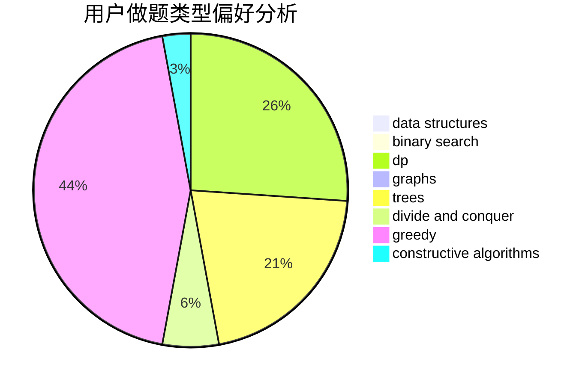

# _ipLee_

<!-- tabs:start -->

#### **用户提交结果分析**

#### **用户做题类型偏好分析**

#### **用户错题知识点分析**

<!-- tabs:end -->
# 推荐题目
[1250B](https://codeforces.com/contest/1250/problem/B)		brute force,
                        constructive algorithms,
                        greedy,
                        math		  
[817B](https://codeforces.com/contest/817/problem/B)		combinatorics,
                        implementation,
                        math,
                        sortings		  
[288D](https://codeforces.com/contest/288/problem/D)		combinatorics,
                        dfs and similar,
                        trees		  
[173A](https://codeforces.com/contest/173/problem/A)		implementation,
                        math		  
[831D](https://codeforces.com/contest/831/problem/D)		dsu,graphs,sortings,trees		  
[1288B](https://codeforces.com/contest/1288/problem/B)		math		  
[1396C](https://codeforces.com/contest/1396/problem/C)		dp,
                        greedy,
                        implementation		  
[566D](https://codeforces.com/contest/566/problem/D)		data structures,
                        dsu		  
[14511](https://codeforces.com/contest/1451/problem/1)		dsu,graphs,sortings,trees		  
[1323D](https://codeforces.com/contest/1323/problem/D)		dsu,graphs,sortings,trees		  
