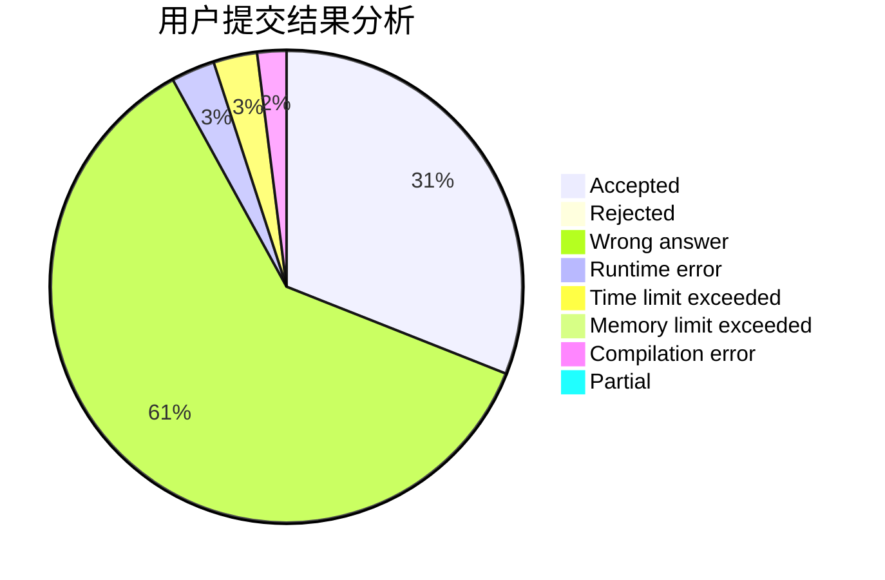
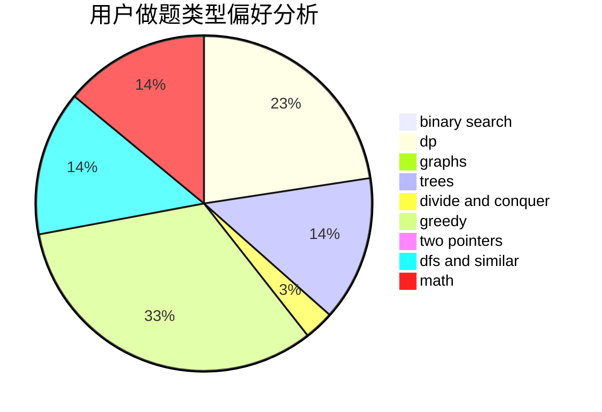

# _ipLee_

<!-- tabs:start -->

#### **用户提交结果分析**

#### **用户做题类型偏好分析**

<!-- tabs:end -->
# 推荐题目
[1250B](https://codeforces.com/contest/1250/problem/B)
[817B](https://codeforces.com/contest/817/problem/B)
[288D](https://codeforces.com/contest/288/problem/D)
[173A](https://codeforces.com/contest/173/problem/A)
[831D](https://codeforces.com/contest/831/problem/D)
[1288B](https://codeforces.com/contest/1288/problem/B)
[1396C](https://codeforces.com/contest/1396/problem/C)
[566D](https://codeforces.com/contest/566/problem/D)
[14511](https://codeforces.com/contest/1451/problem/1)
[1323D](https://codeforces.com/contest/1323/problem/D)
