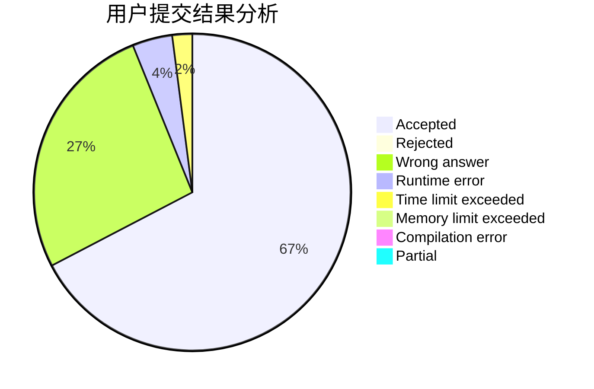
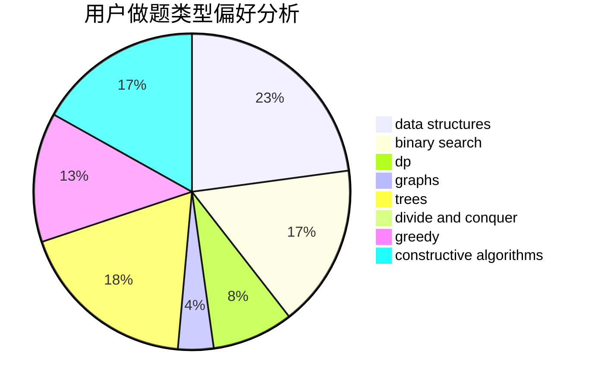

# _jhq

<!-- tabs:start -->

#### **用户提交结果分析**

#### **用户做题类型偏好分析**

#### **用户错题知识点分析**

<!-- tabs:end -->
# 推荐题目
[742E](https://codeforces.com/contest/742/problem/E)		dsu,graphs,sortings,trees		  
[1290A](https://codeforces.com/contest/1290/problem/A)		brute force,
                        data structures,
                        implementation		  
[397E](https://codeforces.com/contest/397/problem/E)		dsu,graphs,sortings,trees		  
[997E](https://codeforces.com/contest/997/problem/E)		data structures		  
[1076F](https://codeforces.com/contest/1076/problem/F)		dp,
                        greedy		  
[992A](https://codeforces.com/contest/992/problem/A)		implementation,
                        sortings		  
[930C](https://codeforces.com/contest/930/problem/C)		data structures,
                        dp		  
[1080B](https://codeforces.com/contest/1080/problem/B)		math		  
[1276E](https://codeforces.com/contest/1276/problem/E)		constructive algorithms		  
[909E](https://codeforces.com/contest/909/problem/E)		dfs and similar,
                        dp,
                        graphs,
                        greedy		  
