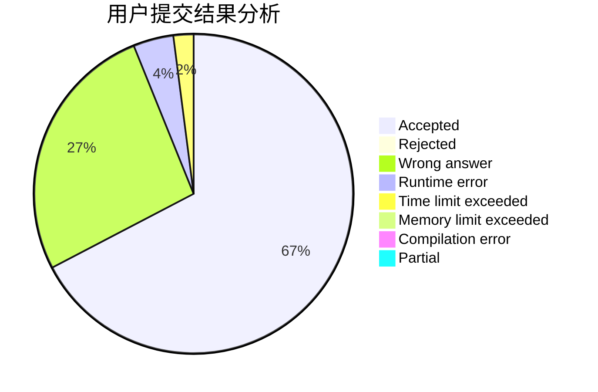
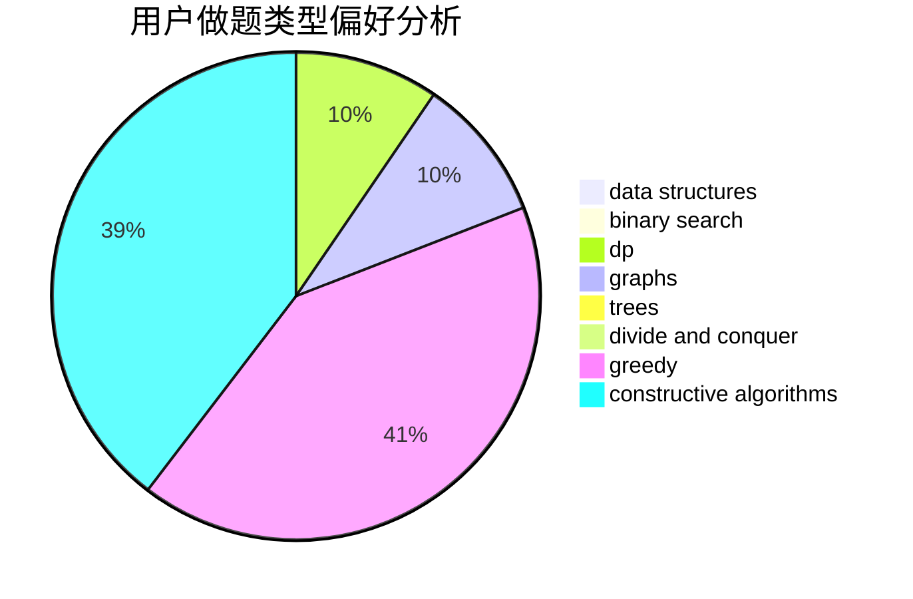

# _jhq

<!-- tabs:start -->

#### **用户提交结果分析**

#### **用户做题类型偏好分析**

#### **用户错题知识点分析**

<!-- tabs:end -->
# 推荐题目
[725A](https://codeforces.com/contest/725/problem/A)		implementation		  
[1283A](https://codeforces.com/contest/1283/problem/A)		math		  
[367A](https://codeforces.com/contest/367/problem/A)		data structures,
                        implementation		  
[982B](https://codeforces.com/contest/982/problem/B)		data structures,
                        greedy,
                        implementation		  
[1076C](https://codeforces.com/contest/1076/problem/C)		binary search,
                        math		  
[978C](https://codeforces.com/contest/978/problem/C)		binary search,
                        implementation,
                        two pointers		  
[911G](https://codeforces.com/contest/911/problem/G)		data structures		  
[107C](https://codeforces.com/contest/107/problem/C)		bitmasks,
                        dp		  
[1267J](https://codeforces.com/contest/1267/problem/J)		greedy,
                        implementation,
                        math		  
[891A](https://codeforces.com/contest/891/problem/A)		brute force,
                        dp,
                        greedy,
                        math,
                        number theory		  
