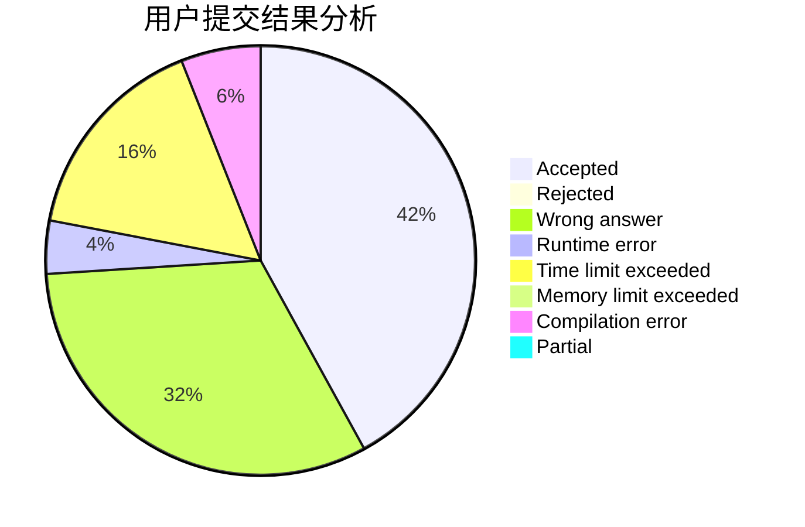
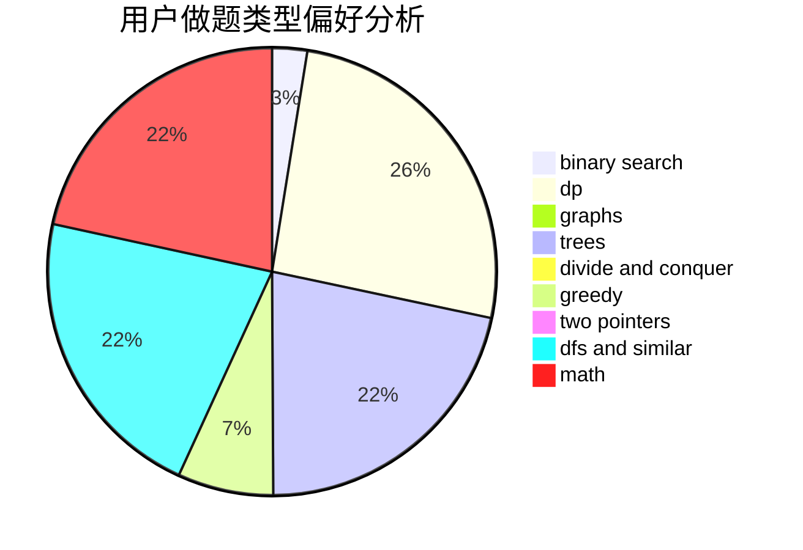

# _lph

<!-- tabs:start -->

#### **用户提交结果分析**

#### **用户做题类型偏好分析**

<!-- tabs:end -->
# 推荐题目
[710F](https://codeforces.com/contest/710/problem/F)
[748C](https://codeforces.com/contest/748/problem/C)
[1058D](https://codeforces.com/contest/1058/problem/D)
[1782](https://codeforces.com/contest/178/problem/2)
[1362F](https://codeforces.com/contest/1362/problem/F)
[1084B](https://codeforces.com/contest/1084/problem/B)
[85A](https://codeforces.com/contest/85/problem/A)
[11152](https://codeforces.com/contest/1115/problem/2)
[269E](https://codeforces.com/contest/269/problem/E)
[13762](https://codeforces.com/contest/1376/problem/2)
