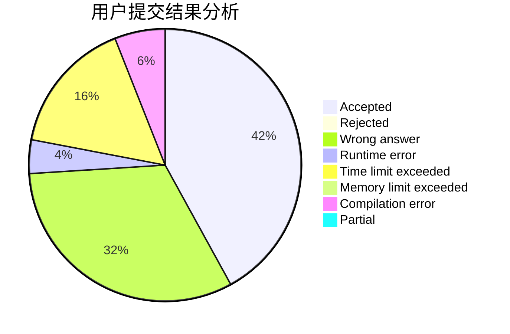
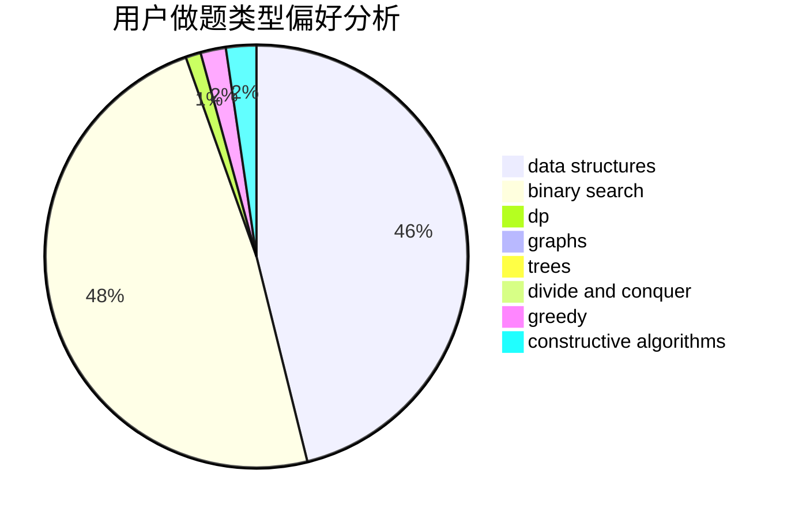
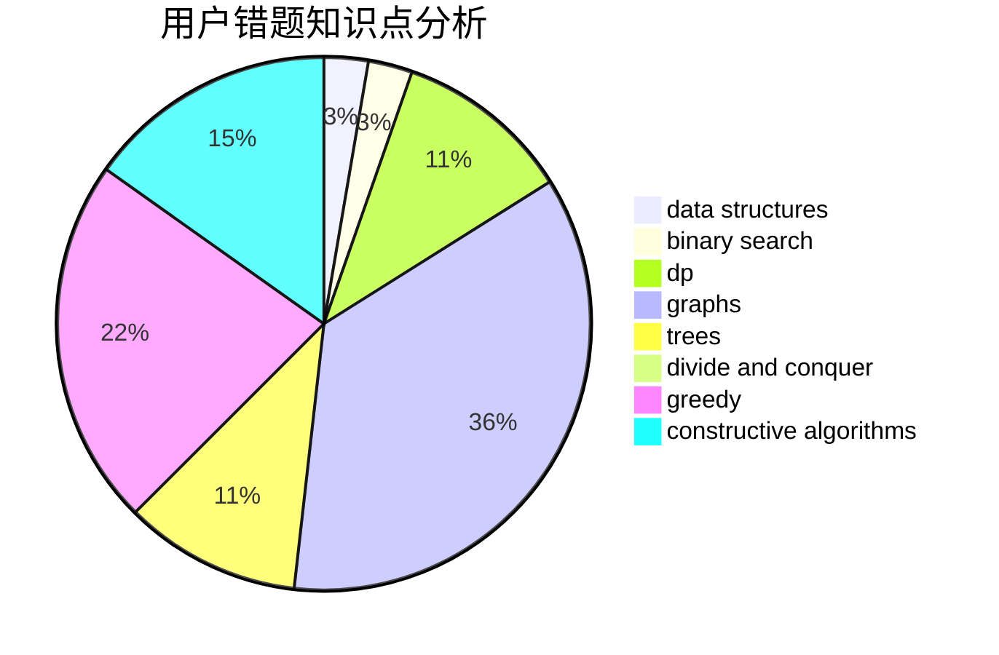

# _lph

<!-- tabs:start -->

#### **用户提交结果分析**

#### **用户做题类型偏好分析**

#### **用户错题知识点分析**

<!-- tabs:end -->
# 推荐题目
[691B](https://codeforces.com/contest/691/problem/B)		implementation,
                        strings		  
[730H](https://codeforces.com/contest/730/problem/H)		constructive algorithms,
                        implementation		  
[1058A](https://codeforces.com/contest/1058/problem/A)		dsu,graphs,sortings,trees		  
[157C](https://codeforces.com/contest/157/problem/C)		dsu,graphs,sortings,trees		  
[1356A1](https://codeforces.com/contest/1356A/problem/1)		*special problem		  
[1083D](https://codeforces.com/contest/1083/problem/D)		data structures,
                        implementation		  
[840C](https://codeforces.com/contest/840/problem/C)		combinatorics,
                        dp		  
[1114E](https://codeforces.com/contest/1114/problem/E)		binary search,
                        interactive,
                        number theory,
                        probabilities		  
[251C](https://codeforces.com/contest/251/problem/C)		dp,
                        greedy,
                        number theory		  
[1369C](https://codeforces.com/contest/1369/problem/C)		greedy,
                        math,
                        sortings,
                        two pointers		  
