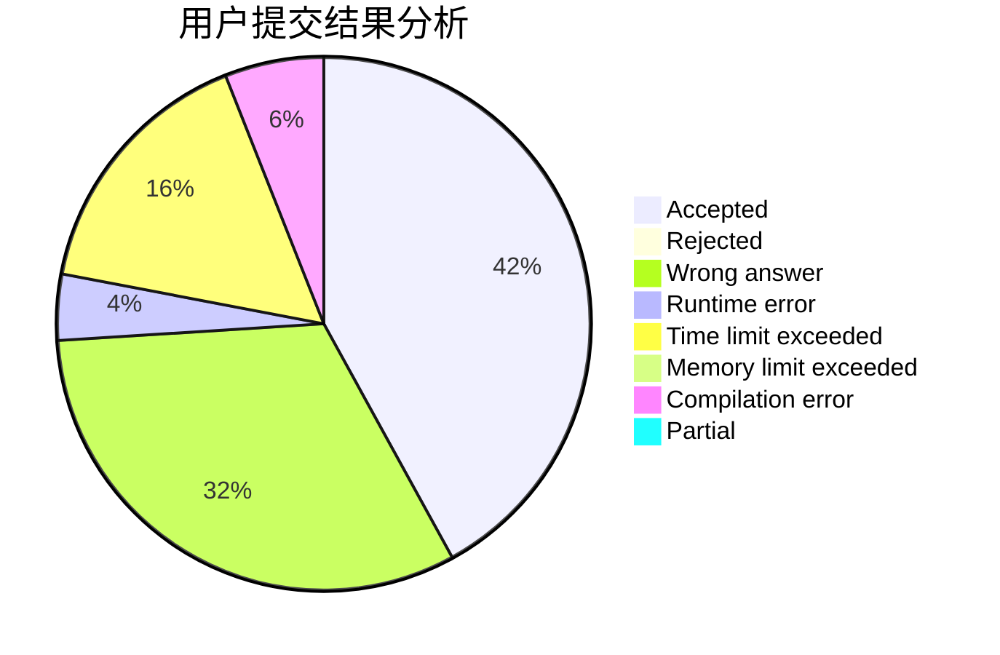
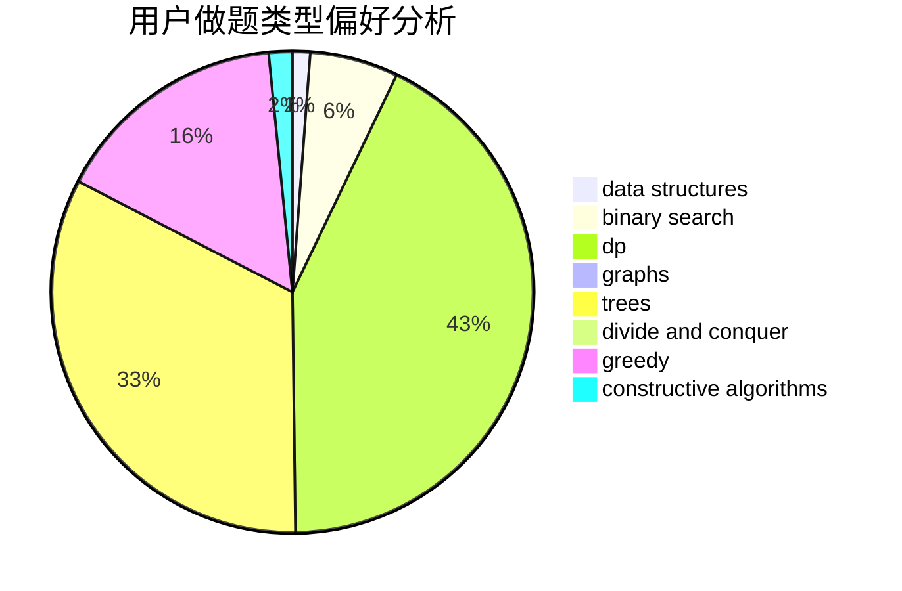
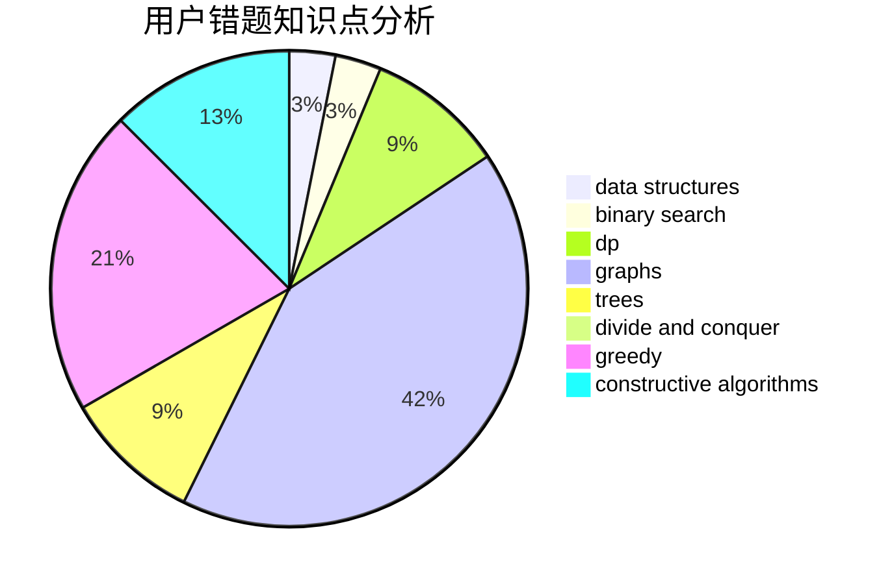

# _lph

<!-- tabs:start -->

#### **用户提交结果分析**

#### **用户做题类型偏好分析**

#### **用户错题知识点分析**

<!-- tabs:end -->
# 推荐题目
[710F](https://codeforces.com/contest/710/problem/F)		brute force,
                        data structures,
                        hashing,
                        interactive,
                        string suffix structures,
                        strings		  
[748C](https://codeforces.com/contest/748/problem/C)		constructive algorithms,
                        math		  
[1058D](https://codeforces.com/contest/1058/problem/D)		dsu,graphs,sortings,trees		  
[1782](https://codeforces.com/contest/178/problem/2)		dsu,graphs,sortings,trees		  
[1362F](https://codeforces.com/contest/1362/problem/F)		dsu,graphs,sortings,trees		  
[1084B](https://codeforces.com/contest/1084/problem/B)		greedy,
                        implementation		  
[85A](https://codeforces.com/contest/85/problem/A)		constructive algorithms,
                        implementation		  
[11152](https://codeforces.com/contest/1115/problem/2)		dsu,graphs,sortings,trees		  
[269E](https://codeforces.com/contest/269/problem/E)		nan		  
[13762](https://codeforces.com/contest/1376/problem/2)		dsu,graphs,sortings,trees		  
