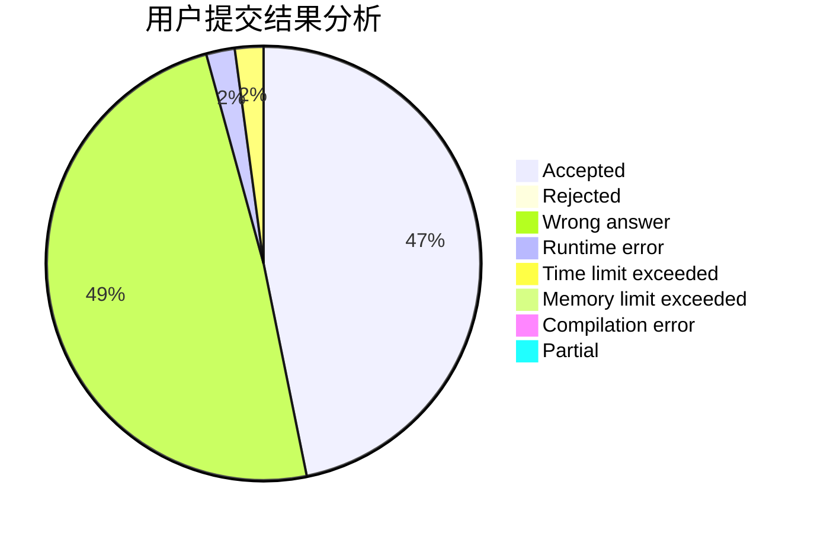
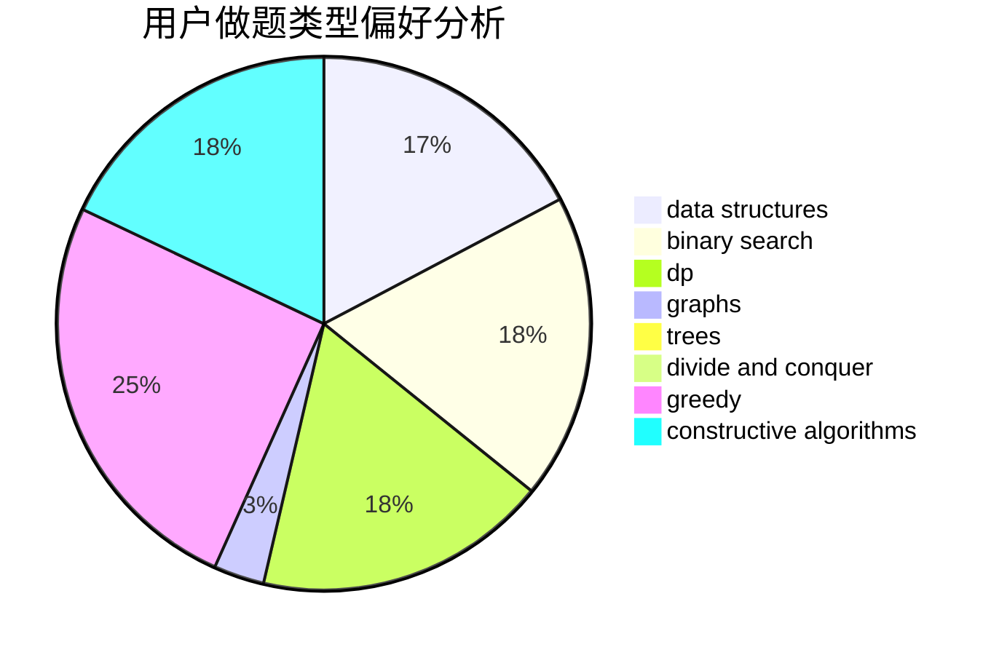

# _misaka
<!-- tabs:start -->
#### **用户提交结果分析**

#### **用户做题类型偏好分析**

#### **用户错题知识点分析**

<!-- tabs:end -->
# 推荐题目
[Planets](http://codeforces.com/problemset/problem/229/B)		binary search,
                        data structures,
                        graphs,
                        shortest paths		  
[Strongly Connected City](http://codeforces.com/problemset/problem/475/B)		brute force,
                        dfs and similar,
                        graphs,
                        implementation		  
[Polygon](http://codeforces.com/problemset/problem/306/D)		constructive algorithms,
                        geometry		  
[Konrad and Company Evaluation](https://codeforces.com/contest/1230/problem/F)		graphs		  
[Multipliers](http://codeforces.com/problemset/problem/615/D)		math,
                        number theory		  
[Columns Swaps](http://codeforces.com/problemset/problem/1385/G)		2-sat,
                        dfs and similar,
                        dsu,
                        graphs,
                        implementation		  
[Luba And The Ticket](http://codeforces.com/problemset/problem/845/B)		brute force,
                        greedy,
                        implementation		  
[Protect Sheep](http://codeforces.com/problemset/problem/948/A)		brute force,
                        dfs and similar,
                        graphs,
                        implementation		  
[Privatization](http://codeforces.com/problemset/problem/212/A)		flows,
                        graphs		  
[Misha and Forest](https://codeforces.com/contest/504/problem/A)		constructive algorithms,
                        data structures,
                        greedy,
                        sortings,
                        trees		  
<!-- tabs:start -->
#### **data structures**
[Planets](http://codeforces.com/problemset/problem/229/B)		binary search,
                        data structures,
                        graphs,
                        shortest paths		  
[Strongly Connected City](https://codeforces.com/contest/504/problem/A)		constructive algorithms,
                        data structures,
                        greedy,
                        sortings,
                        trees		  
[Polygon](http://codeforces.com/problemset/problem/848/B)		constructive algorithms,
                        data structures,
                        geometry,
                        implementation,
                        sortings,
                        two pointers		  
[Konrad and Company Evaluation](http://codeforces.com/problemset/problem/364/A)		combinatorics,
                        data structures,
                        implementation		  
[Multipliers](http://codeforces.com/problemset/problem/1494/D)		constructive algorithms,
                        data structures,
                        dfs and similar,
                        divide and conquer,
                        dsu,
                        greedy,
                        sortings,
                        trees		  
[Columns Swaps](http://codeforces.com/problemset/problem/1380/A)		brute force,
                        data structures		  
[Luba And The Ticket](http://codeforces.com/problemset/problem/1492/C)		binary search,
                        data structures,
                        dp,
                        greedy,
                        two pointers		  
[Protect Sheep](http://codeforces.com/problemset/problem/1490/G)		binary search,
                        data structures,
                        math		  
[Privatization](http://codeforces.com/problemset/problem/1479/D)		binary search,
                        bitmasks,
                        brute force,
                        data structures,
                        probabilities,
                        trees		  
[Misha and Forest](http://codeforces.com/problemset/problem/1497/A)		brute force,
                        data structures,
                        greedy,
                        sortings		  
#### **binary search**
[Planets](http://codeforces.com/problemset/problem/229/B)		binary search,
                        data structures,
                        graphs,
                        shortest paths		  
[Strongly Connected City](http://codeforces.com/problemset/problem/166/A)		binary search,
                        implementation,
                        sortings		  
[Polygon](http://codeforces.com/problemset/problem/772/A)		binary search,
                        math		  
[Konrad and Company Evaluation](http://codeforces.com/problemset/problem/274/A)		binary search,
                        greedy,
                        sortings		  
[Multipliers](http://codeforces.com/problemset/problem/1442/E)		binary search,
                        constructive algorithms,
                        dfs and similar,
                        dp,
                        greedy,
                        trees		  
[Columns Swaps](http://codeforces.com/problemset/problem/1492/C)		binary search,
                        data structures,
                        dp,
                        greedy,
                        two pointers		  
[Luba And The Ticket](http://codeforces.com/problemset/problem/1463/D)		binary search,
                        constructive algorithms,
                        greedy,
                        two pointers		  
[Protect Sheep](http://codeforces.com/problemset/problem/1490/G)		binary search,
                        data structures,
                        math		  
[Privatization](http://codeforces.com/problemset/problem/1479/D)		binary search,
                        bitmasks,
                        brute force,
                        data structures,
                        probabilities,
                        trees		  
[Misha and Forest](http://codeforces.com/problemset/problem/1436/E)		binary search,
                        data structures,
                        two pointers		  
#### **dp**
[Planets](http://codeforces.com/problemset/problem/489/B)		dfs and similar,
                        dp,
                        graph matchings,
                        greedy,
                        sortings,
                        two pointers		  
[Strongly Connected City](http://codeforces.com/problemset/problem/1202/B)		brute force,
                        dp,
                        shortest paths		  
[Polygon](http://codeforces.com/problemset/problem/95/E)		dp,
                        dsu,
                        graphs		  
[Konrad and Company Evaluation](http://codeforces.com/problemset/problem/1149/B)		dp,
                        implementation,
                        strings		  
[Multipliers](http://codeforces.com/problemset/problem/497/E)		dp,
                        matrices		  
[Columns Swaps](http://codeforces.com/problemset/problem/335/F)		dp,
                        greedy		  
[Luba And The Ticket](http://codeforces.com/problemset/problem/1278/F)		combinatorics,
                        dp,
                        math,
                        number theory,
                        probabilities		  
[Protect Sheep](http://codeforces.com/problemset/problem/724/E)		dp,
                        flows,
                        greedy		  
[Privatization](http://codeforces.com/problemset/problem/463/D)		dfs and similar,
                        dp,
                        graphs,
                        implementation		  
[Misha and Forest](http://codeforces.com/problemset/problem/1250/G)		dp,
                        greedy,
                        two pointers		  
#### **graph**
[Planets](http://codeforces.com/problemset/problem/229/B)		binary search,
                        data structures,
                        graphs,
                        shortest paths		  
[Strongly Connected City](http://codeforces.com/problemset/problem/475/B)		brute force,
                        dfs and similar,
                        graphs,
                        implementation		  
[Polygon](https://codeforces.com/contest/1230/problem/F)		graphs		  
[Konrad and Company Evaluation](http://codeforces.com/problemset/problem/1385/G)		2-sat,
                        dfs and similar,
                        dsu,
                        graphs,
                        implementation		  
[Multipliers](http://codeforces.com/problemset/problem/948/A)		brute force,
                        dfs and similar,
                        graphs,
                        implementation		  
[Columns Swaps](http://codeforces.com/problemset/problem/212/A)		flows,
                        graphs		  
[Luba And The Ticket](http://codeforces.com/problemset/problem/550/D)		constructive algorithms,
                        graphs,
                        implementation		  
[Protect Sheep](http://codeforces.com/problemset/problem/489/B)		dfs and similar,
                        dp,
                        graph matchings,
                        greedy,
                        sortings,
                        two pointers		  
[Privatization](http://codeforces.com/problemset/problem/95/E)		dp,
                        dsu,
                        graphs		  
[Misha and Forest](http://codeforces.com/problemset/problem/1263/D)		dfs and similar,
                        dsu,
                        graphs		  
#### **trees**
[Planets](https://codeforces.com/contest/504/problem/A)		constructive algorithms,
                        data structures,
                        greedy,
                        sortings,
                        trees		  
[Strongly Connected City](http://codeforces.com/problemset/problem/1387/B2)		*special problem,
                        dfs and similar,
                        trees		  
[Polygon](http://codeforces.com/problemset/problem/1494/D)		constructive algorithms,
                        data structures,
                        dfs and similar,
                        divide and conquer,
                        dsu,
                        greedy,
                        sortings,
                        trees		  
[Konrad and Company Evaluation](http://codeforces.com/problemset/problem/1338/B)		bitmasks,
                        constructive algorithms,
                        dfs and similar,
                        greedy,
                        math,
                        trees		  
[Multipliers](http://codeforces.com/problemset/problem/1442/E)		binary search,
                        constructive algorithms,
                        dfs and similar,
                        dp,
                        greedy,
                        trees		  
[Columns Swaps](http://codeforces.com/problemset/problem/1479/D)		binary search,
                        bitmasks,
                        brute force,
                        data structures,
                        probabilities,
                        trees		  
[Luba And The Ticket](http://codeforces.com/problemset/problem/1511/C)		brute force,
                        data structures,
                        implementation,
                        trees		  
[Protect Sheep](http://codeforces.com/problemset/problem/1499/F)		combinatorics,
                        dfs and similar,
                        dp,
                        trees		  
[Privatization](http://codeforces.com/problemset/problem/1491/E)		brute force,
                        dfs and similar,
                        divide and conquer,
                        number theory,
                        trees		  
[Misha and Forest](http://codeforces.com/problemset/problem/1466/D)		data structures,
                        greedy,
                        sortings,
                        trees		  
#### **divide and conquer**
[Planets](http://codeforces.com/problemset/problem/1261/F)		bitmasks,
                        divide and conquer,
                        math		  
[Strongly Connected City](http://codeforces.com/problemset/problem/1494/D)		constructive algorithms,
                        data structures,
                        dfs and similar,
                        divide and conquer,
                        dsu,
                        greedy,
                        sortings,
                        trees		  
[Polygon](http://codeforces.com/problemset/problem/1461/D)		binary search,
                        brute force,
                        data structures,
                        divide and conquer,
                        implementation,
                        sortings		  
[Konrad and Company Evaluation](http://codeforces.com/problemset/problem/1466/G)		combinatorics,
                        divide and conquer,
                        hashing,
                        math,
                        string suffix structures,
                        strings		  
[Multipliers](http://codeforces.com/problemset/problem/1490/D)		dfs and similar,
                        divide and conquer,
                        implementation		  
[Columns Swaps](https://codeforces.com/contest/1483/problem/C)		data structures,
                        divide and conquer,
                        dp		  
[Luba And The Ticket](http://codeforces.com/problemset/problem/1491/E)		brute force,
                        dfs and similar,
                        divide and conquer,
                        number theory,
                        trees		  
[Protect Sheep](http://codeforces.com/problemset/problem/1303/G)		data structures,
                        divide and conquer,
                        geometry,
                        trees		  
[Privatization](http://codeforces.com/problemset/problem/1494/D)		constructive algorithms,
                        data structures,
                        dfs and similar,
                        divide and conquer,
                        dsu,
                        greedy,
                        sortings,
                        trees		  
[Misha and Forest](http://codeforces.com/problemset/problem/1482/E)		data structures,
                        divide and conquer,
                        dp		  
#### **greedy**
[Planets](http://codeforces.com/problemset/problem/845/B)		brute force,
                        greedy,
                        implementation		  
[Strongly Connected City](https://codeforces.com/contest/504/problem/A)		constructive algorithms,
                        data structures,
                        greedy,
                        sortings,
                        trees		  
[Polygon](http://codeforces.com/problemset/problem/23/A)		brute force,
                        greedy		  
[Konrad and Company Evaluation](http://codeforces.com/problemset/problem/489/B)		dfs and similar,
                        dp,
                        graph matchings,
                        greedy,
                        sortings,
                        two pointers		  
[Multipliers](http://codeforces.com/problemset/problem/274/A)		binary search,
                        greedy,
                        sortings		  
[Columns Swaps](http://codeforces.com/problemset/problem/335/F)		dp,
                        greedy		  
[Luba And The Ticket](http://codeforces.com/problemset/problem/724/E)		dp,
                        flows,
                        greedy		  
[Protect Sheep](http://codeforces.com/problemset/problem/1493/A)		constructive algorithms,
                        greedy		  
[Privatization](https://codeforces.com/contest/1138/problem/D)		greedy,
                        hashing,
                        strings		  
[Misha and Forest](http://codeforces.com/problemset/problem/1462/D)		greedy,
                        math,
                        number theory		  
#### **constructive algorithms**
[Planets](http://codeforces.com/problemset/problem/306/D)		constructive algorithms,
                        geometry		  
[Strongly Connected City](https://codeforces.com/contest/504/problem/A)		constructive algorithms,
                        data structures,
                        greedy,
                        sortings,
                        trees		  
[Polygon](http://codeforces.com/problemset/problem/550/D)		constructive algorithms,
                        graphs,
                        implementation		  
[Konrad and Company Evaluation](http://codeforces.com/problemset/problem/183/A)		constructive algorithms,
                        math		  
[Multipliers](http://codeforces.com/problemset/problem/803/B)		constructive algorithms		  
[Columns Swaps](http://codeforces.com/problemset/problem/848/B)		constructive algorithms,
                        data structures,
                        geometry,
                        implementation,
                        sortings,
                        two pointers		  
[Luba And The Ticket](http://codeforces.com/problemset/problem/1493/A)		constructive algorithms,
                        greedy		  
[Protect Sheep](http://codeforces.com/problemset/problem/763/B)		constructive algorithms,
                        geometry		  
[Privatization](http://codeforces.com/problemset/problem/766/A)		constructive algorithms,
                        strings		  
[Misha and Forest](http://codeforces.com/problemset/problem/1494/D)		constructive algorithms,
                        data structures,
                        dfs and similar,
                        divide and conquer,
                        dsu,
                        greedy,
                        sortings,
                        trees		  
#### **sortings**
[Planets](https://codeforces.com/contest/504/problem/A)		constructive algorithms,
                        data structures,
                        greedy,
                        sortings,
                        trees		  
[Strongly Connected City](http://codeforces.com/problemset/problem/166/A)		binary search,
                        implementation,
                        sortings		  
[Polygon](http://codeforces.com/problemset/problem/489/B)		dfs and similar,
                        dp,
                        graph matchings,
                        greedy,
                        sortings,
                        two pointers		  
[Konrad and Company Evaluation](http://codeforces.com/problemset/problem/274/A)		binary search,
                        greedy,
                        sortings		  
[Multipliers](http://codeforces.com/problemset/problem/848/B)		constructive algorithms,
                        data structures,
                        geometry,
                        implementation,
                        sortings,
                        two pointers		  
[Columns Swaps](http://codeforces.com/problemset/problem/1494/D)		constructive algorithms,
                        data structures,
                        dfs and similar,
                        divide and conquer,
                        dsu,
                        greedy,
                        sortings,
                        trees		  
[Luba And The Ticket](https://codeforces.com/contest/1496/problem/C)		geometry,
                        greedy,
                        math,
                        sortings		  
[Protect Sheep](http://codeforces.com/problemset/problem/1495/A)		geometry,
                        greedy,
                        math,
                        sortings		  
[Privatization](http://codeforces.com/problemset/problem/1497/A)		brute force,
                        data structures,
                        greedy,
                        sortings		  
[Misha and Forest](http://codeforces.com/problemset/problem/1427/A)		math,
                        sortings		  
<!-- tabs:end -->
