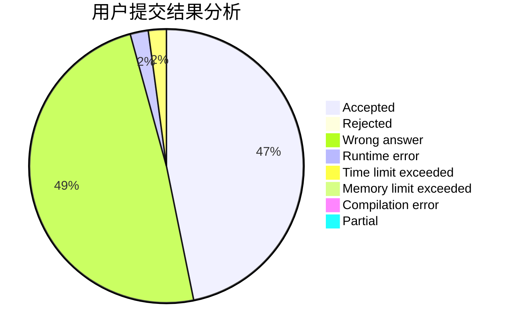
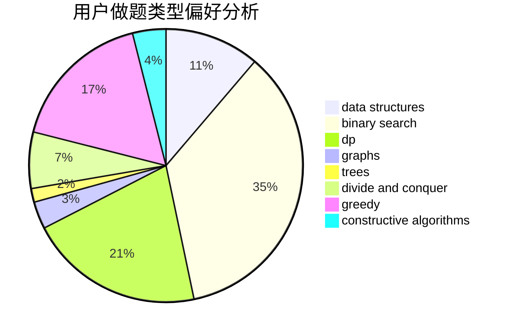
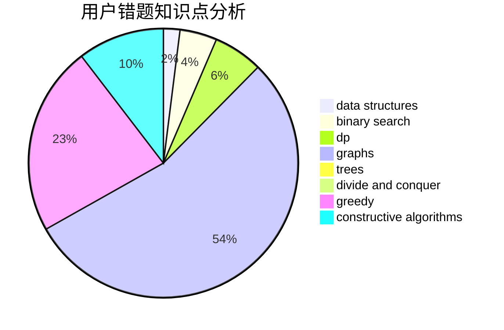

# _misaka

<!-- tabs:start -->

#### **用户提交结果分析**

#### **用户做题类型偏好分析**

#### **用户错题知识点分析**

<!-- tabs:end -->
# 推荐题目
[1396A](https://codeforces.com/contest/1396/problem/A)		constructive algorithms,
                        greedy,
                        number theory		  
[494B](https://codeforces.com/contest/494/problem/B)		dp,
                        strings		  
[363B](https://codeforces.com/contest/363/problem/B)		brute force,
                        dp		  
[329B](https://codeforces.com/contest/329/problem/B)		dfs and similar,
                        shortest paths		  
[1146A](https://codeforces.com/contest/1146/problem/A)		implementation,
                        strings		  
[810A](https://codeforces.com/contest/810/problem/A)		implementation,
                        math		  
[518B](https://codeforces.com/contest/518/problem/B)		greedy,
                        implementation,
                        strings		  
[38E](https://codeforces.com/contest/38/problem/E)		dp,
                        sortings		  
[1140B](https://codeforces.com/contest/1140/problem/B)		implementation,
                        strings		  
[741E](https://codeforces.com/contest/741/problem/E)		data structures,
                        string suffix structures		  
