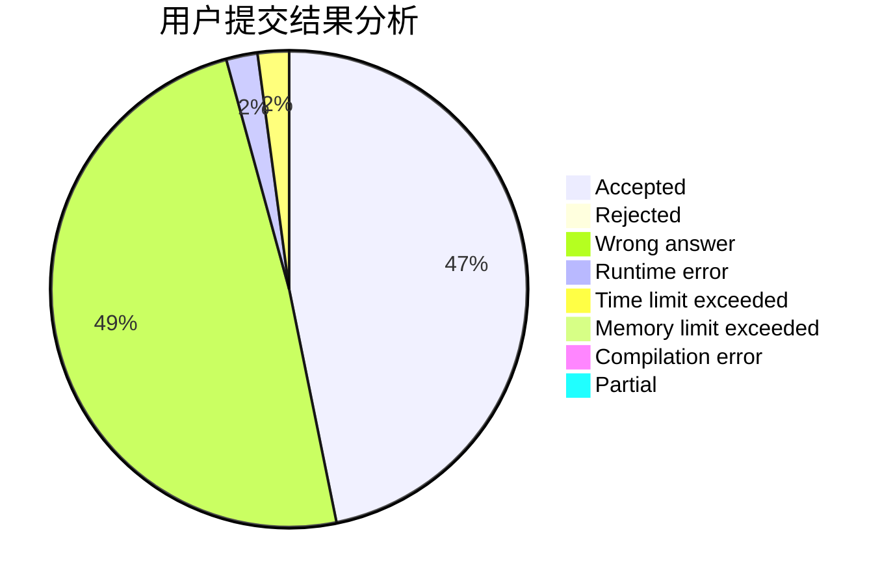
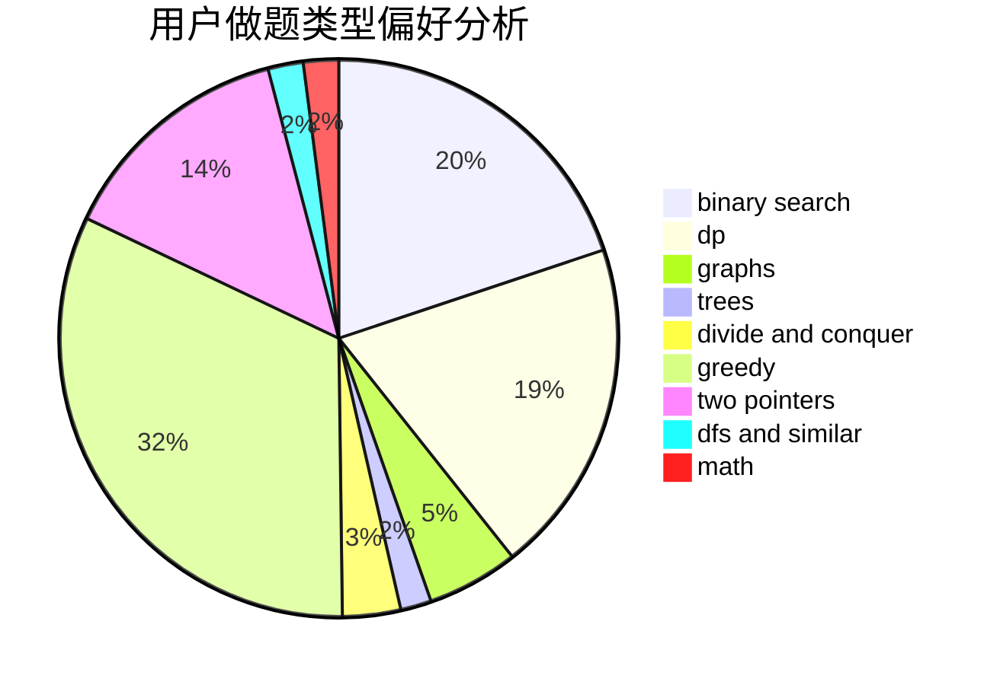

# _misaka

<!-- tabs:start -->

#### **用户提交结果分析**

#### **用户做题类型偏好分析**

<!-- tabs:end -->
# 推荐题目
[1396A](https://codeforces.com/contest/1396/problem/A)
[494B](https://codeforces.com/contest/494/problem/B)
[363B](https://codeforces.com/contest/363/problem/B)
[329B](https://codeforces.com/contest/329/problem/B)
[1146A](https://codeforces.com/contest/1146/problem/A)
[810A](https://codeforces.com/contest/810/problem/A)
[518B](https://codeforces.com/contest/518/problem/B)
[38E](https://codeforces.com/contest/38/problem/E)
[1140B](https://codeforces.com/contest/1140/problem/B)
[741E](https://codeforces.com/contest/741/problem/E)
