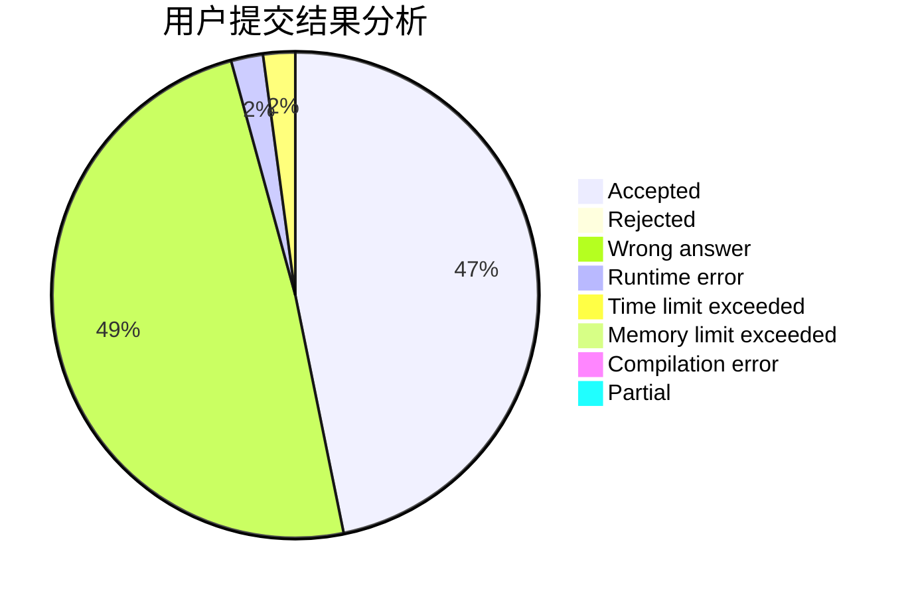
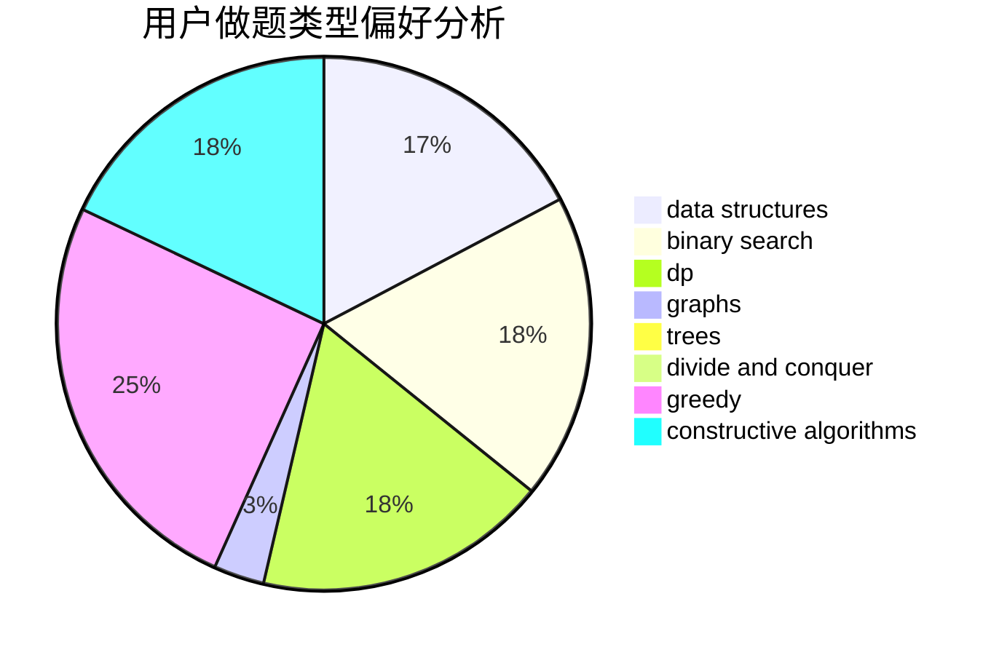

# _misaka

<!-- tabs:start -->

#### **用户提交结果分析**

#### **用户做题类型偏好分析**

#### **用户错题知识点分析**

<!-- tabs:end -->
# 推荐题目
[1385G](https://codeforces.com/contest/1385/problem/G)		2-sat,
                        dfs and similar,
                        dsu,
                        graphs,
                        implementation		  
[475B](https://codeforces.com/contest/475/problem/B)		brute force,
                        dfs and similar,
                        graphs,
                        implementation		  
[335F](https://codeforces.com/contest/335/problem/F)		dp,
                        greedy		  
[306D](https://codeforces.com/contest/306/problem/D)		constructive algorithms,
                        geometry		  
[1143F](https://codeforces.com/contest/1143/problem/F)		dsu,graphs,sortings,trees		  
[795K](https://codeforces.com/contest/795/problem/K)		dsu,graphs,sortings,trees		  
[497E](https://codeforces.com/contest/497/problem/E)		dp,
                        matrices		  
[364A](https://codeforces.com/contest/364/problem/A)		combinatorics,
                        data structures,
                        implementation		  
[1138D](https://codeforces.com/contest/1138/problem/D)		dsu,graphs,sortings,trees		  
[724E](https://codeforces.com/contest/724/problem/E)		dp,
                        flows,
                        greedy		  
