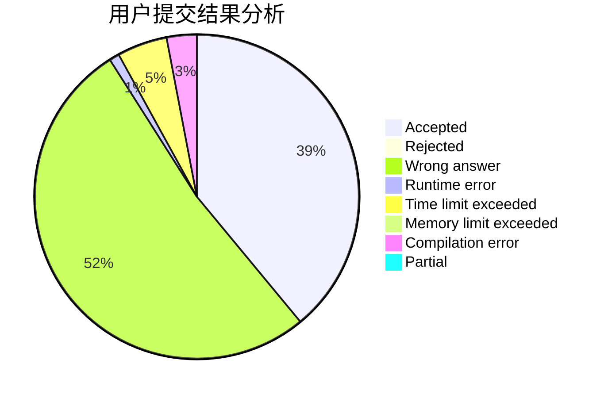
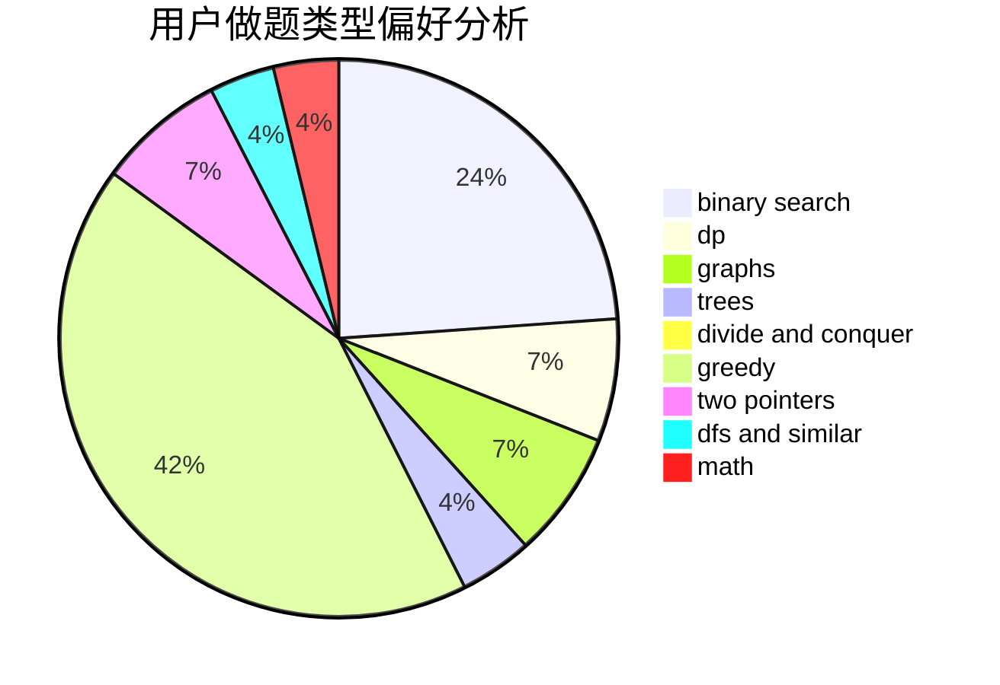

# _n_n_

<!-- tabs:start -->

#### **用户提交结果分析**

#### **用户做题类型偏好分析**

<!-- tabs:end -->
# 推荐题目
[359C](https://codeforces.com/contest/359/problem/C)
[963C](https://codeforces.com/contest/963/problem/C)
[585B](https://codeforces.com/contest/585/problem/B)
[1082F](https://codeforces.com/contest/1082/problem/F)
[338D](https://codeforces.com/contest/338/problem/D)
[1061E](https://codeforces.com/contest/1061/problem/E)
[117C](https://codeforces.com/contest/117/problem/C)
[995F](https://codeforces.com/contest/995/problem/F)
[907D](https://codeforces.com/contest/907/problem/D)
[525C](https://codeforces.com/contest/525/problem/C)
