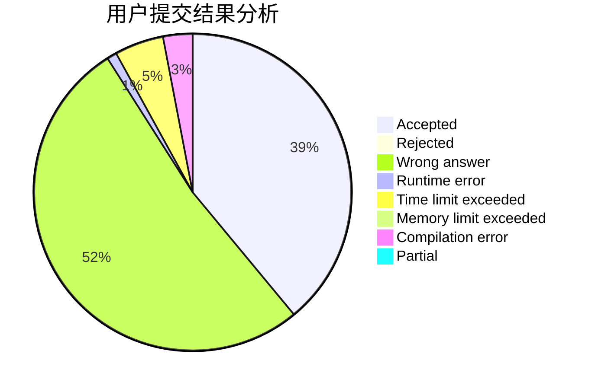
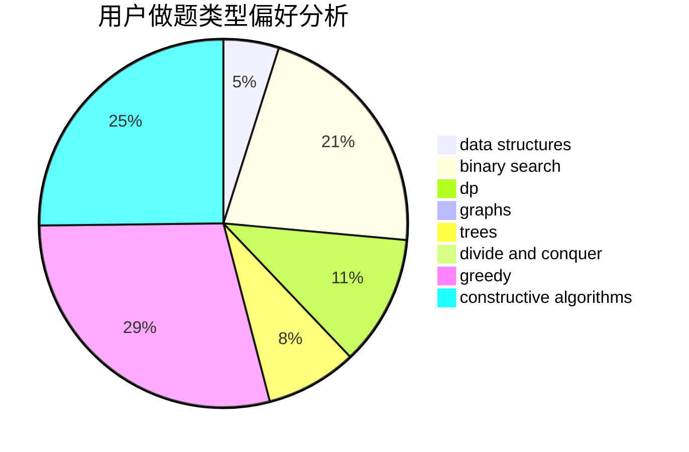
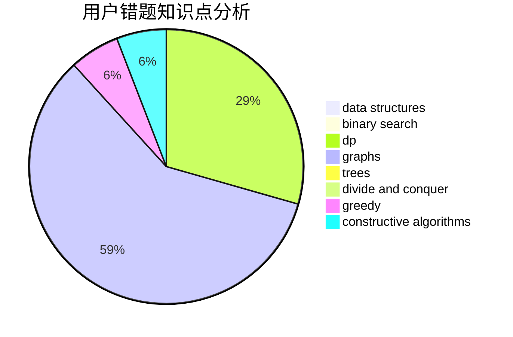

# _n_n_

<!-- tabs:start -->

#### **用户提交结果分析**

#### **用户做题类型偏好分析**

#### **用户错题知识点分析**

<!-- tabs:end -->
# 推荐题目
[359C](https://codeforces.com/contest/359/problem/C)		math,
                        number theory		  
[963C](https://codeforces.com/contest/963/problem/C)		brute force,
                        math,
                        number theory		  
[585B](https://codeforces.com/contest/585/problem/B)		dfs and similar,
                        graphs,
                        shortest paths		  
[1082F](https://codeforces.com/contest/1082/problem/F)		dp,
                        strings,
                        trees		  
[338D](https://codeforces.com/contest/338/problem/D)		chinese remainder theorem,
                        math,
                        number theory		  
[1061E](https://codeforces.com/contest/1061/problem/E)		flows,
                        graphs		  
[117C](https://codeforces.com/contest/117/problem/C)		dfs and similar,
                        graphs		  
[995F](https://codeforces.com/contest/995/problem/F)		combinatorics,
                        dp,
                        math,
                        trees		  
[907D](https://codeforces.com/contest/907/problem/D)		dsu,graphs,sortings,trees		  
[525C](https://codeforces.com/contest/525/problem/C)		greedy,
                        math,
                        sortings		  
