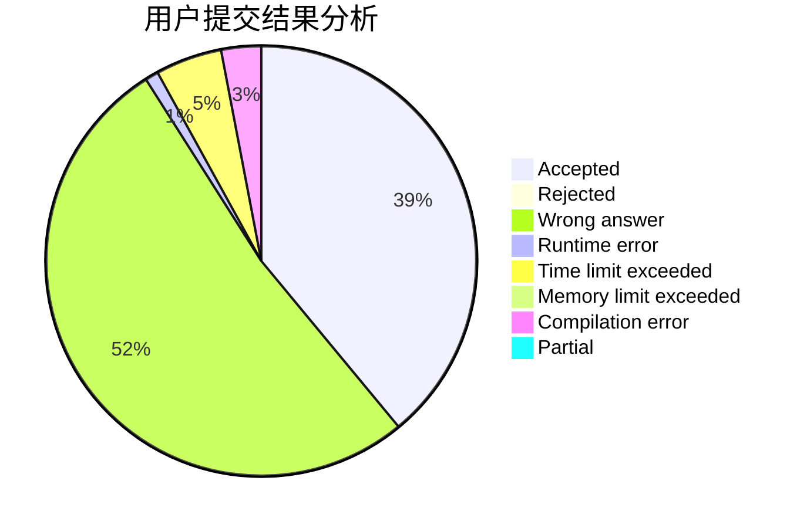
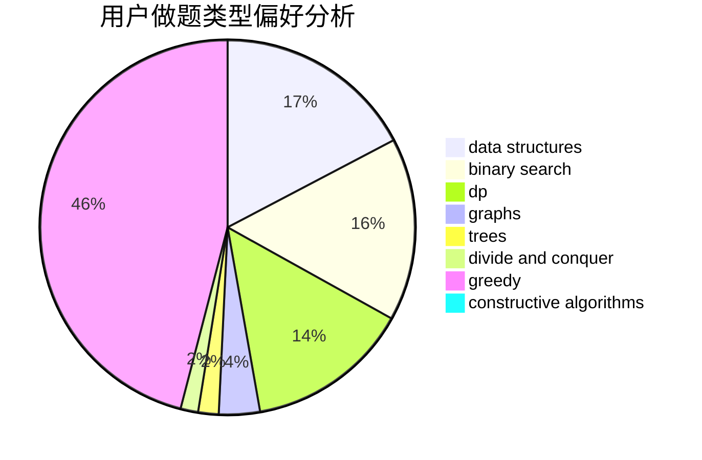
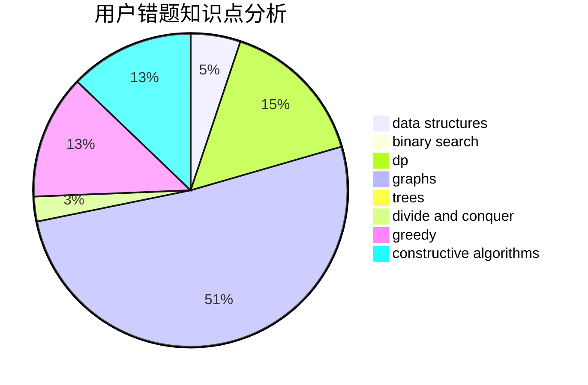

# _n_n_

<!-- tabs:start -->

#### **用户提交结果分析**

#### **用户做题类型偏好分析**

#### **用户错题知识点分析**

<!-- tabs:end -->
# 推荐题目
[331C3](https://codeforces.com/contest/331C/problem/3)		dp		  
[946F](https://codeforces.com/contest/946/problem/F)		combinatorics,
                        dp,
                        matrices		  
[566C](https://codeforces.com/contest/566/problem/C)		dfs and similar,
                        divide and conquer,
                        trees		  
[1082C](https://codeforces.com/contest/1082/problem/C)		greedy,
                        sortings		  
[313E](https://codeforces.com/contest/313/problem/E)		constructive algorithms,
                        data structures,
                        dsu,
                        greedy		  
[1061A](https://codeforces.com/contest/1061/problem/A)		greedy,
                        implementation,
                        math		  
[1176E](https://codeforces.com/contest/1176/problem/E)		dfs and similar,
                        dsu,
                        graphs,
                        shortest paths,
                        trees		  
[980D](https://codeforces.com/contest/980/problem/D)		dp,
                        math,
                        number theory		  
[888B](https://codeforces.com/contest/888/problem/B)		greedy		  
[505A](https://codeforces.com/contest/505/problem/A)		brute force,
                        implementation,
                        strings		  
