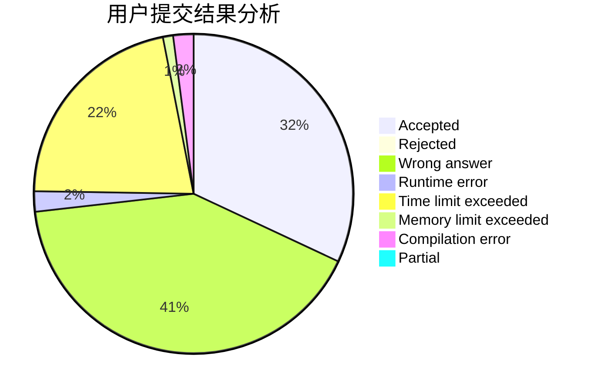
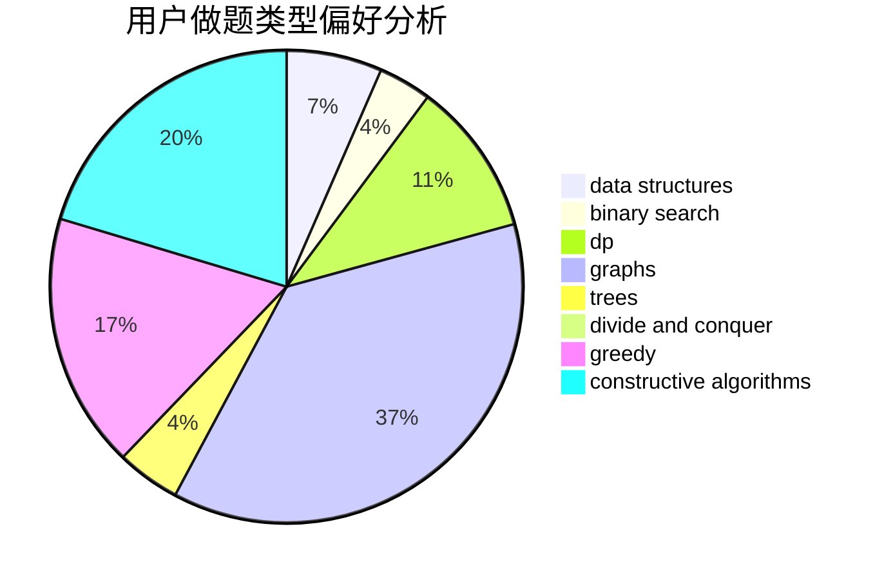
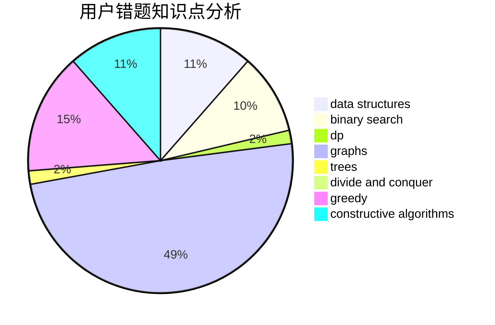

# _rockdu

<!-- tabs:start -->

#### **用户提交结果分析**

#### **用户做题类型偏好分析**

#### **用户错题知识点分析**

<!-- tabs:end -->
# 推荐题目
[1220C](https://codeforces.com/contest/1220/problem/C)		games,
                        greedy,
                        strings		  
[659G](https://codeforces.com/contest/659/problem/G)		combinatorics,
                        dp,
                        number theory		  
[1312F](https://codeforces.com/contest/1312/problem/F)		games,
                        two pointers		  
[1295F](https://codeforces.com/contest/1295/problem/F)		combinatorics,
                        dp,
                        probabilities		  
[759B](https://codeforces.com/contest/759/problem/B)		dsu,graphs,sortings,trees		  
[611C](https://codeforces.com/contest/611/problem/C)		dp,
                        implementation		  
[590A](https://codeforces.com/contest/590/problem/A)		implementation		  
[232A](https://codeforces.com/contest/232/problem/A)		binary search,
                        constructive algorithms,
                        graphs,
                        greedy		  
[1075A](https://codeforces.com/contest/1075/problem/A)		implementation,
                        math		  
[586F](https://codeforces.com/contest/586/problem/F)		dsu,graphs,sortings,trees		  
