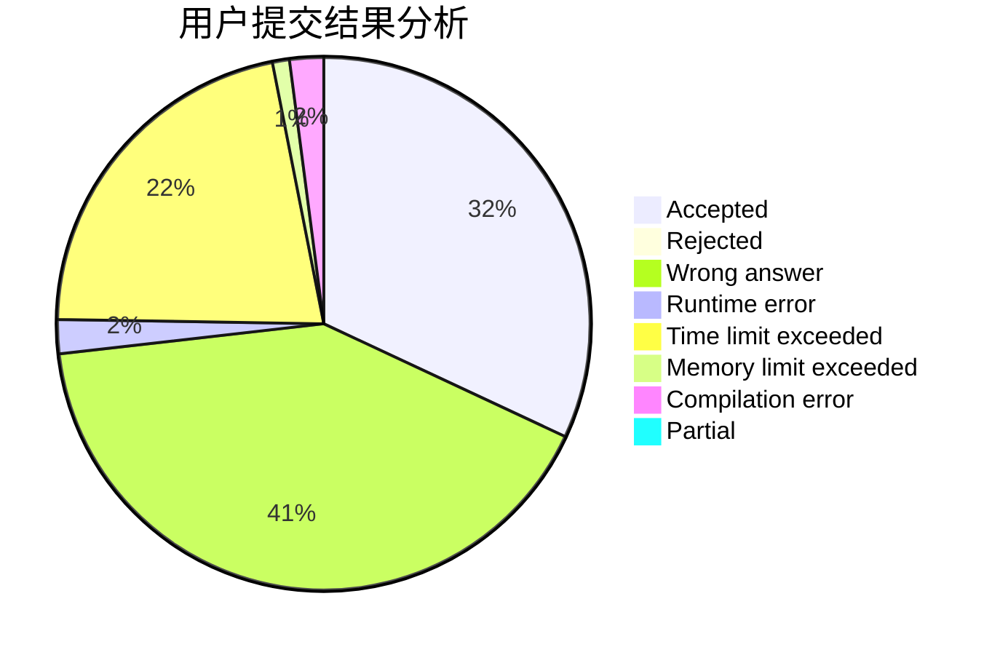
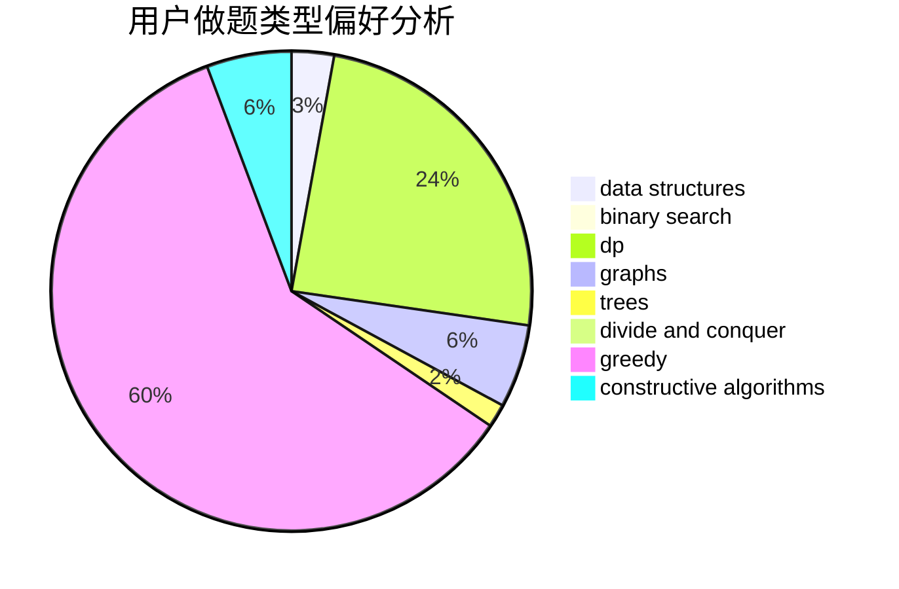
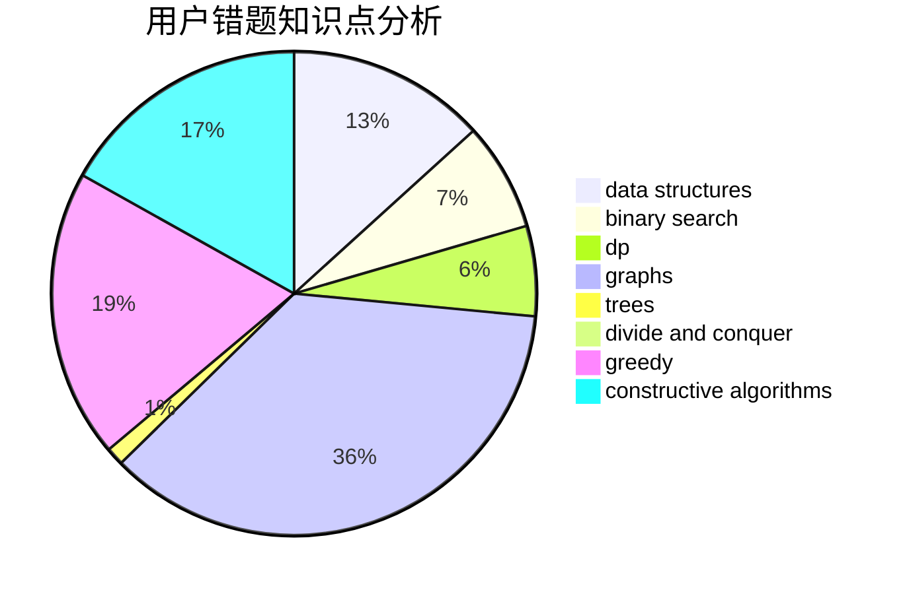

# _rockdu

<!-- tabs:start -->

#### **用户提交结果分析**

#### **用户做题类型偏好分析**

#### **用户错题知识点分析**

<!-- tabs:end -->
# 推荐题目
[1214G](https://codeforces.com/contest/1214/problem/G)		bitmasks,
                        data structures		  
[62E](https://codeforces.com/contest/62/problem/E)		dp,
                        flows		  
[1304A](https://codeforces.com/contest/1304/problem/A)		math		  
[1288D](https://codeforces.com/contest/1288/problem/D)		binary search,
                        bitmasks,
                        dp		  
[737E](https://codeforces.com/contest/737/problem/E)		graph matchings,
                        graphs,
                        greedy,
                        schedules		  
[592A](https://codeforces.com/contest/592/problem/A)		implementation		  
[56E](https://codeforces.com/contest/56/problem/E)		binary search,
                        data structures,
                        sortings		  
[212A](https://codeforces.com/contest/212/problem/A)		flows,
                        graphs		  
[1074A](https://codeforces.com/contest/1074/problem/A)		dsu,graphs,sortings,trees		  
[567B](https://codeforces.com/contest/567/problem/B)		implementation		  
